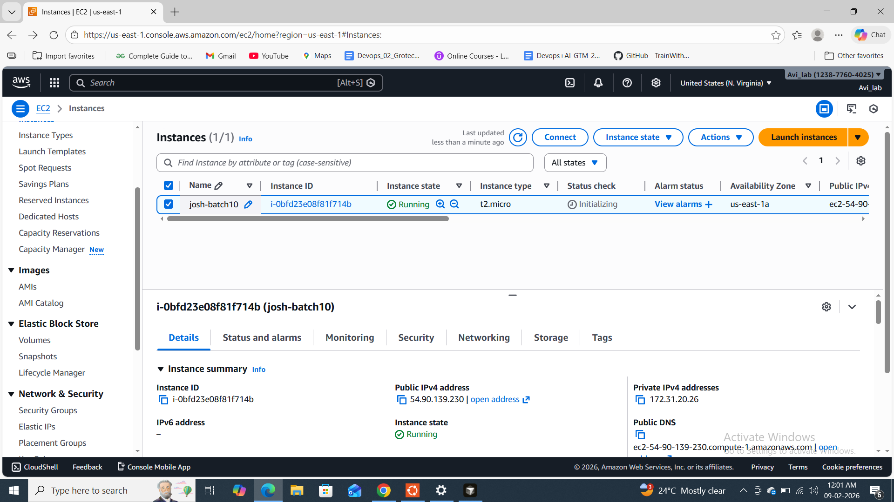
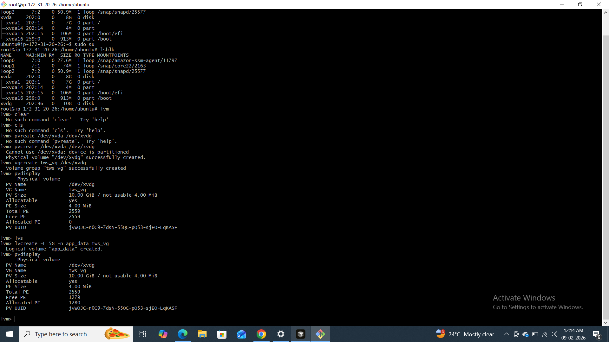
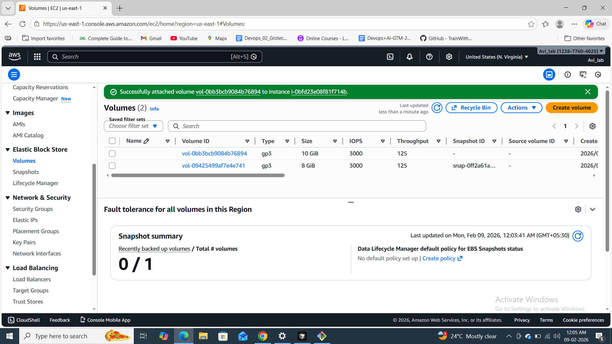
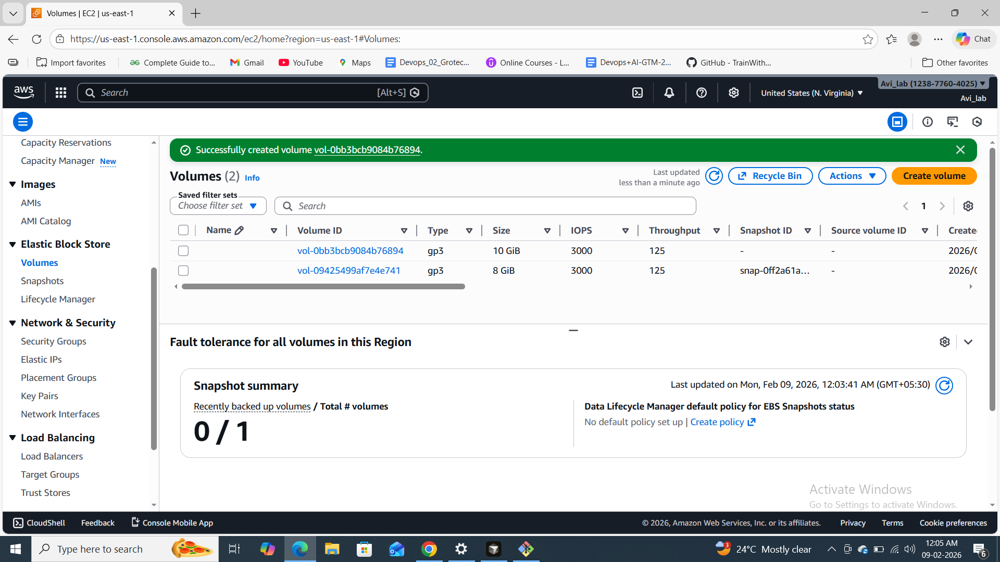
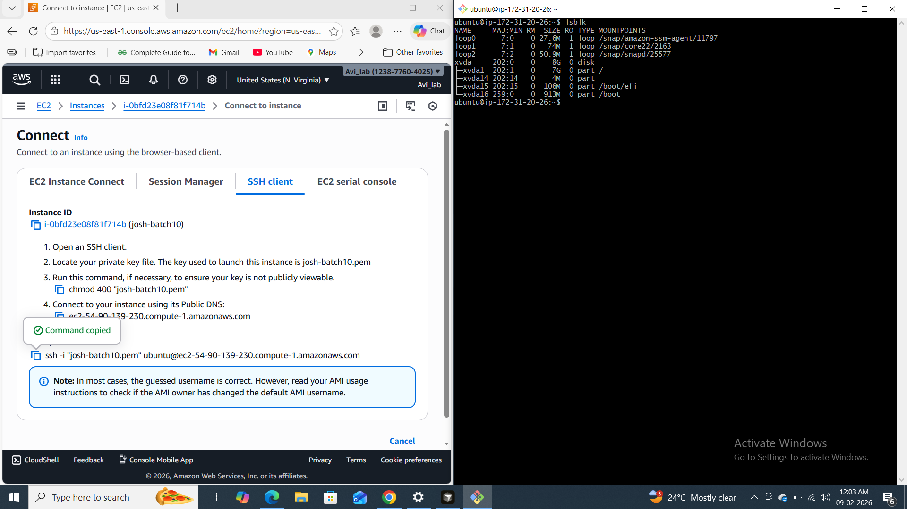
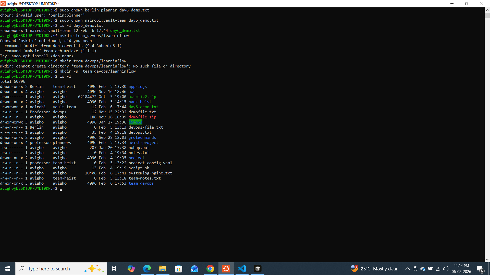
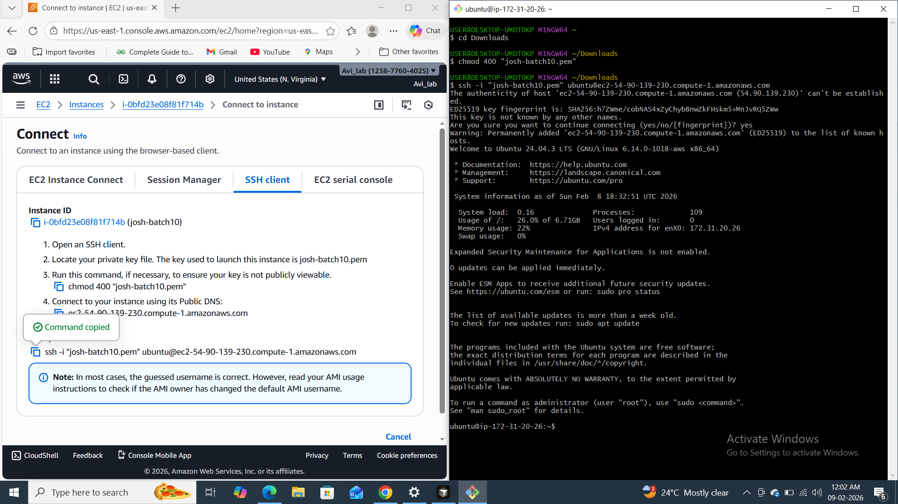
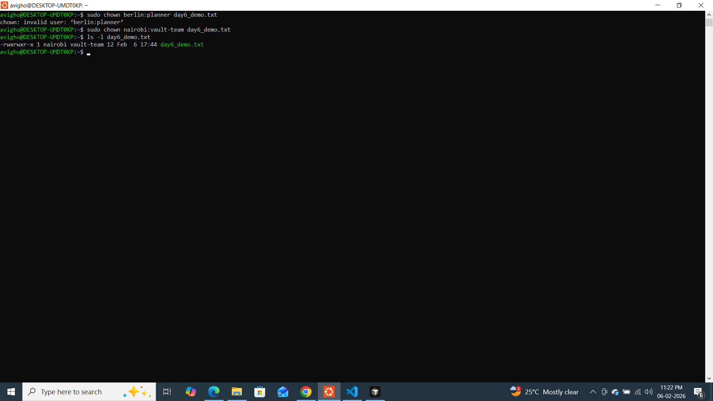
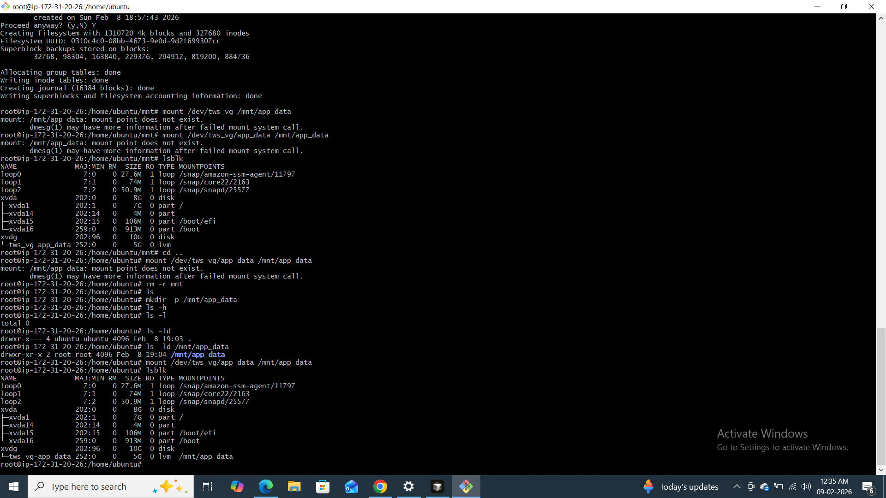
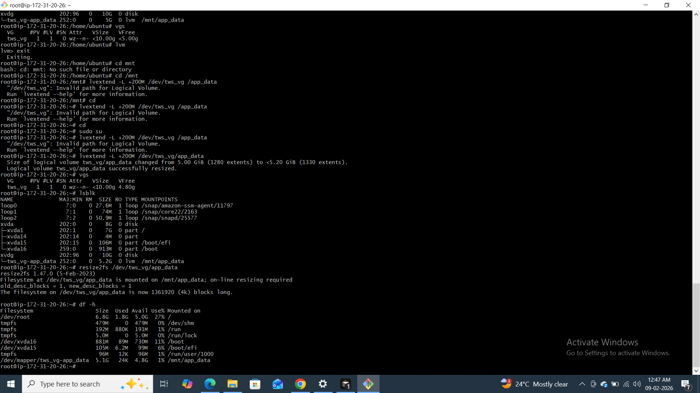

# Day 13 – Linux Volume Management (LVM)

## Overview

Day 13 focused on **Linux LVM** (Logical Volume Management) and **AWS EC2 + EBS** setup. I created an EC2 instance, attached an EBS volume, connected via SSH, and then used LVM on the attached disk to create a physical volume, volume group, logical volume, filesystem, and mount point.

---

## Environment

- **AWS Account:** Avi_lab (us-east-1)
- **EC2 Instance:** `josh-batch10` (ID: `i-0bfd23e08f81f714b`)
- **Instance type:** t2.micro | **AMI:** Ubuntu
- **Private key:** `josh-batch10.pem`
- **Public IP:** 54.90.139.230
- **EBS volume:** 10 GiB gp3 attached as `/dev/xvdg` (NVMe naming on Ubuntu)

---

## Task 1: Check Current Storage

On the EC2 instance after SSH login, I listed block devices to see the root disk and the new EBS volume.

**Commands:**
```bash
lsblk
```

**Observation:**  
- `xvda` (8G) had partitions for `/`, `/boot`, `/boot/efi`.  
- `xvdg` (10G) was a raw disk with no partitions — used for LVM.













---

## Task 2: Create Physical Volume

Switched to root and created a physical volume on the EBS disk. Did **not** use the partitioned root disk (`xvda`).

**Commands:**
```bash
sudo su
# or: sudo -i
pvcreate /dev/xvdg
```

**Note:** `pvcreate /dev/xvda` fails with *"device is partitioned"* — use only unpartitioned disks for PVs.

**Verify:**
```bash
pvs
pvdisplay
```



---

## Task 3: Create Volume Group

Created a volume group named `tws_vg` using the new PV.

**Commands:**
```bash
vgcreate tws_vg /dev/xvdg
vgs
```

---

## Task 4: Create Logical Volume

Created a 5 GB logical volume for application data.

**Commands:**
```bash
lvcreate -L 5G -n app_data tws_vg
lvs
```

**Verify:**  
`pvdisplay` showed **Allocated PE** increased and **Free PE** decreased after creating the LV.



---

## Task 5: Format and Mount

Formatted the LV with ext4, created mount point, and mounted it.

**Commands:**
```bash
mkfs.ext4 /dev/tws_vg/app_data
mkdir -p /mnt/app_data
mount /dev/tws_vg/app_data /mnt/app_data
df -h /mnt/app_data
```

**Note:** Mount failed with *"mount point does not exist"* until `/mnt/app_data` was created with `mkdir -p /mnt/app_data`.

**Verify:**
```bash
lsblk
```
The logical volume `tws_vg-app_data` then showed mount point `/mnt/app_data`.



---

## Task 6: Extend the Volume

Extended the logical volume by 200 MB, then resized the filesystem so the new space is usable.

**Commands:**
```bash
# Ensure you're root (lvextend can fail otherwise)
sudo su

# Check current state
lsblk
vgs

# Add 200 MB to the logical volume
lvextend -L +200M /dev/tws_vg/app_data

# Verify: VFree decreases, lsblk shows larger LV (e.g. 5.2G)
vgs
lsblk

# Grow the filesystem to use the new space (works while mounted)
resize2fs /dev/tws_vg/app_data

# Confirm new size
df -h /mnt/app_data
```

**Note:** Running `lvextend` without root can give *"Invalid path for Logical Volume"*. Use `sudo su` (or `sudo -i`) first.

**Result:** LV grew from 5.00 GiB to ~5.2 GiB (1330 extents). Filesystem resized on-line; `df -h` showed ~5.1G size, 4.8G available.



---

## Commands Summary

| Step | Command |
|------|--------|
| Storage check | `lsblk`, `pvs`, `vgs`, `lvs`, `df -h` |
| Switch to root | `sudo su` or `sudo -i` |
| Create PV | `pvcreate /dev/xvdg` |
| Create VG | `vgcreate tws_vg /dev/xvdg` |
| Create LV | `lvcreate -L 5G -n app_data tws_vg` |
| Format | `mkfs.ext4 /dev/tws_vg/app_data` |
| Mount point | `mkdir -p /mnt/app_data` |
| Mount | `mount /dev/tws_vg/app_data /mnt/app_data` |
| Extend LV | `lvextend -L +200M /dev/tws_vg/app_data` |
| Resize FS | `resize2fs /dev/tws_vg/app_data` |
| Verify | `lsblk`, `df -h /mnt/app_data` |

---

## SSH Connection to EC2

From local machine (e.g. Git Bash / WSL):

```bash
chmod 400 "josh-batch10.pem"
ssh -i "josh-batch10.pem" ubuntu@ec2-54-90-139-230.compute-1.amazonaws.com
```

---

## What I Learned (3 Points)

1. **LVM layers:** Physical Volume (PV) → Volume Group (VG) → Logical Volume (LV). You create a PV from a block device, add PV(s) to a VG, then create LVs from the VG. This allows flexible sizing and multiple volumes from one or more disks.

2. **Mount point must exist:** `mount` fails if the target directory does not exist. Always `mkdir -p /mnt/app_data` (or your path) before mounting.

3. **Don’t use partitioned disks for new PVs:** `pvcreate` on a disk that already has partitions (e.g. root disk `xvda`) fails. Use a separate, unpartitioned disk (e.g. attached EBS as `xvdg`) for LVM.

---

## Screenshots Checklist

Place your screenshots in the `day-13/screenshots/` folder (create the folder if needed) with these names for the images to show in this doc:

| # | Filename | Description |
|---|----------|-------------|
| 1 | `01-ec2-instances.png` | EC2 Instances console – josh-batch10 running |
| 2 | `02-ebs-volume-created.png` | EBS volume created (vol-0bb3bcb9084b76894) |
| 3 | `03-ebs-volume-attached.png` | EBS volume attached to instance |
| 4 | `04-ec2-connect-ssh.png` | EC2 Connect – SSH client tab with command |
| 5 | `05-ssh-logged-in.png` | Terminal – SSH login and Ubuntu welcome |
| 6 | `06-lsblk-initial.png` | `lsblk` on EC2 showing xvda and xvdg |
| 7 | `07-lvm-pv-vg-lv.png` | LVM: pvcreate, vgcreate, lvcreate |
| 8 | `08-lvm-pvdisplay-lvs.png` | pvdisplay and lvs output |
| 9 | `09-mount-success-lsblk.png` | mkfs, mount, and lsblk with /mnt/app_data |
| 10 | `10-lvextend-resize2fs.png` | lvextend +200M, resize2fs, df -h |