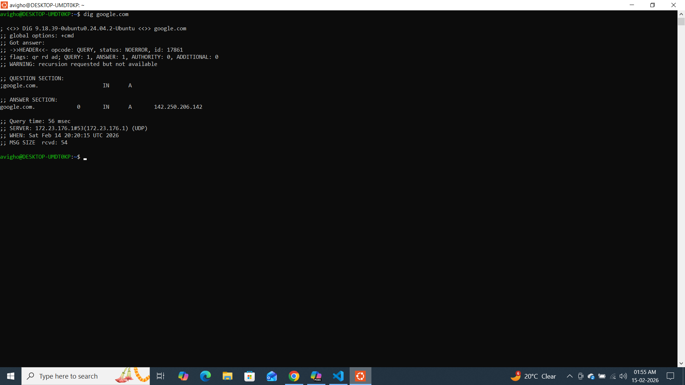
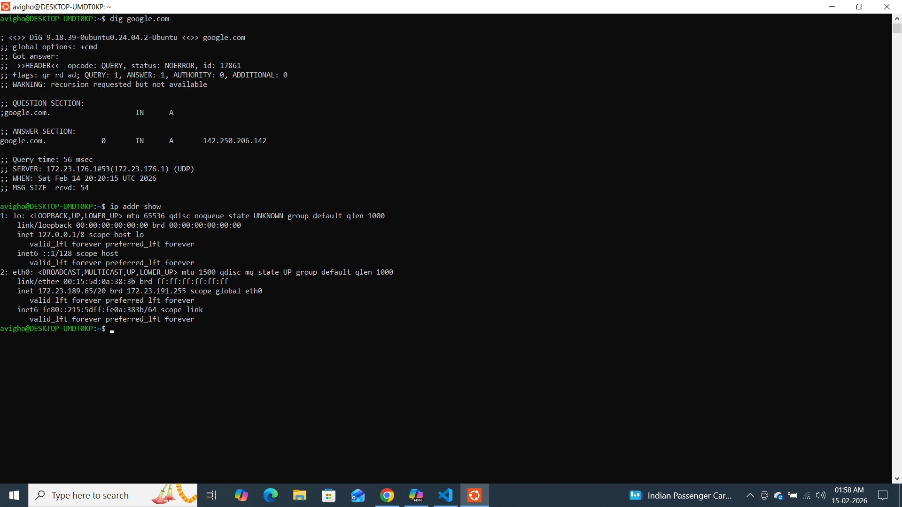
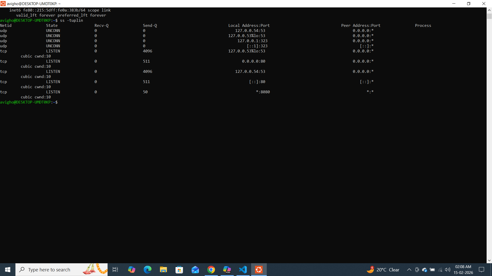

Day 15 – Networking Concepts: DNS, IP, Subnets & Ports
Task 1: DNS – How Names Become IPs
1️⃣ What happens when you type google.com in a browser?
Ans-When I type google.com in a browser, the system first checks DNS to convert the domain name into an IP address. If it is not cached locally, the request goes to a DNS resolver, which contacts authoritative DNS servers to get the IP. Once the IP is returned, the browser establishes a TCP connection (usually HTTPS on port 443) with the server. Then it sends an HTTP request and receives the webpage response

2. What are these record types? Write one line each:
   - `A`, `AAAA`, `CNAME`, `MX`, `NS`
Ans-A – Maps a domain name to an IPv4 address.

AAAA – Maps a domain name to an IPv6 address.

CNAME – Points one domain name to another domain name (alias).

MX – Specifies mail servers responsible for receiving email for a domain.

NS – Defines the authoritative name servers for a domain.

3. Run: `dig google.com` — identify the A record and TTL from the output

A record (IP address): 142.250.206.142

TTL: 56msc

👉 TTL (Time To Live) tells how long the DNS response can be cached before refreshing.

If you share your actual dig output, I can help you identify the exact A record and TTL from your system.

Task 2: IP Addressing
1️⃣ What is an IPv4 address?

An IPv4 address is a 32-bit numeric address used to identify devices on a network. It is written in dotted decimal format like 192.168.1.10, consisting of four octets (0–255).

2️⃣ Public vs Private IP

Public IP: Accessible over the internet (Example: 8.8.8.8)

Private IP: Used inside local networks (Example: 192.168.1.10)

3️⃣ Private IP Ranges

10.0.0.0 – 10.255.255.255

172.16.0.0 – 172.31.255.255

192.168.0.0 – 192.168.255.255

4. Run: `ip addr show` — identify which of your IPs are private

inet show the ip address  inet 127.0.0.1/8 own machine ip address
::1 = localhost (IPv6).

/8 means subnet mask 255.0.0.0.

This is always private and never accessible from outside.

👉 Used for internal communication (like testing apps locally).
2: eth0: <BROADCAST,MULTICAST,UP,LOWER_UP>
inet 172.23.189.65/20
brd 172.23.191.255
This is your actual network interface connected to the network.
✅ IPv4 Address:

172.23.189.65/20

This is your machine’s IP address.

/20 means:

Subnet mask = 255.255.240.0

Total IPs = 4096

Usable IPs = 4094

✅ Is it Private or Public?

172.23.x.x falls inside:

172.16.0.0 – 172.31.255.255

So ✅ This is a Private IP address.

It is likely coming from:

Your router

WSL

Or internal virtual network

✅ Broadcast Address:

172.23.191.255

This is the broadcast address for your /20 network.
Used to send messages to all devices in that subnet.

✅ IPv6 Address:
fe80::215:5dff:fe0a:383b/64

This is a link-local IPv6 address

fe80:: addresses are automatically assigned

Used only inside your local network

🔥 Summary of Your Network
Interface	IP Address	Type
lo	127.0.0.1	Loopback
eth0	172.23.189.65	Private
eth0 IPv6	fe80::...	Link-local
💡 What This Tells Me

You are running on a private internal network.

Task 3: CIDR & Subnetting
1️⃣ What does /24 mean?

/24 means the first 24 bits are used for the network portion, leaving 8 bits for host addresses.

2️⃣ Usable Hosts

/24 → 256 total IPs → 254 usable hosts

/16 → 65,536 total IPs → 65,534 usable hosts

/28 → 16 total IPs → 14 usable hosts

(Usable hosts = Total IPs – 2 for network and broadcast)

3️⃣ Why do we subnet?

 subnet to divide a large network into smaller networks for better security, performance, and IP address management.

4️⃣ CIDR Table
CIDR	Subnet Mask	Total IPs	Usable Hosts
/24	255.255.255.0	256	254
/16	255.255.0.0	65536	65534
/28	255.255.255.240	16	14

Task 4: Ports – The Doors to Services
1️⃣ What is a port?

A port is a logical communication endpoint used by services to send and receive data. Ports allow multiple services to run on the same IP address.

2️⃣ Common Ports
Port	Service
22	SSH
80	HTTP
443	HTTPS
53	DNS
3306	MySQL
6379	Redis
27017	MongoDB
3️⃣

ss -tuplin means:

-t → TCP

-u → UDP

-p → Show process

-l → Listening sockets

-i → Internal TCP info

-n → Show port numbers (not service names)

So this shows which services are listening on which ports.

🔹 UDP Services
1️⃣ 127.0.0.53:53
udp UNCONN 127.0.0.53:53
udp UNCONN 127.0.0.54:53

Port 53 = DNS

127.x.x.x → Loopback (local only)

This is systemd-resolved DNS service

Used internally by your system for DNS resolution

👉 Only accessible locally.

2️⃣ 127.0.0.1:323
udp UNCONN 127.0.0.1:323
udp UNCONN [::1]:323

Port 323 = NTP (time sync service)

Used by chronyd or time sync service

Keeps system clock synchronized

🔹 TCP Services (LISTEN)
✅ Port 53 (DNS)
tcp LISTEN 127.0.0.53:53
tcp LISTEN 127.0.0.54:53

DNS service listening locally

Only accessible from your machine

✅ Port 80 (HTTP)
tcp LISTEN 0.0.0.0:80
tcp LISTEN [::]:80

🚀 Very important one.

Port 80 = HTTP

0.0.0.0 means → Listening on ALL network interfaces

[::] means → IPv6 all interfaces

👉 This means a web server (like nginx or apache) is running and accessible from network.

✅ Port 8080
tcp LISTEN *:8080

Port 8080 = Alternative HTTP port

* means → Listening on all interfaces

Some application server is running (maybe Node, Tomcat, etc.)

👉 This service is accessible from other machines in your network.

📊 Summary of Active Services
Port	Protocol	Likely Service	Accessible From
53	TCP/UDP	DNS	Local only
323	UDP	NTP (time)	Local only
80	TCP	Web Server	Network
8080	TCP	App Server	Network
🔥 Important Observations

DNS is running locally (system resolver).

A web server is running on port 80.

Another application is running on port 8080.

Ports 80 and 8080 are exposed to network (0.0.0.0 / *).

🧠 If This Were Production, I Would Check:

Which process is running on 80?

sudo lsof -i :80

Which app is on 8080?

sudo lsof -i :8080

Firewall rules:

sudo ufw status

Task 5: Putting It Together
1️⃣ curl http://myapp.com:8080

Concepts involved:

DNS resolution (domain → IP)

TCP connection

Port 8080 communication

HTTP protocol

2️⃣ App can't reach 10.0.1.50:3306

I would check:

If the IP is reachable (ping)

If port 3306 is open (telnet/nc)

Firewall rules and security groups

Whether MySQL service is running

What I Learned (3 Key Points)

DNS translates human-readable names into IP addresses.

CIDR notation helps in dividing networks efficiently.

Ports allow multiple services to run on the same machine.

Learn in Public
#90DaysOfDevOps #DevOpsKaJosh #TrainWithShubham

Happy Learning 🚀
TrainWithShubham

can you describe it avigho@DESKTOP-UMDT0KP:~$ ip addr show
1: lo: <LOOPBACK,UP,LOWER_UP> mtu 65536 qdisc noqueue state UNKNOWN group default qlen 1000
    link/loopback 00:00:00:00:00:00 brd 00:00:00:00:00:00
    inet 127.0.0.1/8 scope host lo
       valid_lft forever preferred_lft forever
    inet6 ::1/128 scope host
       valid_lft forever preferred_lft forever
2: eth0: <BROADCAST,MULTICAST,UP,LOWER_UP> mtu 1500 qdisc mq state UP group default qlen 1000
    link/ether 00:15:5d:0a:38:3b brd ff:ff:ff:ff:ff:ff
    inet 172.23.189.65/20 brd 172.23.191.255 scope global eth0
       valid_lft forever preferred_lft forever
    inet6 fe80::215:5dff:fe0a:383b/64 scope link
       valid_lft forever preferred_lft forever

Good 👌 let’s break down your ip addr show output clearly.

🔹 1️⃣ Interface: lo (Loopback)
1: lo: <LOOPBACK,UP,LOWER_UP>
inet 127.0.0.1/8
inet6 ::1/128

lo = loopback interface (your own machine talking to itself).

127.0.0.1 = localhost (IPv4).

::1 = localhost (IPv6).

/8 means subnet mask 255.0.0.0.

This is always private and never accessible from outside.

👉 Used for internal communication (like testing apps locally).

🔹 2️⃣ Interface: eth0 (Main Network Interface)
2: eth0: <BROADCAST,MULTICAST,UP,LOWER_UP>
inet 172.23.189.65/20
brd 172.23.191.255

This is your actual network interface connected to the network.

✅ IPv4 Address:

172.23.189.65/20

This is your machine’s IP address.

/20 means:

Subnet mask = 255.255.240.0

Total IPs = 4096

Usable IPs = 4094

✅ Is it Private or Public?

172.23.x.x falls inside:

172.16.0.0 – 172.31.255.255

So ✅ This is a Private IP address.

It is likely coming from:

Your router

WSL

Or internal virtual network

✅ Broadcast Address:

172.23.191.255

This is the broadcast address for your /20 network.
Used to send messages to all devices in that subnet.

✅ IPv6 Address:
fe80::215:5dff:fe0a:383b/64

This is a link-local IPv6 address

fe80:: addresses are automatically assigned

Used only inside your local network

🔥 Summary of Your Network
Interface	IP Address	Type
lo	127.0.0.1	Loopback
eth0	172.23.189.65	Private
eth0 IPv6	fe80::...	Link-local
💡 What This Tells Me

You are running on a private internal network

Probably WSL or a virtual adapter

Your system is connected properly (UP state)

No public IP directly assigned

If you want, I can now help you calculate:

Network ID

First usable IP

Last usable IP

Broadcast IP

from your 172.23.189.65/20 👀

avigho@DESKTOP-UMDT0KP:~$ ss -tuplin
Netid               State                Recv-Q               Send-Q                               Local Address:Port                               Peer Address:Port               Process
udp                 UNCONN               0                    0                                       127.0.0.54:53                                      0.0.0.0:*
udp                 UNCONN               0                    0                                    127.0.0.53%lo:53                                      0.0.0.0:*
udp                 UNCONN               0                    0                                        127.0.0.1:323                                     0.0.0.0:*
udp                 UNCONN               0                    0                                            [::1]:323                                        [::]:*
tcp                 LISTEN               0                    4096                                 127.0.0.53%lo:53                                      0.0.0.0:*
         cubic cwnd:10
tcp                 LISTEN               0                    511                                        0.0.0.0:80                                      0.0.0.0:*
         cubic cwnd:10
tcp                 LISTEN               0                    4096                                    127.0.0.54:53                                      0.0.0.0:*
         cubic cwnd:10
tcp                 LISTEN               0                    511                                           [::]:80                                         [::]:*
         cubic cwnd:10
tcp                 LISTEN               0                    50                                               *:8080                                          *:*
         cubic cwnd:10

Very good 👏 this is proper DevOps observation practice.

Let’s break your ss -tuplin output clearly.

🔎 What This Command Shows

ss -tuplin means:

-t → TCP

-u → UDP

-p → Show process

-l → Listening sockets

-i → Internal TCP info

-n → Show port numbers (not service names)

So this shows which services are listening on which ports.

🔹 UDP Services
1️⃣ 127.0.0.53:53
udp UNCONN 127.0.0.53:53
udp UNCONN 127.0.0.54:53

Port 53 = DNS

127.x.x.x → Loopback (local only)

This is systemd-resolved DNS service

Used internally by your system for DNS resolution

👉 Only accessible locally.

2️⃣ 127.0.0.1:323
udp UNCONN 127.0.0.1:323
udp UNCONN [::1]:323

Port 323 = NTP (time sync service)

Used by chronyd or time sync service

Keeps system clock synchronized

🔹 TCP Services (LISTEN)
✅ Port 53 (DNS)
tcp LISTEN 127.0.0.53:53
tcp LISTEN 127.0.0.54:53

DNS service listening locally

Only accessible from your machine

✅ Port 80 (HTTP)
tcp LISTEN 0.0.0.0:80
tcp LISTEN [::]:80

🚀 Very important one.

Port 80 = HTTP

0.0.0.0 means → Listening on ALL network interfaces

[::] means → IPv6 all interfaces

👉 This means a web server (like nginx or apache) is running and accessible from network.

✅ Port 8080
tcp LISTEN *:8080

Port 8080 = Alternative HTTP port

* means → Listening on all interfaces

Some application server is running (maybe Node, Tomcat, etc.)

👉 This service is accessible from other machines in your network.

📊 Summary of Active Services
Port	Protocol	Likely Service	Accessible From
53	TCP/UDP	DNS	Local only
323	UDP	NTP (time)	Local only
80	TCP	Web Server	Network
8080	TCP	App Server	Network
🔥 Important Observations

DNS is running locally (system resolver).

A web server is running on port 80.

Another application is running on port 8080.

Ports 80 and 8080 are exposed to network (0.0.0.0 / *).

🧠 If This Were Production, I Would Check:

Which process is running on 80?

sudo lsof -i :80

Which app is on 8080?

sudo lsof -i :8080

Firewall rules:

sudo ufw status

If you want, I can now explain:

👉 What security risk exists when 0.0.0.0:80 is open
👉 Or how to restrict a service to localhost only

Task 5: Putting It Together
1️⃣ curl http://myapp.com:8080

Concepts involved:

DNS resolution (domain → IP)

TCP connection

Port 8080 communication

HTTP protocol

2️⃣ App can't reach 10.0.1.50:3306

I would check:

If the IP is reachable (ping)

If port 3306 is open (telnet/nc)

Firewall rules and security groups

Whether MySQL service is running

What I Learned (3 Key Points)

DNS translates human-readable names into IP addresses.

CIDR notation helps in dividing networks efficiently.

Ports allow multiple services to run on the same machine.