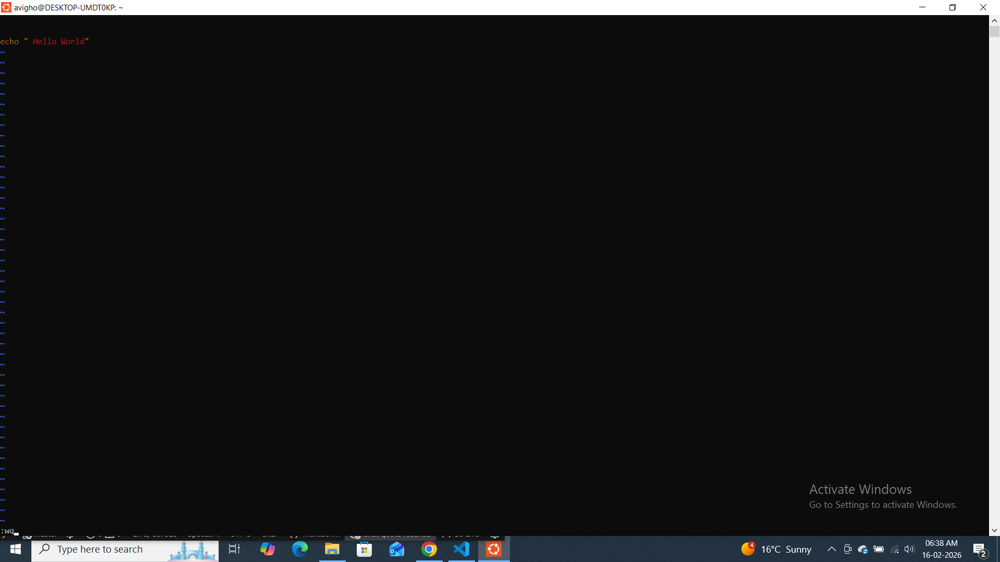
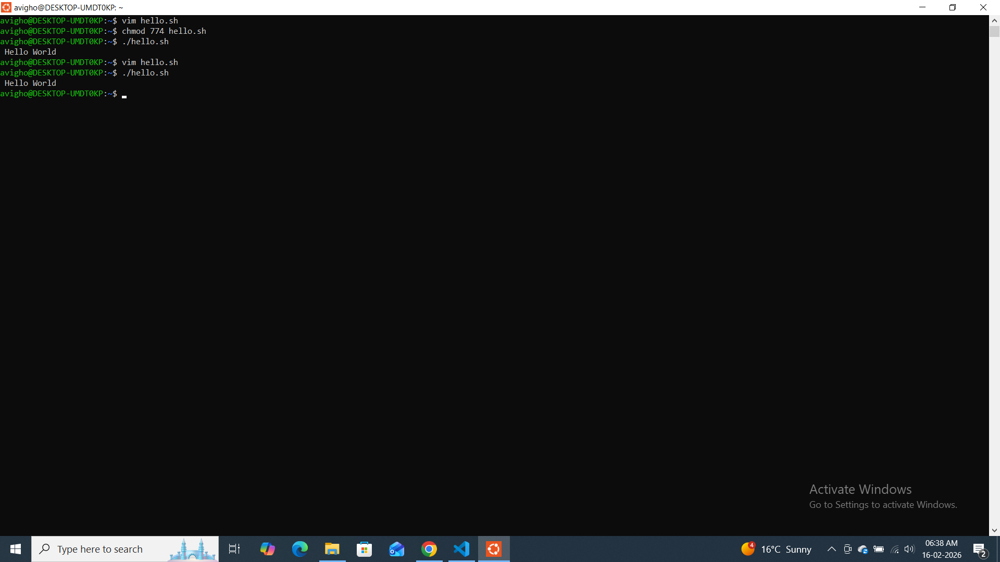
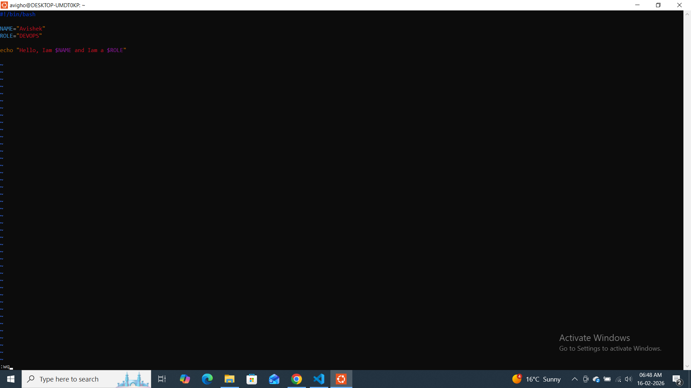
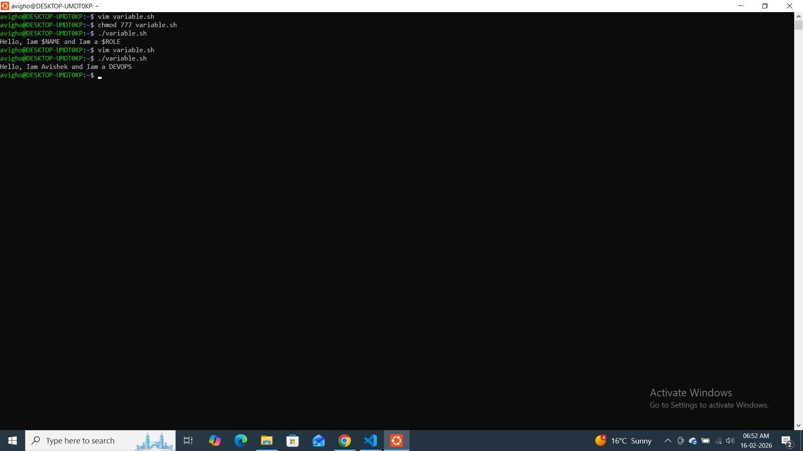
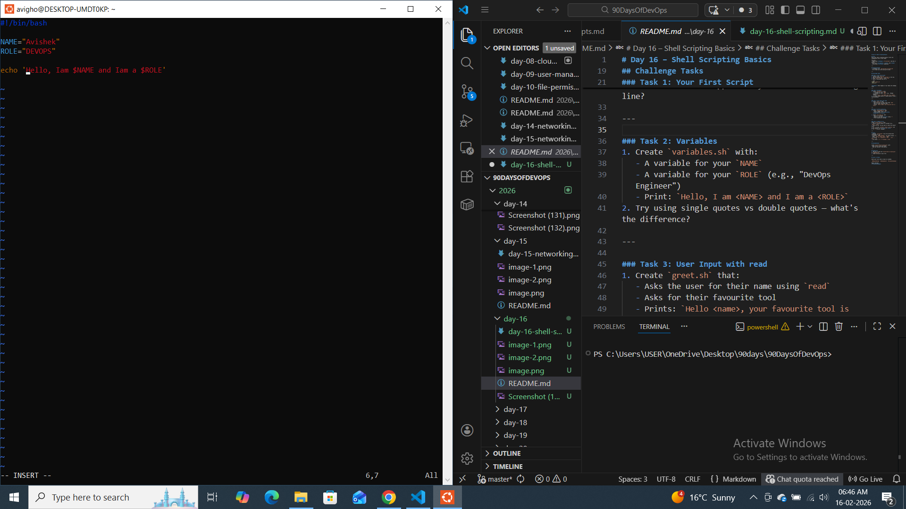
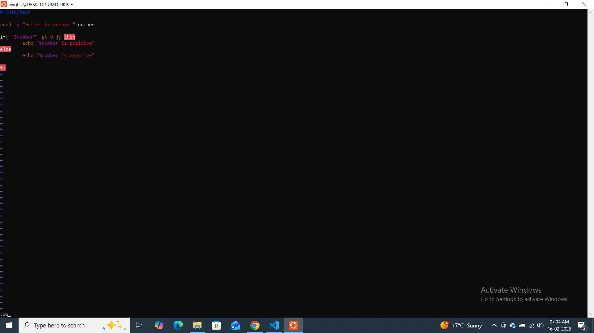
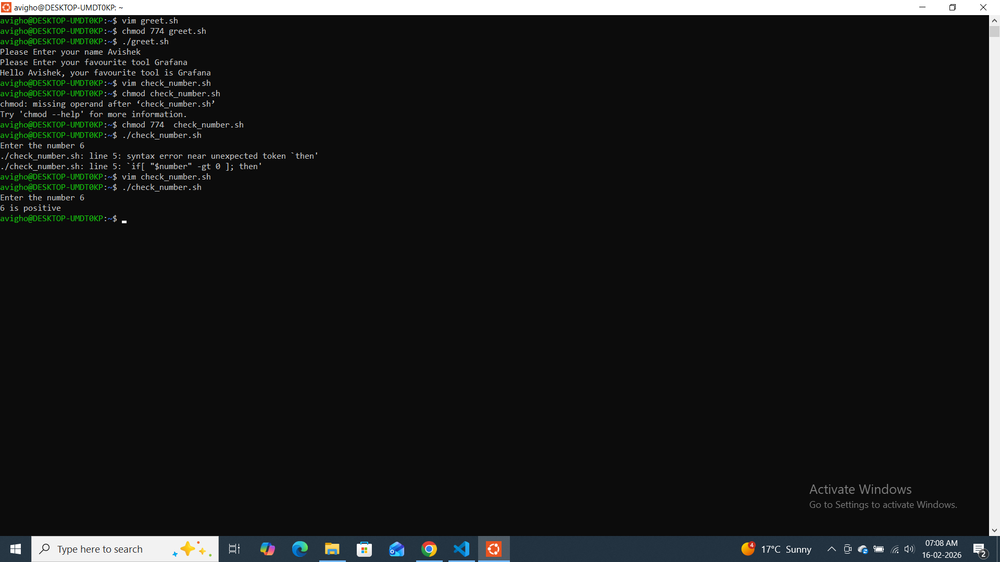
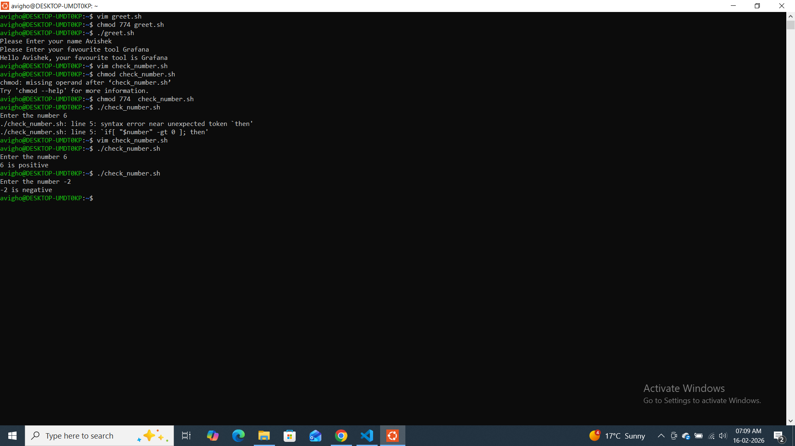
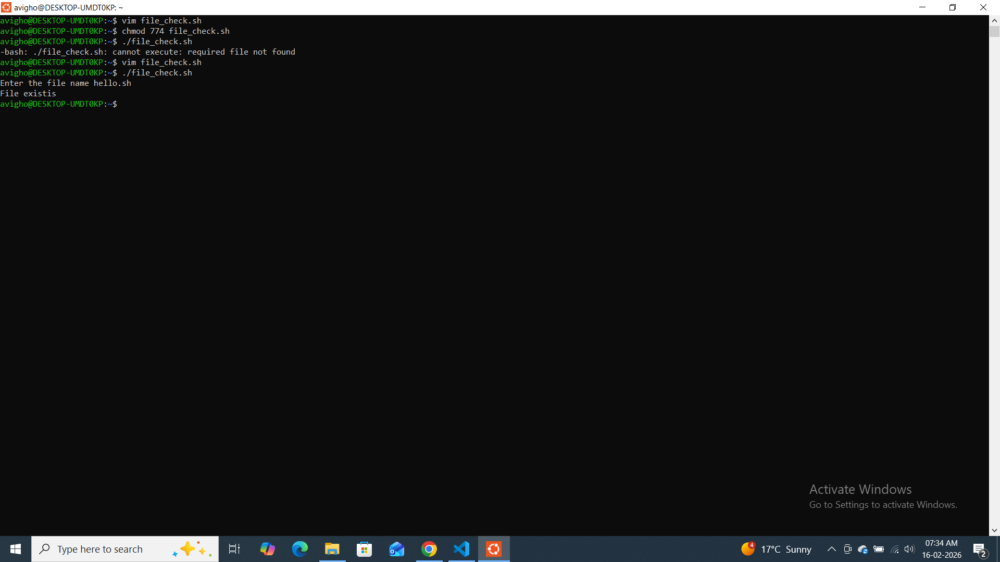

## Challenge Tasks

### Task 1: Your First Script

.png>)

what if i delete Shebang line ?
Removing the shebang did not cause any visible issue because the current shell (bash) executed the script. However, in different environments or when using bash-specific syntax, removing the shebang can cause unexpected behavior depending on the default shell.

### Task 2: Variables

when we print with Duble quotes

Allow variable expansion

Allow command substitution

Allow special characters like \n

when we print with single quote
echo 'Hello, I am $NAME and I am a $ROLE'
It prints variables literally.
Everything inside is treated as plain text

### Task 3: User Input with read
1. Create `check_number.sh` that:

### Task 4: If-Else Conditions

2. Create `file_check.sh` that:

### Task 5: Combine It All
