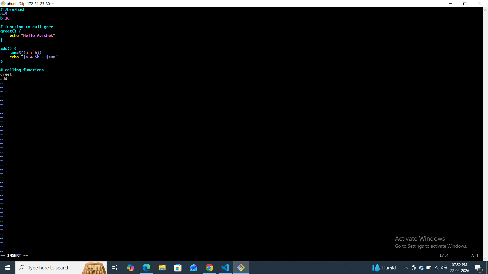
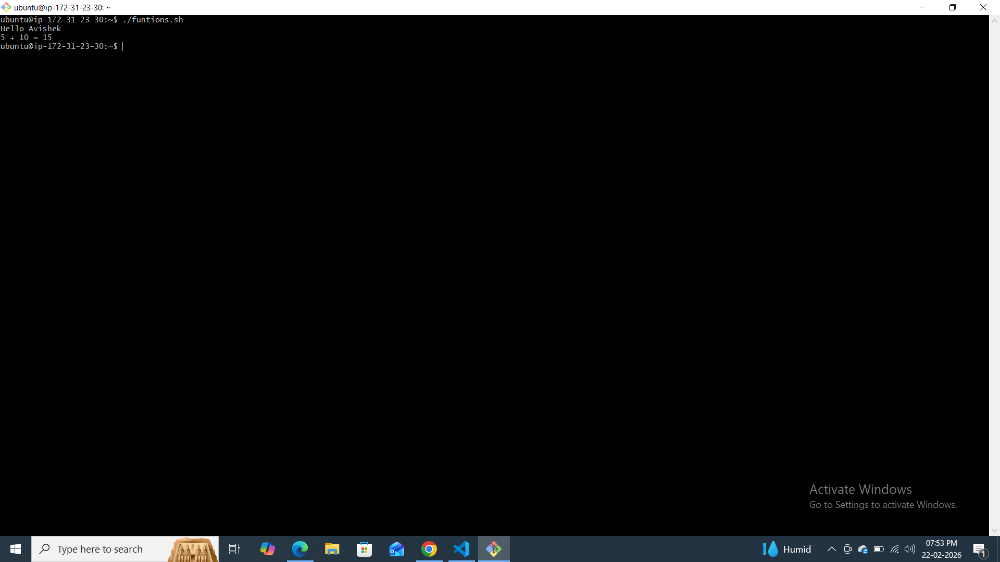
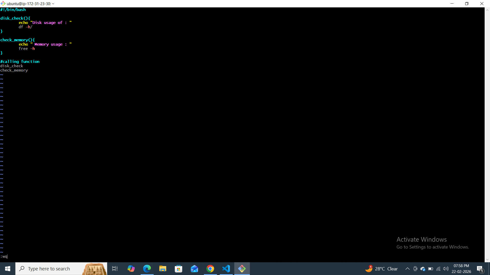
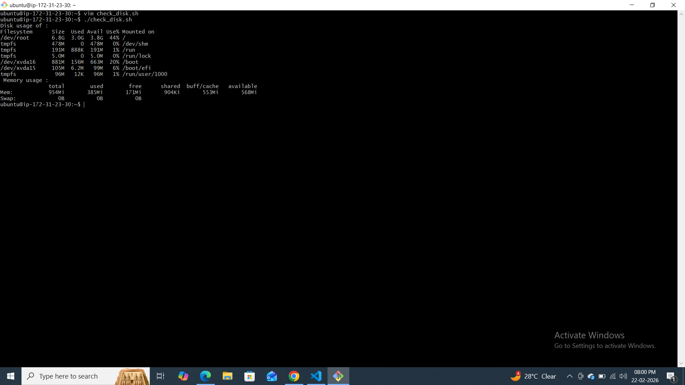
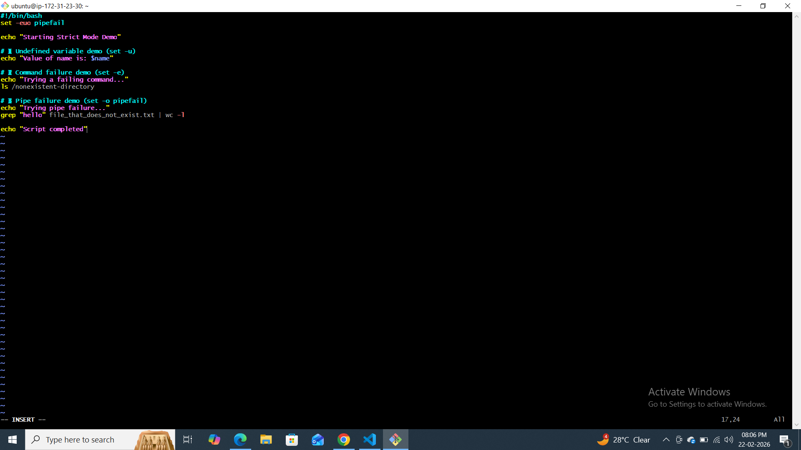
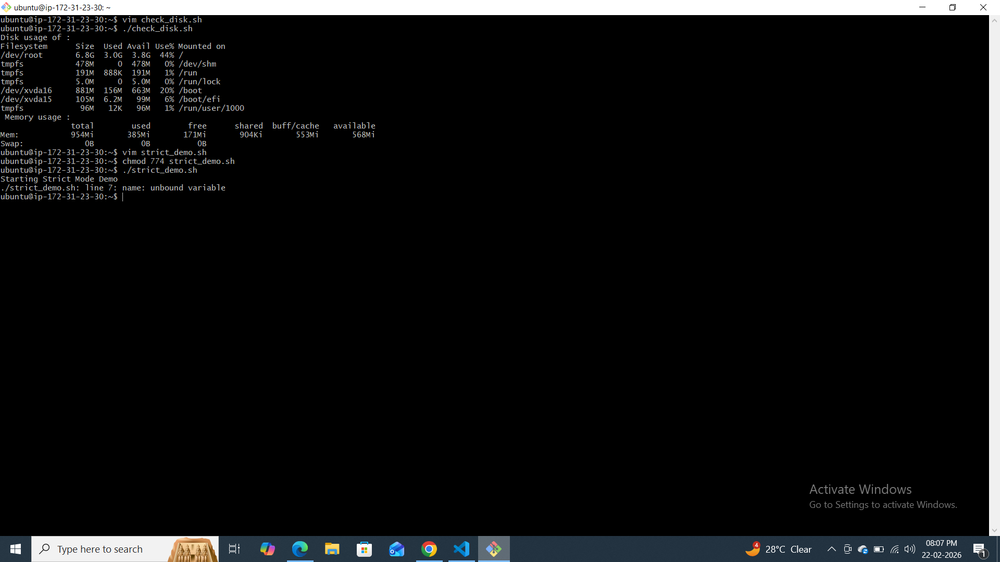
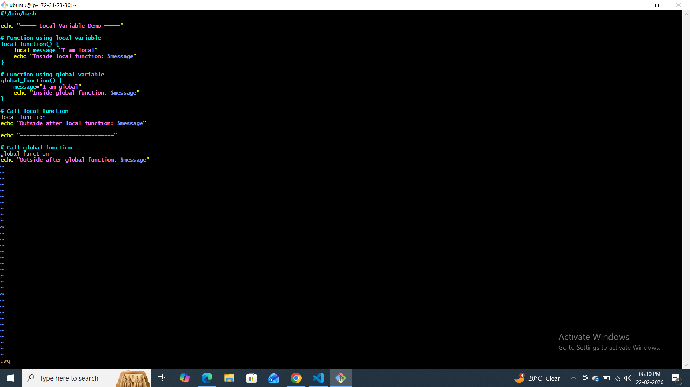
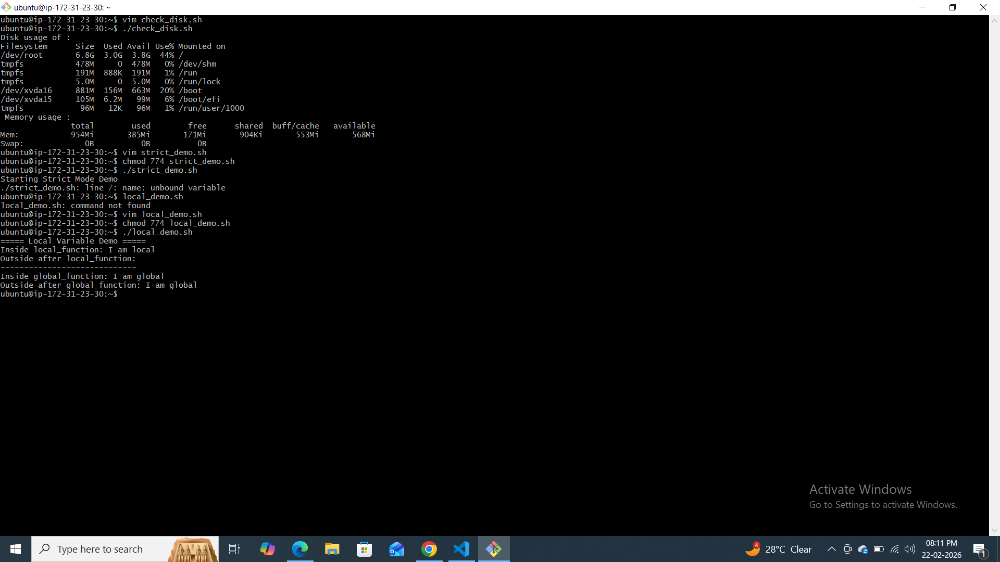
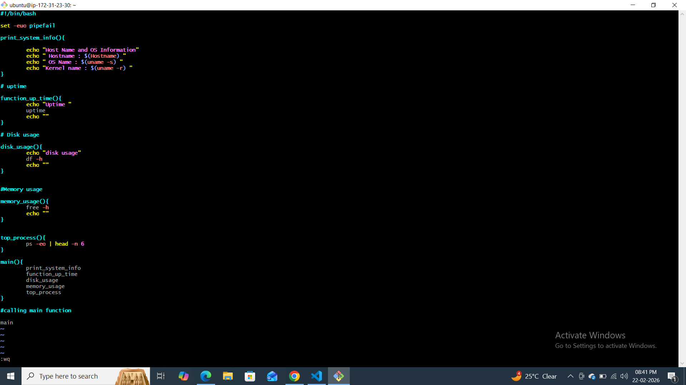
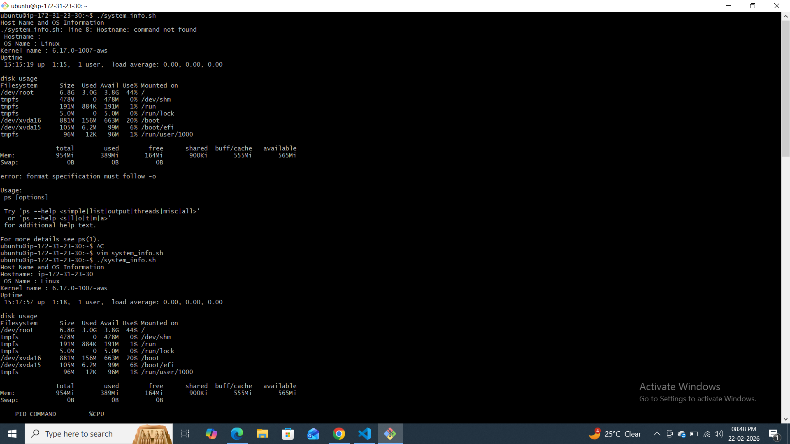

### Task 1: Basic Functions
1. Create `functions.sh` with:
   - A function `greet` that takes a name as argument and prints `Hello, <name>!`
   - A function `add` that takes two numbers and prints their sum
   - Call both functions from the script
#!/bin/bash
a=5
b=10

# function to call greet
greet() {
    echo "Hello Avishek"
}

add() {
    sum=$((a + b))
    echo "$a + $b = $sum"
}

# calling functions
greet
add

### Task 2: Functions with Return Values
1. Create `disk_check.sh` with:
   - A function `check_disk` that checks disk usage of `/` using `df -h`
   - A function `check_memory` that checks free memory using `free -h`
   - A main section that calls both and prints the results
   #!/bin/bash

disk_check(){
        echo "Disk usage of : "
        df -h
}

check_memory(){
        echo " Memory usage : "
        free -h
}

#calling function
disk_check
check_memory

   
   
### Task 3: Strict Mode — `set -euo pipefail`
1. Create `strict_demo.sh` with `set -euo pipefail` at the top
2. Try using an **undefined variable** — what happens with `set -u`?
3. Try a command that **fails** — what happens with `set -e`?
4. Try a **piped command** where one part fails — what happens with `set -o pipefail`?

**Document:** What does each flag do?
- `set -e` →
- `set -u` →
- `set -o pipefail` →
   #!/bin/bash
set -euo pipefail

echo "Starting Strict Mode Demo"

# 1️⃣ Undefined variable demo (set -u)
echo "Value of name is: $name"

# 2️⃣ Command failure demo (set -e)
echo "Trying a failing command..."
ls /nonexistent-directory

# 3️⃣ Pipe failure demo (set -o pipefail)
echo "Trying pipe failure..."
grep "hello" file_that_does_not_exist.txt | wc -l

echo "Script completed"

### Task 4: Local Variables
1. Create `local_demo.sh` with:
   - A function that uses `local` keyword for variables
   - Show that `local` variables don't leak outside the function
   - Compare with a function that uses regular variables
#!/bin/bash

echo "===== Local Variable Demo ====="

# Function using local variable
local_function() {
    local message="I am local"
    echo "Inside local_function: $message"
}

# Function using global variable
global_function() {
    message="I am global"
    echo "Inside global_function: $message"
}

# Call local function
local_function
echo "Outside after local_function: $message"

echo "-----------------------------"

# Call global function
global_function
echo "Outside after global_function: $message"

### Task 5: Build a Script — System Info Reporter
Create `system_info.sh` that uses functions for everything:
1. A function to print **hostname and OS info**
2. A function to print **uptime**
3. A function to print **disk usage** (top 5 by size)
4. A function to print **memory usage**
5. A function to print **top 5 CPU-consuming processes**
6. A `main` function that calls all of the above with section headers
7. Use `set -euo pipefail` at the top

#!/bin/bash

set -euo pipefail

print_system_info(){

        echo "Host Name and OS Information"
        echo "Hostname: $(hostname)"
        echo " OS Name : $(uname -s) "
        echo "Kernel name : $(uname -r) "
}

# uptime

function_up_time(){
        echo "Uptime "
        uptime
        echo ""
}

# Disk usage

disk_usage(){
        echo "disk usage"
        df -h
        echo ""
}

#Memory usage

memory_usage(){
        free -h
        echo ""
}

top_process(){
        ps -eo | head -n 6
}

main(){
        print_system_info
        function_up_time
        disk_usage
        memory_usage
        top_process
}

#calling main function

main

