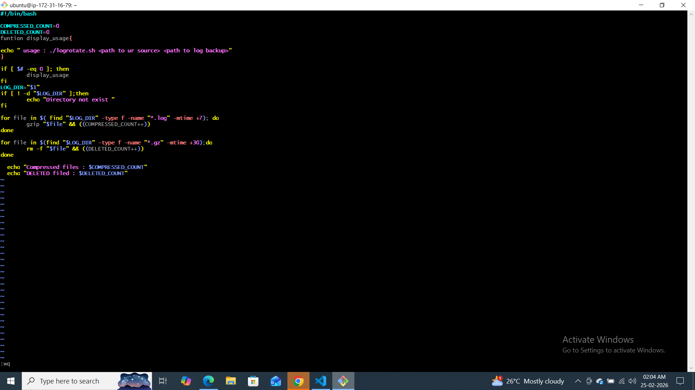
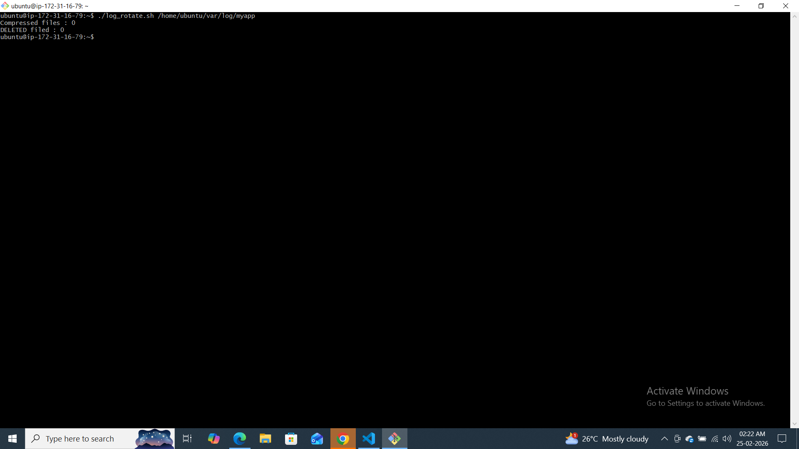
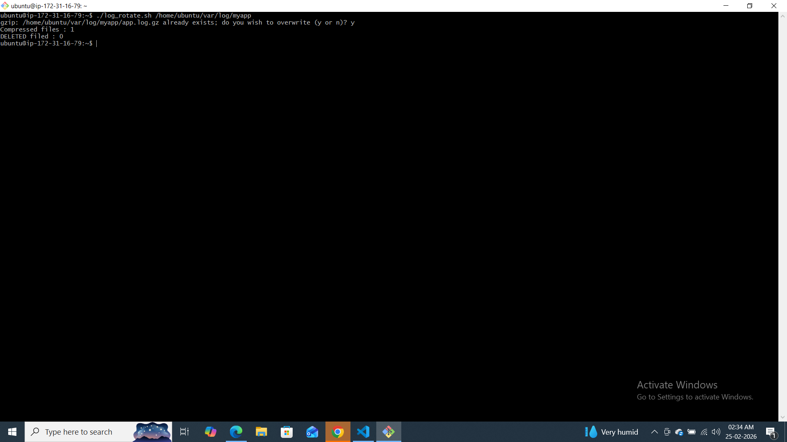
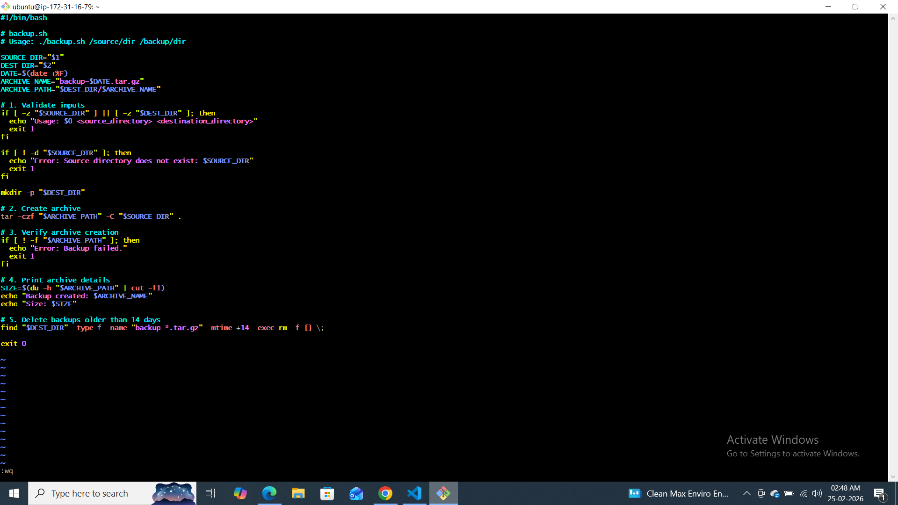
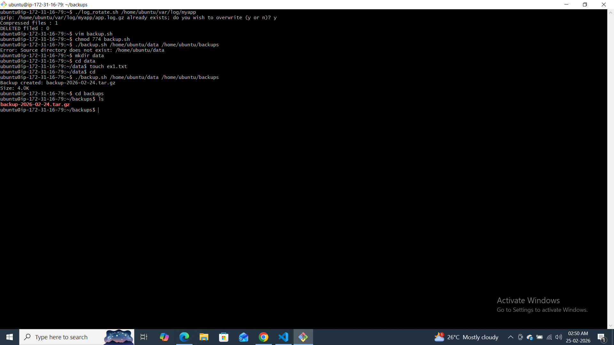
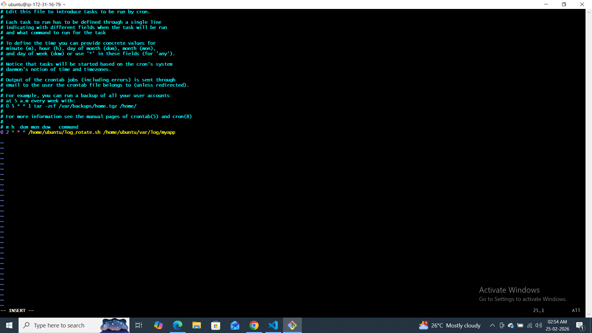
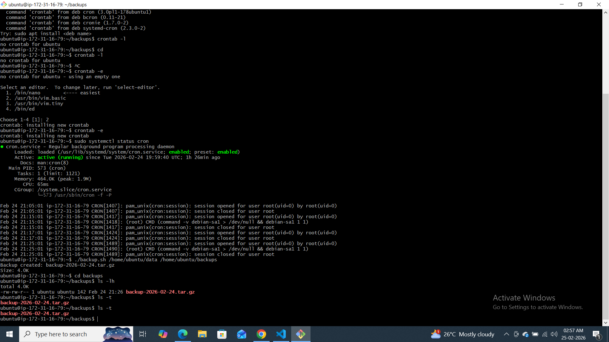
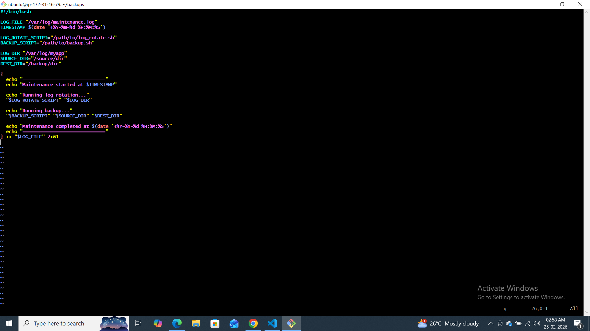
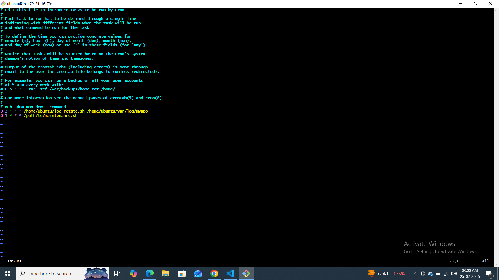

### Task 1: Log Rotation Script
Create `log_rotate.sh` that:
1. Takes a log directory as an argument (e.g., `/var/log/myapp`)
2. Compresses `.log` files older than 7 days using `gzip`
3. Deletes `.gz` files older than 30 days
4. Prints how many files were compressed and deleted
5. Exits with an error if the directory doesn't exist

#!/bin/bash

COMPRESSED_COUNT=0
DELETED_COUNT=0
funtion display_usage{

echo " usage : ./logrotate.sh <path to ur source> <path to log backup>"
}

if [ $# -eq 0 ]; then
        display_usage
fi
LOG_DIR="$1"
if [ ! -d "$LOG_DIR" ];then
        echo "Directory not exist "
        exit 1
fi

for file in $( find "$LOG_DIR" -type f -name "*.log" -mtime +7); do
        gzip "$file" && ((COMPRESSED_COUNT++))
done

for file in $(find "$LOG_DIR" -type f -name "*.gz" -mtime +30);do
        rm -f "$file" && ((DELETED_COUNT++))
done

  echo "Compressed files : $COMPRESSED_COUNT"
  echo "DELETED filed : $DELETED_COUNT"
  



### Task 2: Server Backup Script
Create `backup.sh` that:
1. Takes a source directory and backup destination as arguments
2. Creates a timestamped `.tar.gz` archive (e.g., `backup-2026-02-08.tar.gz`)
3. Verifies the archive was created successfully
4. Prints archive name and size
5. Deletes backups older than 14 days from the destination
6. Handles errors — exit if source doesn't exist
#!/bin/bash

# backup.sh
# Usage: ./backup.sh /source/dir /backup/dir

SOURCE_DIR="$1"
DEST_DIR="$2"
DATE=$(date +%F)
ARCHIVE_NAME="backup-$DATE.tar.gz"
ARCHIVE_PATH="$DEST_DIR/$ARCHIVE_NAME"

# 1. Validate inputs
if [ -z "$SOURCE_DIR" ] || [ -z "$DEST_DIR" ]; then
  echo "Usage: $0 <source_directory> <destination_directory>"
  exit 1
fi

if [ ! -d "$SOURCE_DIR" ]; then
  echo "Error: Source directory does not exist: $SOURCE_DIR"
  exit 1
fi

mkdir -p "$DEST_DIR"

# 2. Create archive
tar -czf "$ARCHIVE_PATH" -C "$SOURCE_DIR" . 

# 3. Verify archive creation
if [ ! -f "$ARCHIVE_PATH" ]; then
  echo "Error: Backup failed."
  exit 1
fi

# 4. Print archive details
SIZE=$(du -h "$ARCHIVE_PATH" | cut -f1)
echo "Backup created: $ARCHIVE_NAME"
echo "Size: $SIZE"

# 5. Delete backups older than 14 days
find "$DEST_DIR" -type f -name "backup-*.tar.gz" -mtime +14 -exec rm -f {} \;

exit 0


### Task 3: Crontab
1. Read: `crontab -l` — what's currently scheduled?
2. Understand cron syntax:
   ```
   * * * * *  command
   │ │ │ │ │
   │ │ │ │ └── Day of week (0-7)
   │ │ │ └──── Month (1-12)
   │ │ └────── Day of month (1-31)
   │ └──────── Hour (0-23)
   └────────── Minute (0-59)
   ```
3. Write cron entries (in your markdown, don't apply if unsure) for:
   - Run `log_rotate.sh` every day at 2 AM
   - Run `backup.sh` every Sunday at 3 AM
   - Run a health check script every 5 minutes
   
   

### Task 4: Combine — Scheduled Maintenance Script
Create `maintenance.sh` that:
1. Calls your log rotation function
2. Calls your backup function
3. Logs all output to `/var/log/maintenance.log` with timestamps
4. Write the cron entry to run it daily at 1 AM

#!/bin/bash

LOG_FILE="/var/log/maintenance.log"
TIMESTAMP=$(date '+%Y-%m-%d %H:%M:%S')

LOG_ROTATE_SCRIPT="/path/to/log_rotate.sh"
BACKUP_SCRIPT="/path/to/backup.sh"

LOG_DIR="/var/log/myapp"
SOURCE_DIR="/source/dir"
DEST_DIR="/backup/dir"

{
  echo "=============================="
  echo "Maintenance started at $TIMESTAMP"

  echo "Running log rotation..."
  "$LOG_ROTATE_SCRIPT" "$LOG_DIR"

  echo "Running backup..."
  "$BACKUP_SCRIPT" "$SOURCE_DIR" "$DEST_DIR"

  echo "Maintenance completed at $(date '+%Y-%m-%d %H:%M:%S')"
  echo "=============================="
} >> "$LOG_FILE" 2>&1

   
   