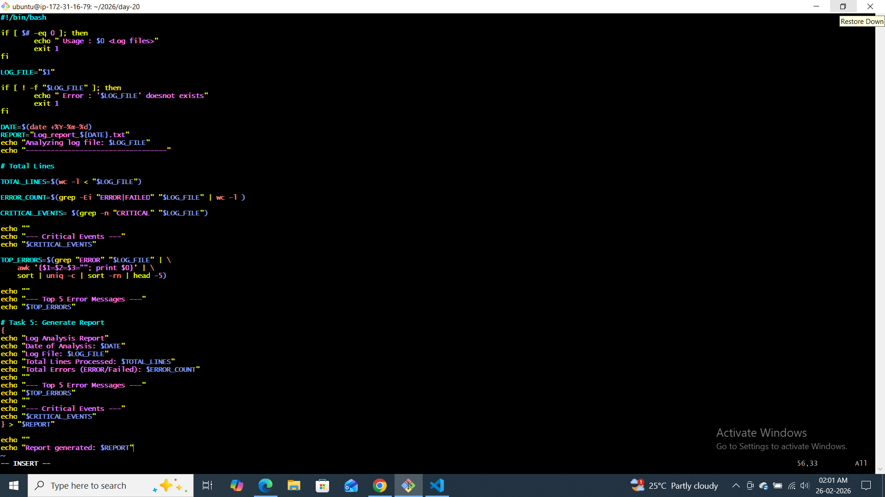
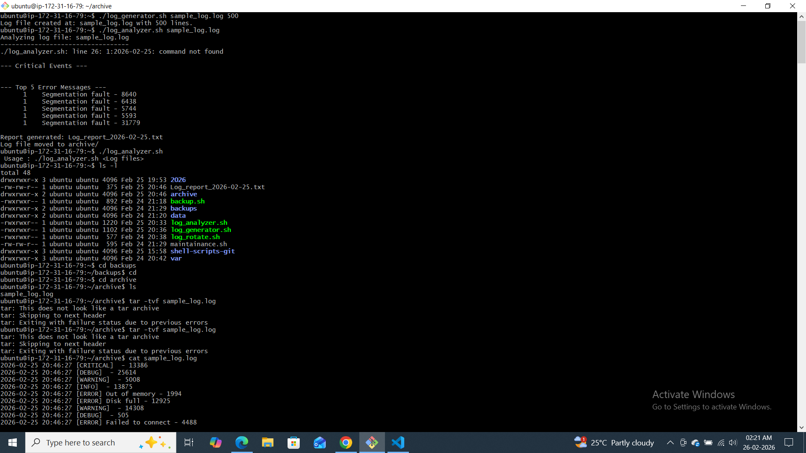
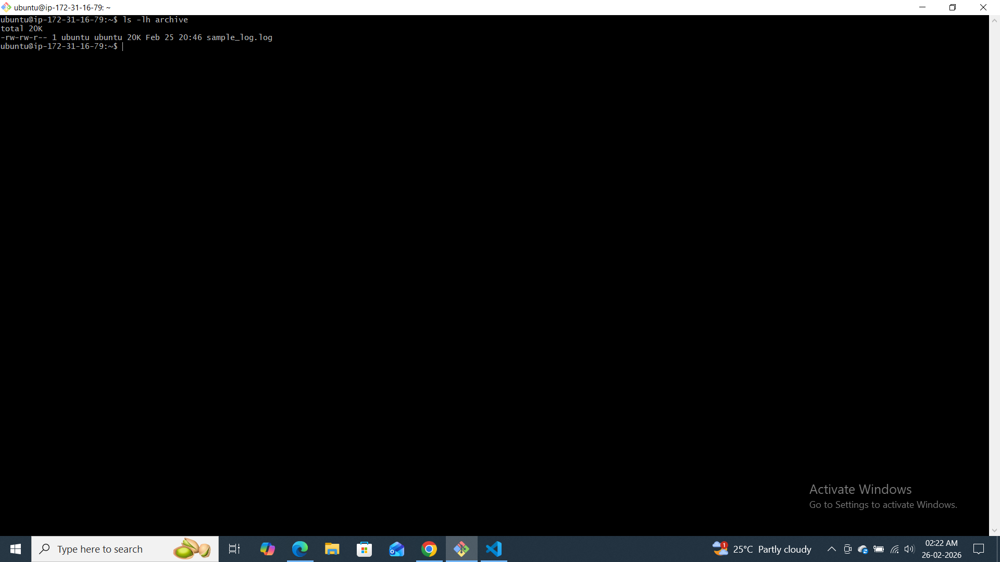
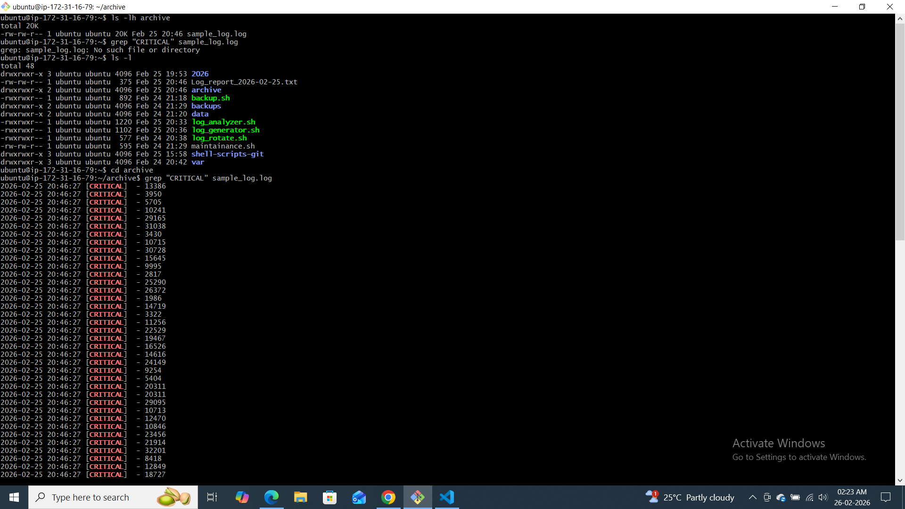
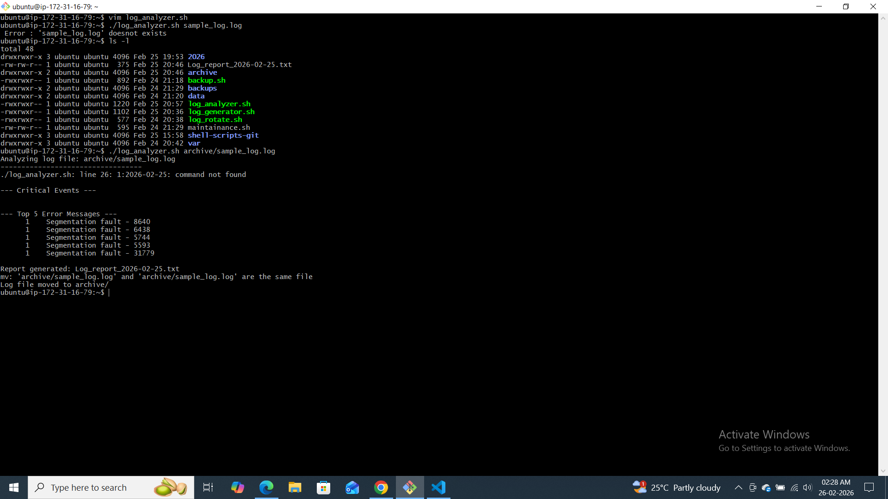
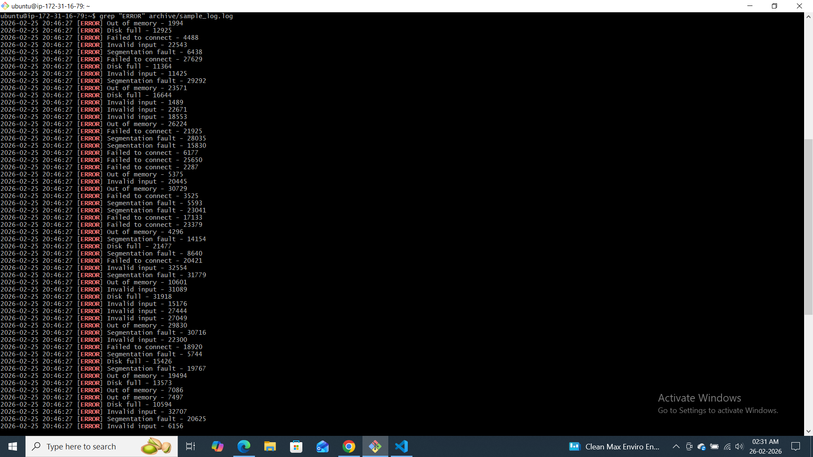
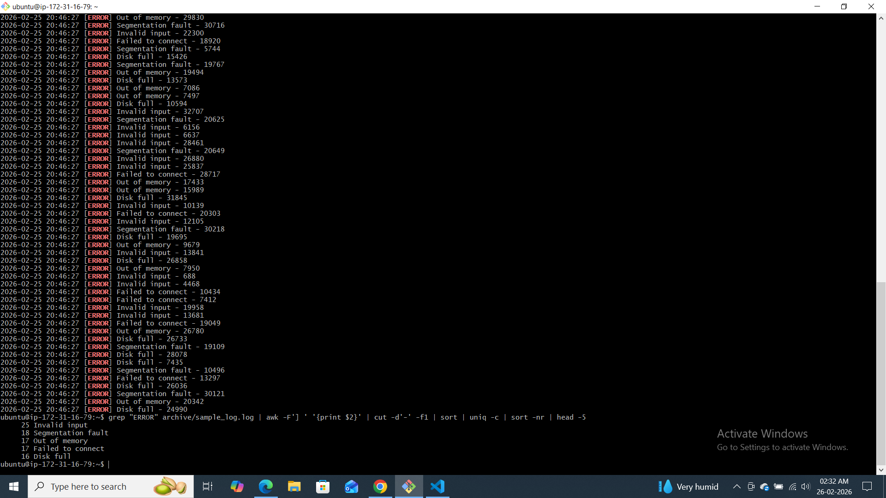

 Day-20 challange

 ### Task 1: Input and Validation
Your script should:
1. Accept the path to a log file as a command-line argument
2. Exit with a clear error message if no argument is provided
3. Exit with a clear error message if the file doesn't exist
#!/bin/bash

if [ $# -eq 0 ]; then
        echo " Usage : $0 <Log files>"
        exit 1
fi

LOG_FILE="$1"

if [ ! -f "$LOG_FILE" ]; then
        echo " Error : '$LOG_FILE' doesnot exists"
        exit 1
fi

DATE=$(date +%Y-%m-%d)
REPORT="Log_report_${DATE}.txt"
echo "Analyzing log file: $LOG_FILE"
echo "----------------------------------"

# Total Lines

TOTAL_LINES=$(wc -l < "$LOG_FILE")

ERROR_COUNT=$(grep -Ei "ERROR|FAILED" "$LOG_FILE" | wc -l )

CRITICAL_EVENTS= $(grep -n "CRITICAL" "$LOG_FILE")

echo ""
echo "--- Critical Events ---"
echo "$CRITICAL_EVENTS"

TOP_ERRORS=$(grep "ERROR" "$LOG_FILE" | \
    awk '{$1=$2=$3=""; print $0}' | \
    sort | uniq -c | sort -rn | head -5)

echo ""
echo "--- Top 5 Error Messages ---"
echo "$TOP_ERRORS"

# Task 5: Generate Report
{
echo "Log Analysis Report"
echo "Date of Analysis: $DATE"
echo "Log File: $LOG_FILE"
echo "Total Lines Processed: $TOTAL_LINES"
echo "Total Errors (ERROR/Failed): $ERROR_COUNT"
echo ""
echo "--- Top 5 Error Messages ---"
echo "$TOP_ERRORS"
echo ""
echo "--- Critical Events ---"
echo "$CRITICAL_EVENTS"
} > "$REPORT"

echo ""
echo "Report generated: $REPORT"
# Task 6 (Optional): Archive
mkdir -p archive
mv "$LOG_FILE" archive/
echo "Log file moved to archive/"

### Task 2: Error Count
1. Count the total number of lines containing the keyword `ERROR` or `Failed`
2. Print the total error count to the console

### Task 3: Critical Events
1. Search for lines containing the keyword `CRITICAL`
2. Print those lines along with their line number

### Task 4: Top Error Messages
1. Extract all lines containing `ERROR`
2. Identify the **top 5 most common** error messages
3. Display them with their occurrence count, sorted in descending order

