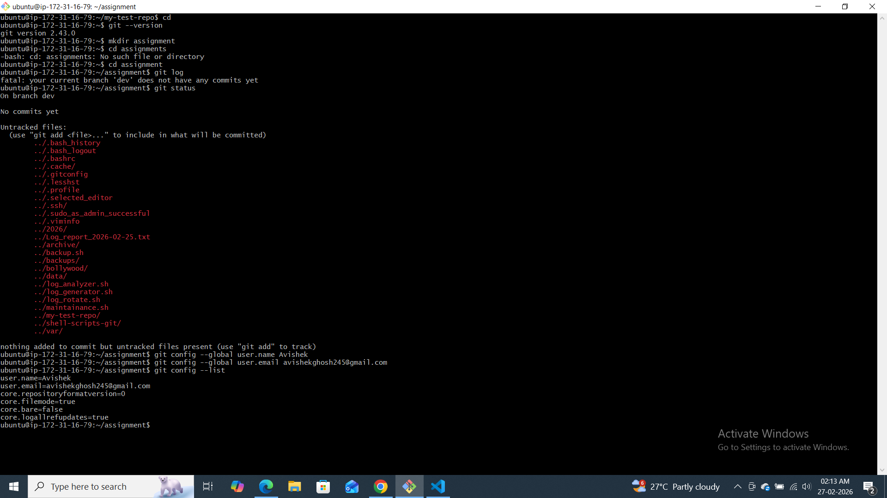
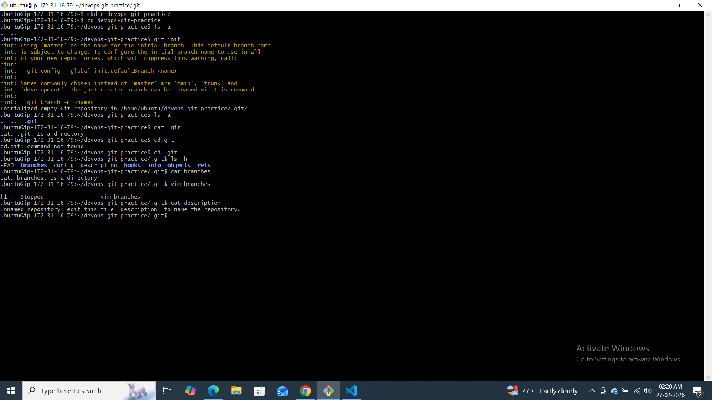
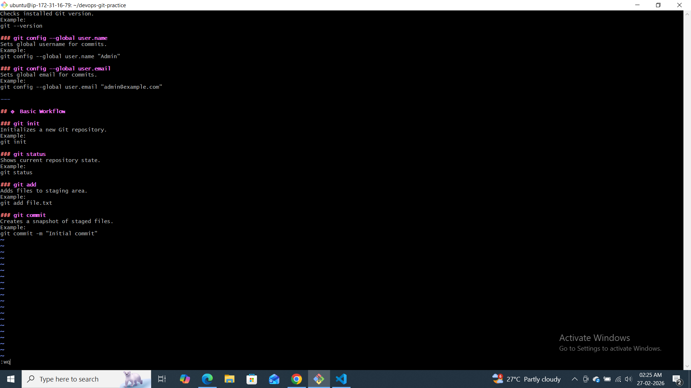
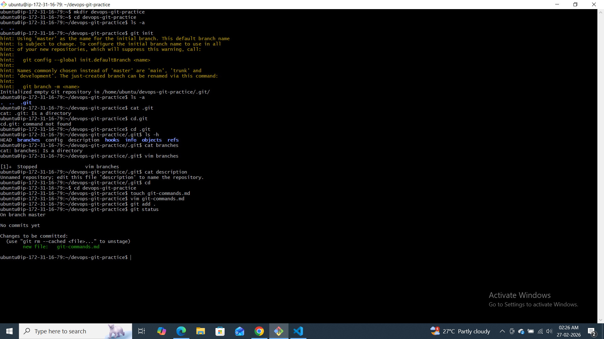
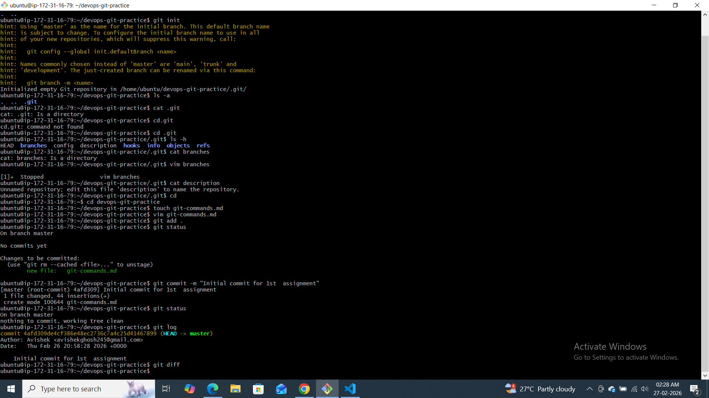
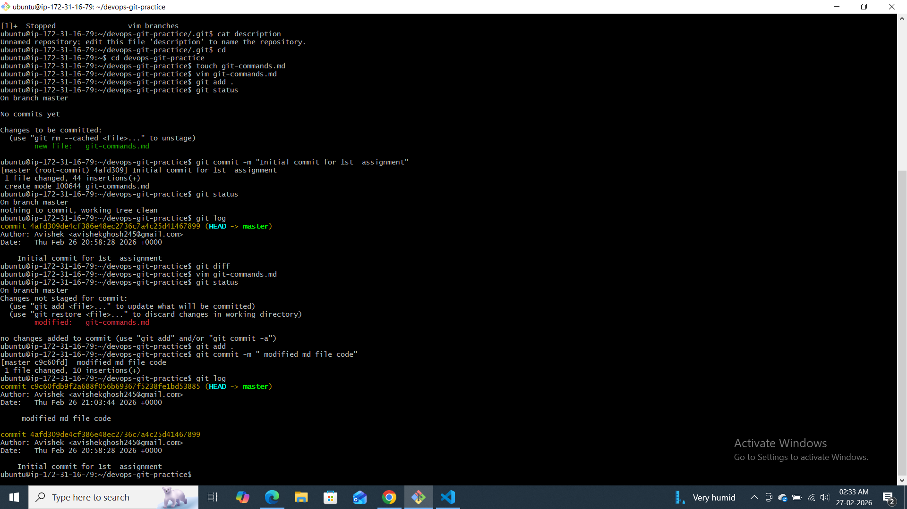

# Day 22 – Introduction to Git: Your First Repository
## Challenge Tasks

### Task 1: Install and Configure Git
1. Verify Git is installed on your machine
2. Set up your Git identity — name and email
3. Verify your configuration
commands used here is:
git --version
git config --global user.name <name>
git congfig --global user.email<email>
git config --list

----------

### Task 2: Create Your Git Project
1. Create a new folder called `devops-git-practice`
2. Initialize it as a Git repository
3. Check the status — read and understand what Git is telling you
4. Explore the hidden `.git/` directory — look at what's inside

--------------
### Task 3: Create Your Git Commands Reference
1. Create a file called `git-commands.md` inside the repo
2. Add the Git commands you've used so far, organized by category:
   - **Setup & Config**
   - **Basic Workflow**
   - **Viewing Changes**
3. For each command, write:
   - What it does (1 line)
   - An example of how to use it

-----

### Task 4: Stage and Commit
1. Stage your file
2. Check what's staged
3. Commit with a meaningful message
4. View your commit history
command used :
to staged git add .
to commit : git commit -m "Initial commit for assignment"

-----

### Task 5: Make More Changes and Build History
1. Edit `git-commands.md` — add more commands as you discover them
2. Check what changed since your last commit
3. Stage and commit again with a different, descriptive message
4. Repeat this process at least **3 times** so you have multiple commits in your history
5. View the full history in a compact format

--------

