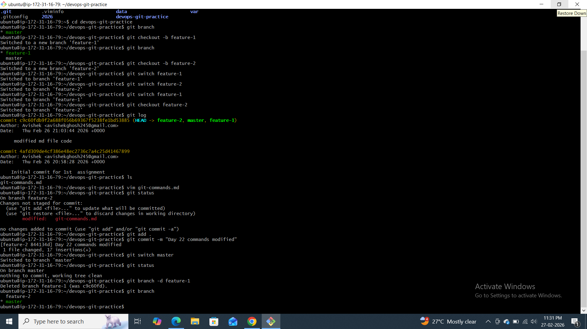
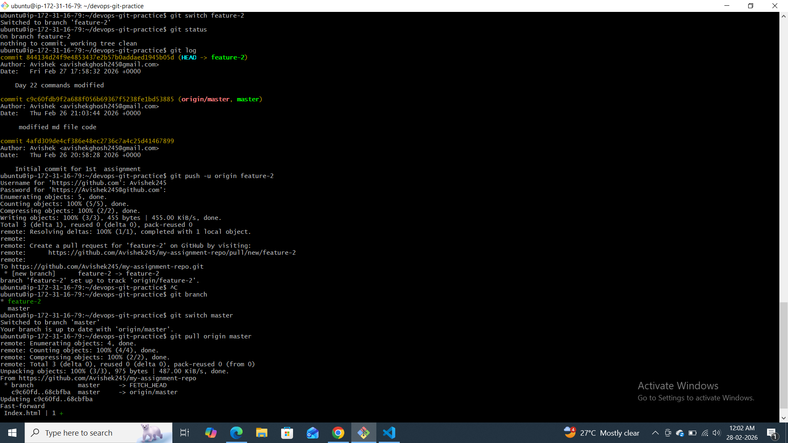
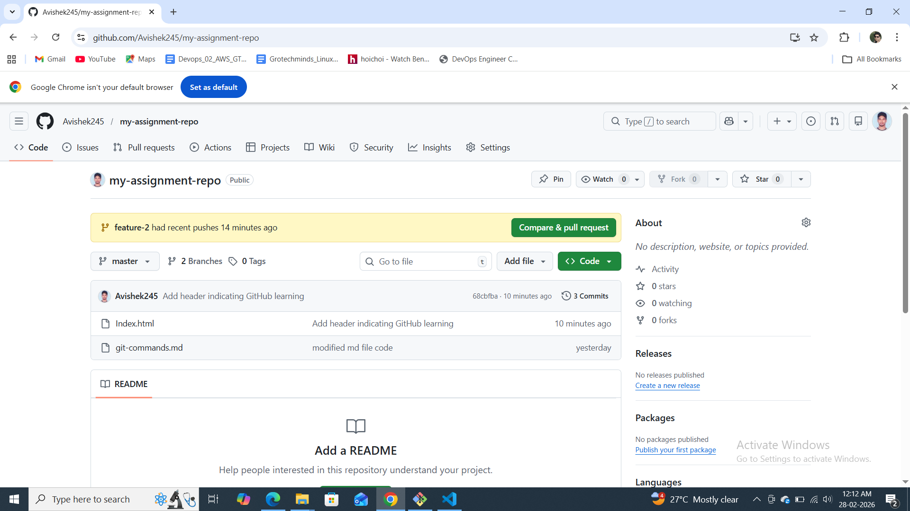

Day 22 challange 

1️⃣ What is a branch in Git?

A branch in Git is a lightweight pointer to a specific commit.

It allows you to:

Work on new features

Fix bugs

Experiment with changes

Without affecting the main codebase.

By default, Git creates a branch called main (or sometimes master).

You can think of a branch like a separate version of your project where you can safely make changes.

2️⃣ Why do we use branches instead of committing everything to main?

We use branches because:

✅ To keep main stable and production-ready

✅ To develop features independently

✅ To fix bugs without breaking working code

✅ To allow multiple developers to work simultaneously

If everyone commits directly to main:

Code can break easily

It becomes hard to track changes

Collaboration becomes risky

Branches help maintain a clean and organized workflow.

3️⃣ What is HEAD in Git?

HEAD is a special pointer in Git.

It points to:

The current branch

And the latest commit on that branch

For example:

If you are on main, HEAD points to the latest commit of main.

If you switch to feature-login, HEAD moves to that branch.

So basically:

👉 HEAD tells Git “where you currently are”.

4️⃣ What happens to your files when you switch branches?

When you switch branches:

Git updates your working directory

Files change to match the state of the selected branch

Files that exist in one branch but not in another may appear or disappear

Example:

If feature-1 has a new file, switching to that branch will show the file.

If main doesn’t have that file, switching back will remove it from your working directory.

⚠️ Important:
If you have uncommitted changes, Git may prevent you from switching branches to avoid losing work.






---

### Task 5: Clone vs Fork

1. **Clone** any public repository from GitHub to your local machine
2. **Fork** the same repository on GitHub, then clone your fork

**What is the difference between clone and fork?**

- *Clone* creates a local copy of an existing repository (URL) on your machine. It downloads all commits, branches, and history but remains tied to the original repo as the remote (often `origin`).
- *Fork* is a GitHub-specific action that makes a separate copy of the repository under your own GitHub account. It allows you to make changes without affecting the upstream project.

**When would you clone vs fork?**

- Clone when you just need to work locally on a repo you already have access to (e.g., your own projects or a repo you contribute to directly).
- Fork when you want to propose changes to someone else’s project and you don’t have push rights to the original. Fork gives you your own remote to push to and then you can open pull requests.

**After forking, how do you keep your fork in sync with the original repo?**

- Add the original repository as a new remote (commonly named `upstream`).
  ```bash
  git remote add upstream https://github.com/original/owner.git
  git fetch upstream
  git checkout main
  git merge upstream/main
  ```
- Or use `git pull upstream main` to fetch and merge in one step.
- Push the updated local branch back to your fork (`git push origin main`).

These commands keep your forked copy up to date with the source repository.
