# Day 24 – Advanced Git: Merge, Rebase, Stash & Cherry Pick
## Challenge Tasks

### Task 1: Git Merge — Hands-On
1. Create a new branch `feature-login` from `main`, add a couple of commits to it
2. Switch back to `main` and merge `feature-login` into `main`
3. Observe the merge — did Git do a **fast-forward** merge or a **merge commit**?
4. Now create another branch `feature-signup`, add commits to it — but also add a commit to `main` before merging
5. Merge `feature-signup` into `main` — what happens this time?
6. Answer in your notes:
   - What is a fast-forward merge?
   - When does Git create a merge commit instead?
   - What is a merge conflict? (try creating one intentionally by editing the same line in both branches)
   📘 Now Answer the Questions (Write This in Notes)
1️⃣ What is a Fast-Forward Merge?

A fast-forward merge happens when:

The main branch has no new commits

Git simply moves the branch pointer forward

No new merge commit is created.

In your first merge:

Updating 68cbfba..c1b0f1e
Fast-forward

Git just moved master forward.

2️⃣ When does Git create a merge commit?

Git creates a merge commit when:

Both branches have new commits

Their histories have diverged

Git must combine them → so it creates a new commit.

3️⃣ What is a Merge Conflict?

A merge conflict happens when:

The same file

Same line

Is modified differently in two branches

Git does not know which change to keep.
   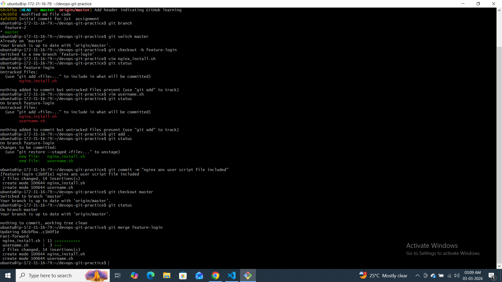
   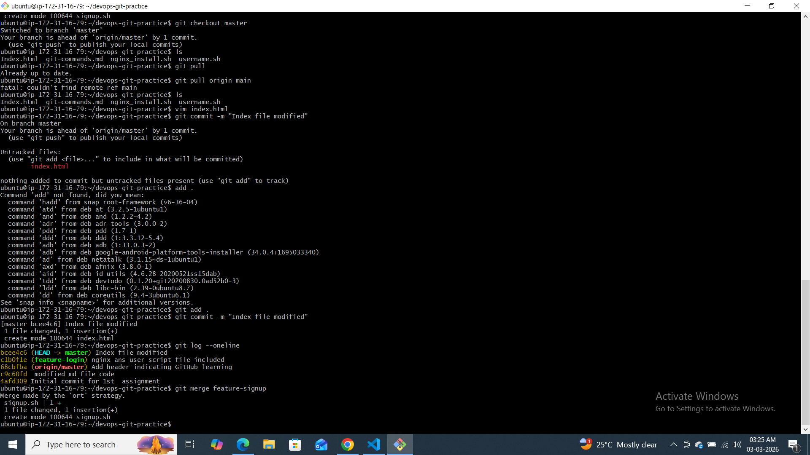

### Task 2: Git Rebase — Hands-On
1. Create a branch `feature-dashboard` from `main`, add 2-3 commits
2. While on `main`, add a new commit (so `main` moves ahead)
3. Switch to `feature-dashboard` and rebase it onto `main`
4. Observe your `git log --oneline --graph --all` — how does the history look compared to a merge?
1️⃣ What does rebase actually do?

Rebase:

Takes your feature branch commits

Temporarily removes them

Moves branch to latest master

Reapplies your commits on top

It rewrites commit history.

2️⃣ How is history different from merge?

Merge:

Creates a merge commit
History shows branches

Rebase:

Rewrites history
Creates linear history
No merge commit
3️⃣ Why should you NEVER rebase pushed commits?

Because:

Rebase changes commit IDs (SHA changes)

Other developers already have old history

Causes conflicts & broken history

Rule:
✅ Rebase only local commits
❌ Never rebase shared/public branch

4️⃣ When to use rebase vs merge?
🔹 Use Rebase:

Before pushing feature branch

To clean history

To keep project linear

🔹 Use Merge:

In shared branches

When collaborating

When preserving branch history is important
   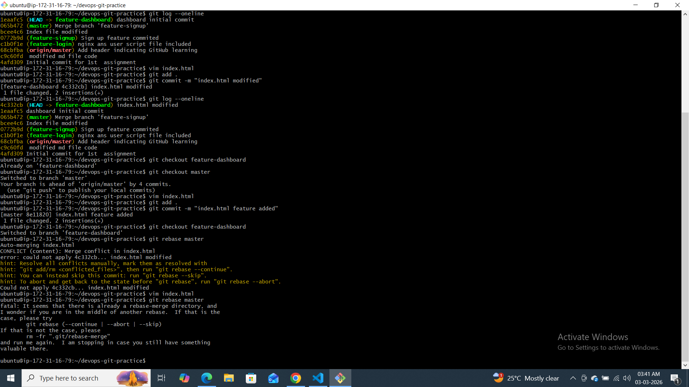
   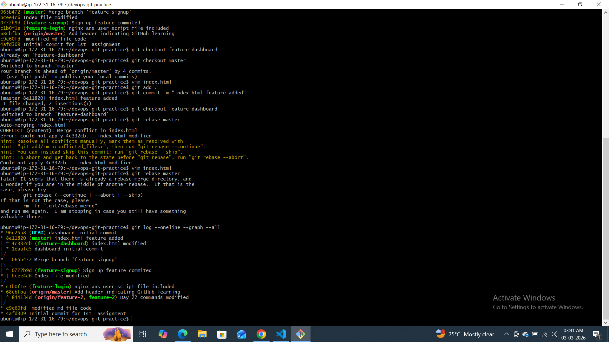

---

### Task 3: Squash Commit vs Merge Commit
1. Create a branch `feature-profile`, add 4-5 small commits (typo fix, formatting, etc.)
2. Merge it into `main` using `--squash` — what happens?
3. Check `git log` — how many commits were added to `main`?
4. Now create another branch `feature-settings`, add a few commits
5. Merge it into `main` **without** `--squash` (regular merge) — compare the history
1️⃣ What does squash merging do?

Squash merge:

Combines all commits from feature branch

Creates ONE single commit in main

Keeps history clean

It does NOT preserve commit-by-commit history.

2️⃣ When to use squash merge vs regular merge?
✅ Use Squash Merge:

Many small messy commits

“Fix typo”, “debug”, “test” commits

Want clean project history

Pull Requests in GitHub (very common)

✅ Use Regular Merge:

Want to preserve commit history

Important development steps

Team collaboration

When debugging needs full history

3️⃣ What is the Trade-off?
Squash Pros:

✔ Clean history
✔ Easy to read
✔ Professional looking log

Squash Cons:

❌ Lose detailed commit history
❌ Harder to track step-by-step changes
   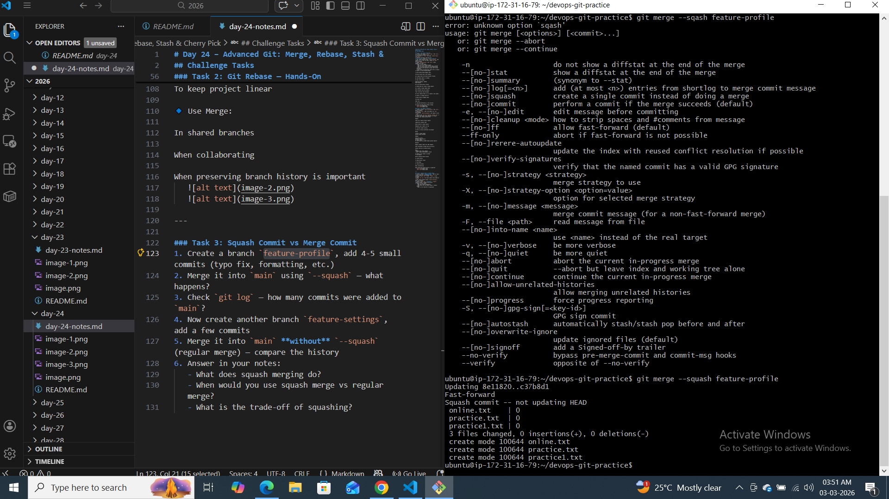
   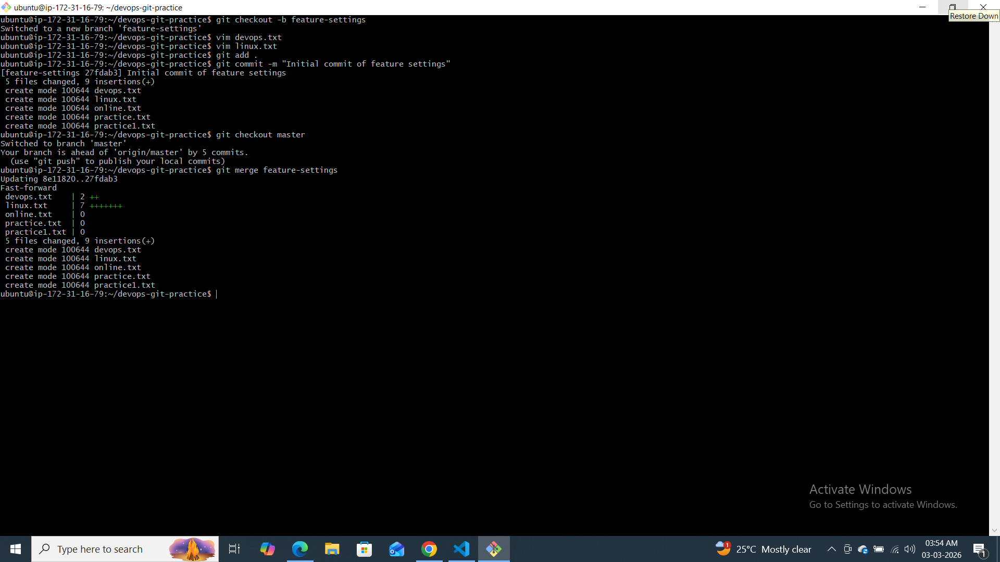

   ### Task 4: Git Stash — Hands-On
1. Start making changes to a file but **do not commit**
2. Now imagine you need to urgently switch to another branch — try switching. What happens?
3. Use `git stash` to save your work-in-progress
4. Switch to another branch, do some work, switch back
5. Apply your stashed changes using `git stash pop`
6. Try stashing multiple times and list all stashes
7. Try applying a specific stash from the list
git stash apply

Applies the stashed changes

Keeps the stash saved

You can reuse it again

Example:

git stash apply

After this:

Changes are restored

Stash still exists in git stash list

🔹 git stash pop

Applies the stashed changes

Deletes the stash after applying

Example:

git stash pop

After this:

Changes are restored

Stash is removed from stash list
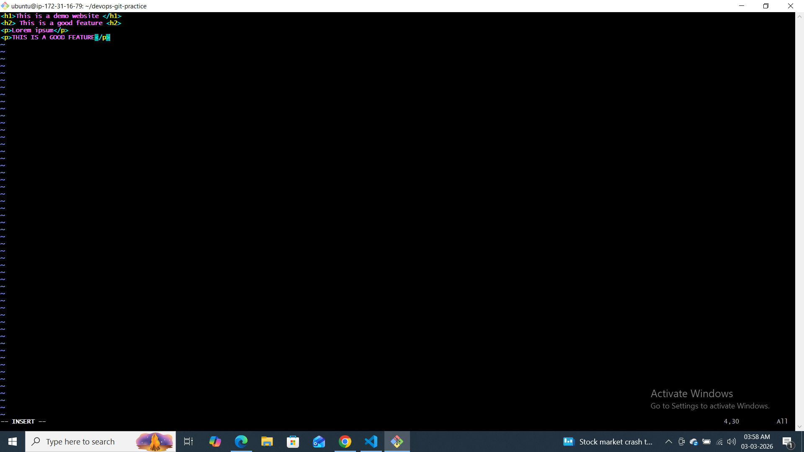
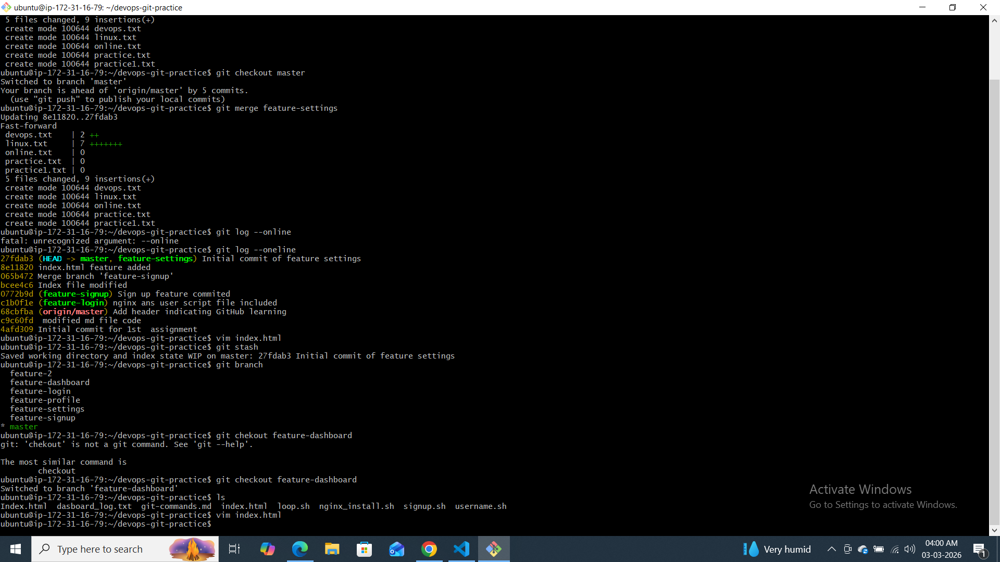
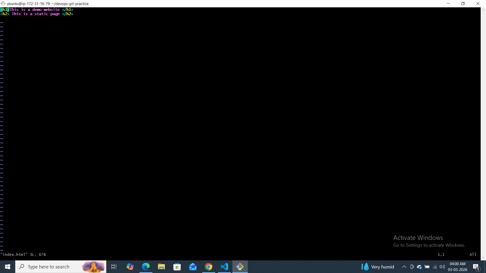
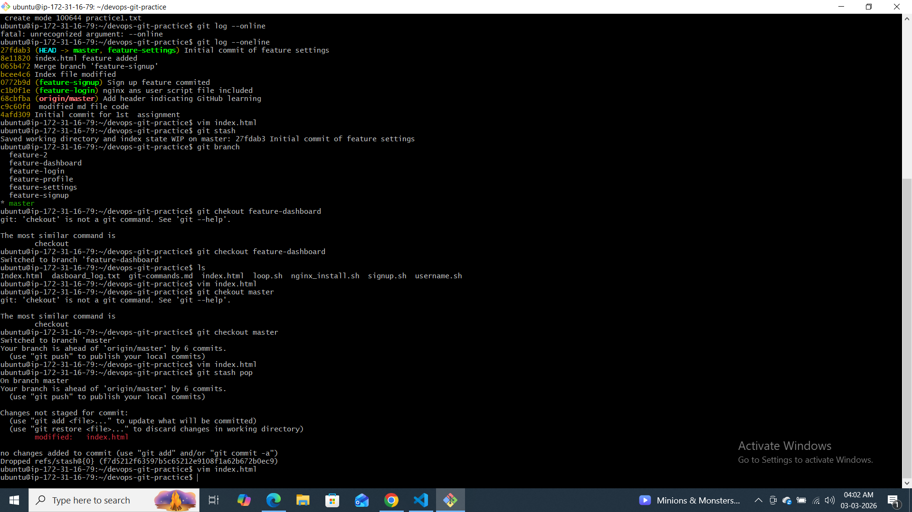
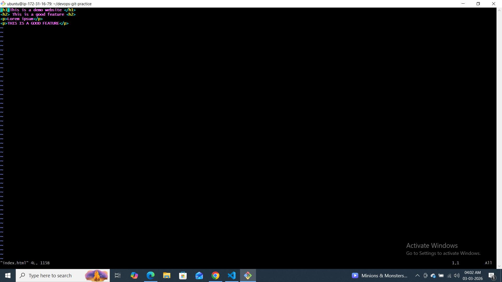
---

### Task 5: Cherry Picking
1. Create a branch `feature-hotfix`, make 3 commits with different changes
2. Switch to `main`
3. Cherry-pick **only the second commit** from `feature-hotfix` onto `main`
4. Verify with `git log` that only that one commit was applied
5. Answer in your notes:
   - What does cherry-pick do?
   - When would you use cherry-pick in a real project?
   - What can go wrong with cherry-picking?
   What does git cherry-pick do?

git cherry-pick:

👉 Takes one specific commit from another branch
👉 Applies it to your current branch
👉 Creates a new commit with a new commit ID

It copies the change — not the branch.

Example:

git cherry-pick <commit-id>

So instead of merging the whole branch, you bring only one commit.

📌 2️⃣ When would you use cherry-pick in a real project?
🔹 Scenario 1: Bug Fix in Production

You fixed a bug in develop branch.

Now production (main) also needs that fix.

Instead of merging everything:

git checkout main
git cherry-pick <bug-fix-commit-id>

You move only the bug fix.

🔹 Scenario 2: Accidentally committed to wrong branch

You committed on main by mistake.

You can:

git checkout correct-branch
git cherry-pick <commit-id>

Then reset main.

🔹 Scenario 3: Selective feature reuse

You want only one improvement from another branch,
not the whole feature.

📌 3️⃣ What can go wrong with cherry-picking?
❌ 1. Merge Conflicts

If code has changed in current branch,
you may get conflicts.

You must:

# fix file
git add .
git cherry-pick --continue

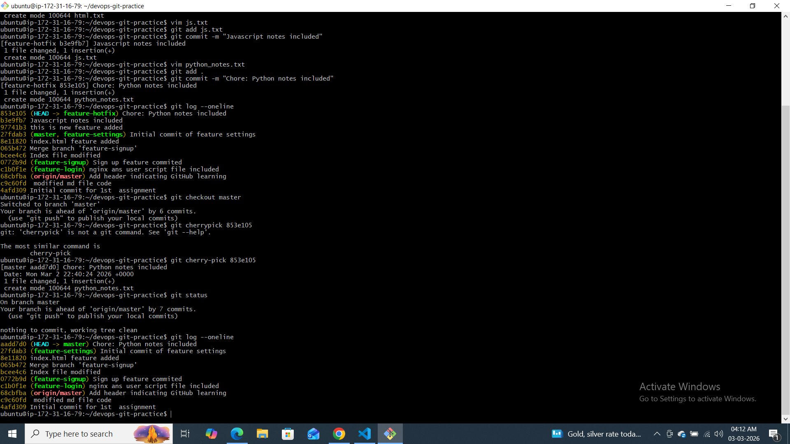
---