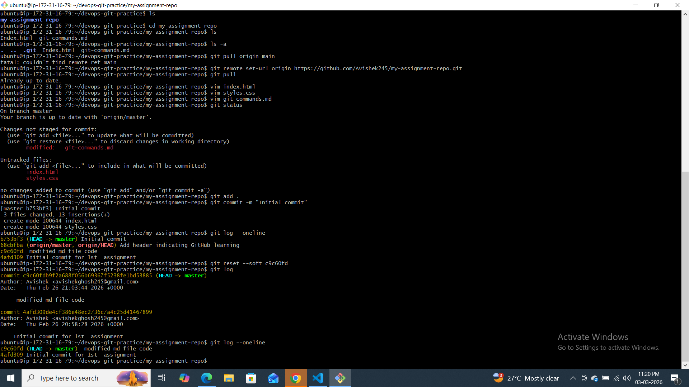
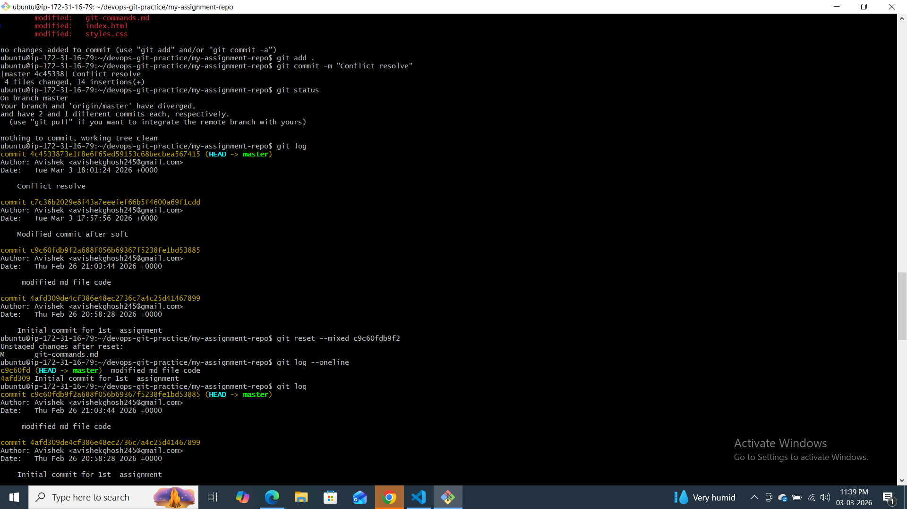
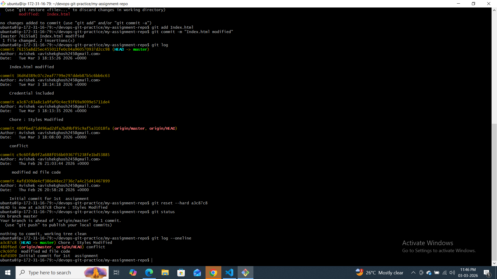
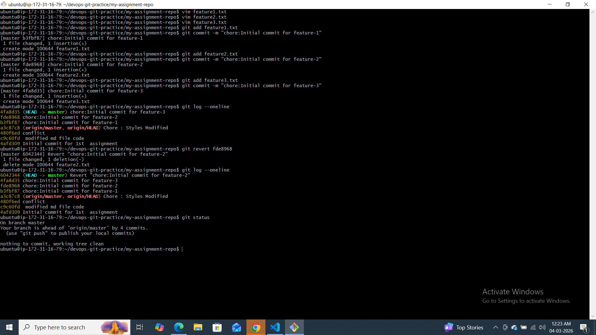

# Day 25 – Git Reset vs Revert & Branching Strategies

## Challenge Tasks

### Task 1: Git Reset — Hands-On
1. Make 3 commits in your practice repo (commit A, B, C)
2. Use `git reset --soft` to go back one commit — what happens to the changes?
3. Re-commit, then use `git reset --mixed` to go back one commit — what happens now?
4. Re-commit, then use `git reset --hard` to go back one commit — what happens this time?
5. Answer in your notes:
   - **What is the difference between `--soft`, `--mixed`, and `--hard`?**
     * `--soft` moves only `HEAD`; the index and working tree stay the same, effectively unstaging the last commit but keeping changes staged.
     * `--mixed` (the default) moves `HEAD` and resets the index to match it, leaving the working tree untouched so changes remain in files but are unstaged.
     * `--hard` moves `HEAD`, resets the index, and updates the working tree to match the target commit, discarding all local changes.
   - **Which one is destructive and why?**
     * `--hard` is destructive because it throws away both staged and working-directory modifications; uncommitted work is lost.
   - **When would you use each one?**
     1. Use `--soft` when you want to undo a commit but keep the changes staged for an amended commit or to combine with other edits.
     2. Use `--mixed` when you need to un‑commit and un‑stage changes but still work on them in the files.
     3. Use `--hard` when you want to abandon all local modifications and revert completely to a known good commit (e.g. after an experiment that failed).
   - **Should you ever use `git reset` on commits that are already pushed?**
     * Generally not—rewriting public history can confuse collaborators. If you must, coordinate carefully and force‑push, but prefer `git revert` for shared branches.





---

### Task 2: Git Revert — Hands-On
1. Make 3 commits (commit X, Y, Z)
2. Revert commit Y (the middle one) — what happens?
3. Check `git log` — is commit Y still in the history?
4. Answer in your notes:
   - **How is `git revert` different from `git reset`?**
     * `git revert` creates a new commit that undoes the changes introduced by a previous commit, leaving the original commit in history.  `git reset` moves the branch pointer to an earlier commit and (depending on the mode) may alter the index and working tree, effectively rewriting history.
   - **Why is revert considered **safer** than reset for shared branches?**
     * Revert does not rewrite existing commits; it adds a new commit, so collaborators’ history stays intact. Reset, by changing branch history, forces others to reconcile diverging histories when they’ve already pulled.
   - **When would you use revert vs reset?**
     * Use revert on public/shared branches where you need to back out a change without disturbing history. Use reset (especially mixed/soft) on private branches or local work when you want to clean up or rewrite recent commits before they are shared.


---

### Task 3: Reset vs Revert — Summary
Create a comparison in your notes:

| | `git reset` | `git revert` |
|---|---|---|
| What it does | Moves the branch pointer back and optionally changes index/working tree; rewrites history. | Creates a new commit that undoes the effects of a previous commit. |
| Removes commit from history? | Yes, the targeted commit is no longer reachable (history rewritten). | No, the original commit remains; a new undo commit is added. |
| Safe for shared/pushed branches? | No—rewriting published history can disrupt collaborators. | Yes—history isn’t rewritten, so it’s safe for shared branches. |
| When to use | During local development/private branches when you want to edit or drop recent commits. | When you need to revert a change on a public or shared branch without altering history. |

---

### Task 4: Branching Strategies
Research the following branching strategies and document each in your notes with:
- How it works (short description)
- A simple diagram or flow (text-based is fine)
- When/where it's used
- Pros and cons

1. **GitFlow** — develop, feature, release, hotfix branches

   **How it works:**
   A long-running `develop` branch holds ongoing work; features branch off `develop` and merge back when ready. Releases are prepared on a `release` branch, then merged into `main` and `develop`. Hotfix branches branch off `main` to patch urgent bugs and then merge back into both `main` and `develop`.

   **Diagram:**
   ```text
   main ---r1----r2---
            \       \
   develop--f1--f2---\
            \          \---hotfix
             release------/
   ```

   **When/where used:**
   Common in teams with defined release cycles and QA processes (e.g. enterprise projects).

   **Pros:**
   - Structured workflow with clear stages
   - Easier to manage releases and hotfixes
   **Cons:**
   - Complex, heavy branching
   - Slower integration; can lead to merge conflicts

2. **GitHub Flow** — simple, single main branch + feature branches

   **How it works:**
   All work is based on `main`. Create a short-lived feature branch, open a pull request, review, merge to `main`, and deploy. No long-lived develop or release branches.

   **Diagram:**
   ```text
   main ---o---o---o---
            \   \   \
             f1  f2  f3 (merged)
   ```

   **When/where used:**
   Popular for web apps and continuous deployment environments (GitHub itself uses this).

   **Pros:**
   - Simple, lightweight
   - Encourages continuous integration and deployment
   **Cons:**
   - Less formal release control
   - May not scale well for very large teams

3. **Trunk-Based Development** — everyone commits to main, short-lived branches

   **How it works:**
   Developers commit to main frequently (at least daily). Feature flags or toggles are used for incomplete work. Short-lived branches may exist but are merged quickly (within hours).

   **Diagram:**
   ```text
   main---o-o-o-o---
          \ \ \    
           b1 b2    (merged fast)
   ```

   **When/where used:**
   Suitable for high-velocity teams practicing continuous delivery; many open-source projects and Google, Amazon scale use variations.

   **Pros:**
   - Fast feedback, minimal merge overhead
   - Encourages small incremental changes
   **Cons:**
   - Requires discipline and feature toggles for incomplete work
   - Can be risky without strong testing

4. Answer:
   - **Which strategy for a startup shipping fast?** GitHub Flow or Trunk-Based Development (pick one, e.g. GitHub Flow for its simplicity and quick PR-to-deploy cycle).
   - **Which for a large team with scheduled releases?** GitFlow, because of its structured release and hotfix branches.
   - **Which one does your favorite open-source project use?** (Example; choose e.g. `kubernetes` uses GitHub Flow with `main` and PRs) Identify one by checking a repo. Need to answer generically; say maybe GitHub Flow since many projects use it.
