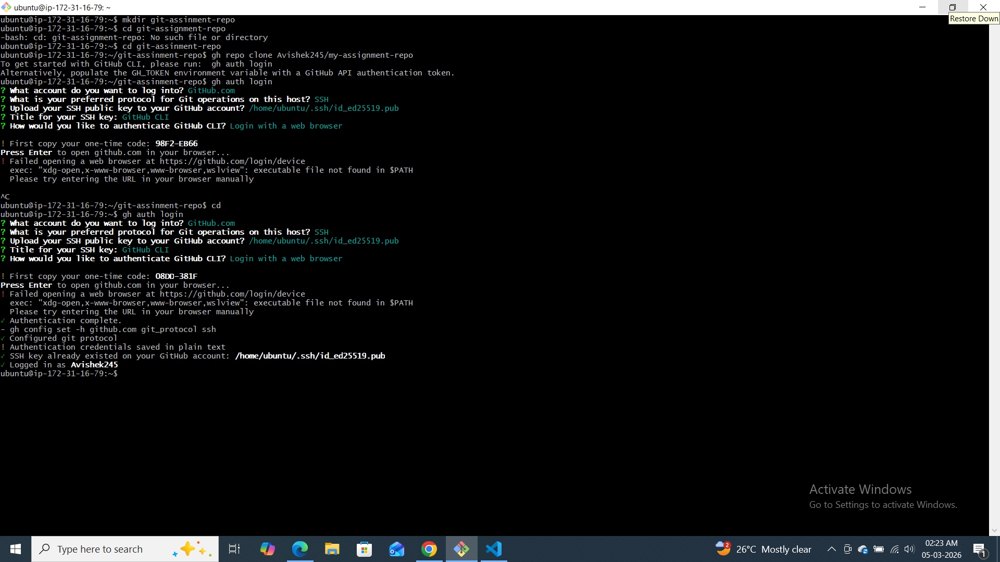
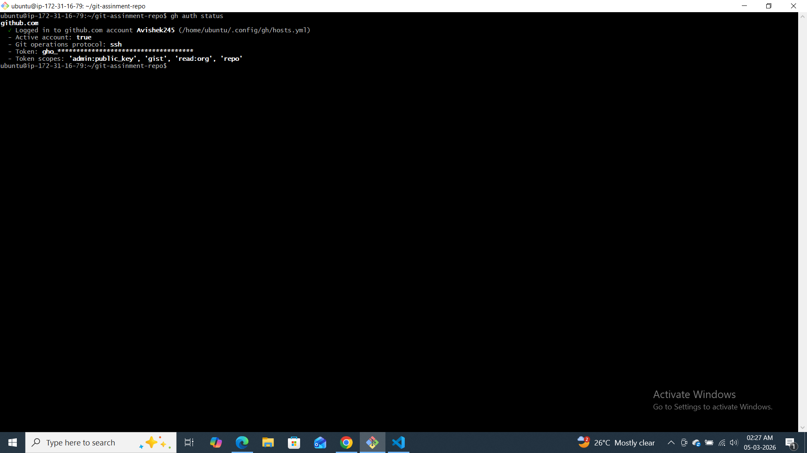
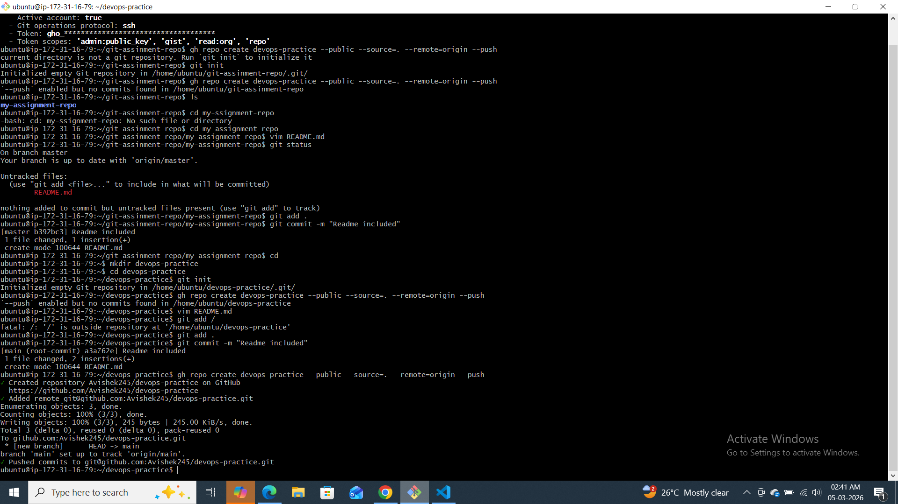
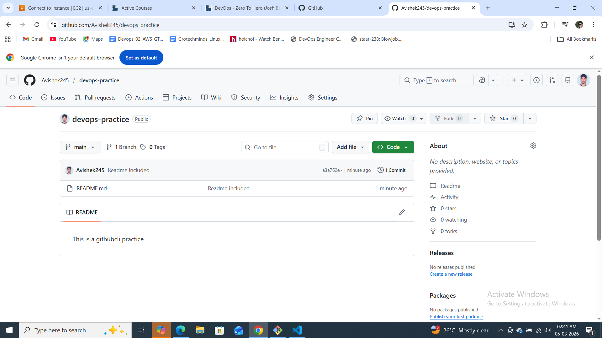
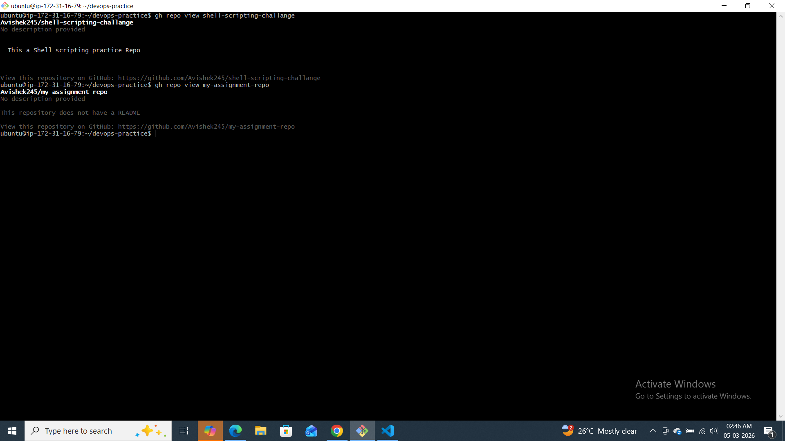
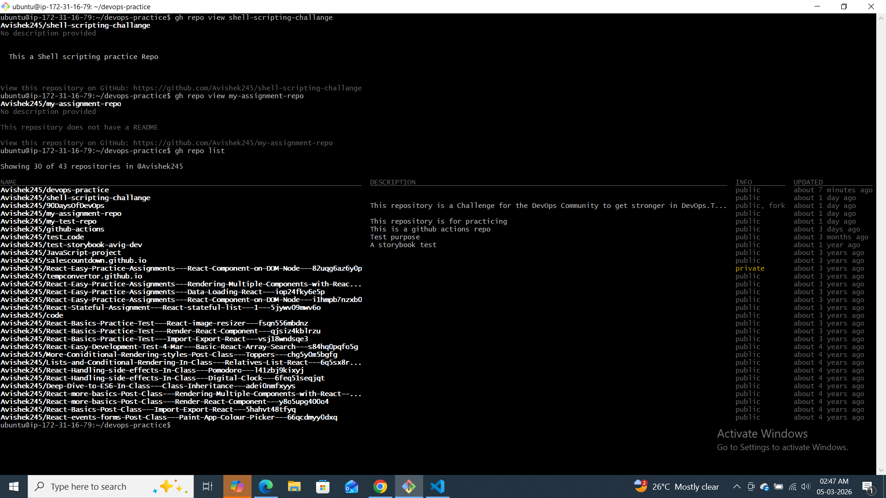
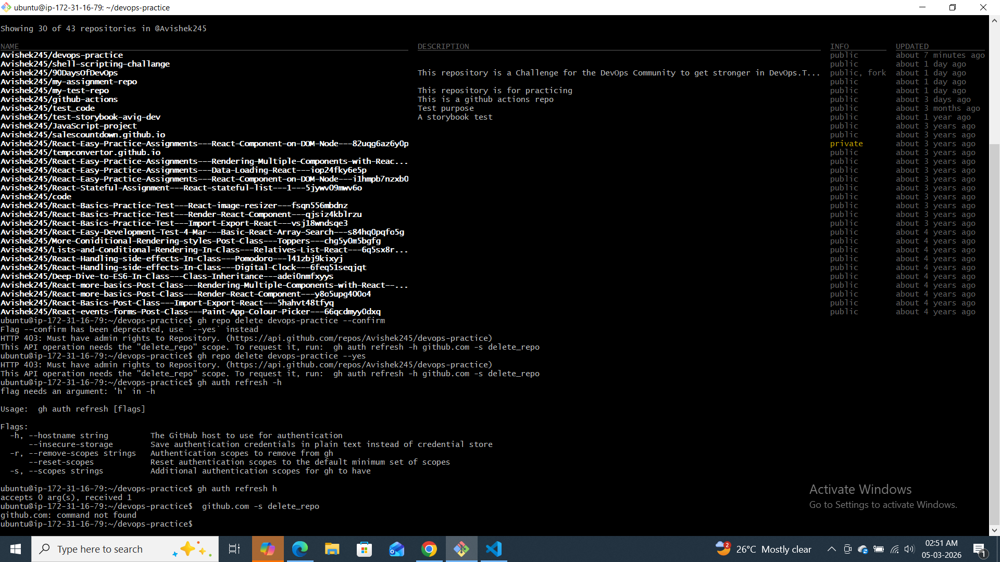
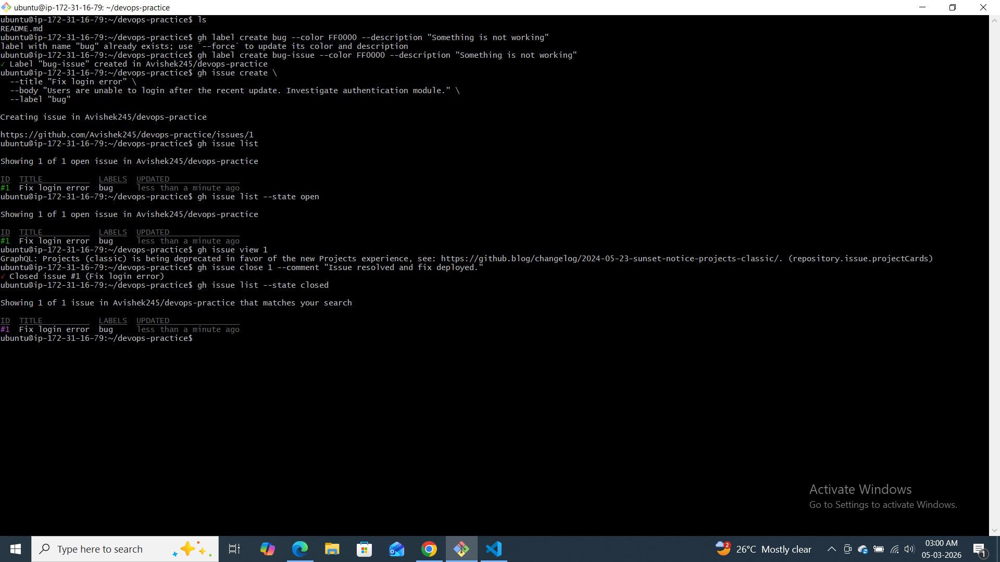
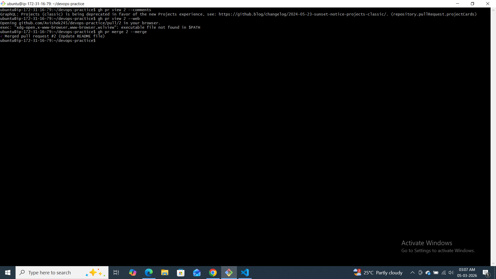
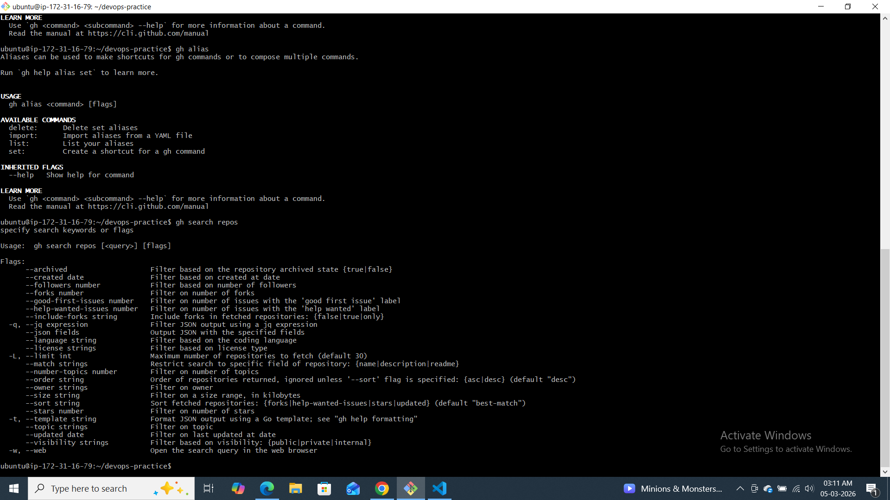

# Day 26 – GitHub CLI: Manage GitHub from Your Terminal

## Challenge Tasks

### Task 1: Install and Authenticate
1. Install the GitHub CLI on your machine
2. Authenticate with your GitHub account
3. Verify you're logged in and check which account is active
4. The gh tool supports the following authentication methods:

Web browser – you’re redirected to GitHub in your browser to authorize the CLI.
Personal access token (PAT) – you can paste a token instead of using the browser.
SSH key – for operations that require git authentication, gh can use your SSH key.
GitHub App token – when gh is used in automation, it can authenticate as an app installation.

----------------
### Task 2: Working with Repositories
1. Create a **new GitHub repo** directly from the terminal — make it public with a README
2. Clone a repo using `gh` instead of `git clone`
3. View details of one of your repos from the terminal
4. List all your repositories
5. Open a repo in your browser directly from the terminal
6. Delete the test repo you created (be careful!)

### Task 3: Issues
1. Create an issue on one of your repos from the terminal — give it a title, body, and a label
2. List all open issues on that repo
3. View a specific issue by its number
4. Close an issue from the terminal
5. Answer in your notes: How could you use `gh issue` in a script or automation?
Ans:-Monitoring Automation

If a monitoring script detects:

Server down

Disk usage > 90%

High CPU usage

It can automatically open an issue.

---

### Task 4: Pull Requests
1. Create a branch, make a change, push it, and create a **pull request** entirely from the terminal
2. List all open PRs on a repo
3. View the details of your PR — check its status, reviewers, and checks
4. Merge your PR from the terminal
What merge methods does gh pr merge support?
gh pr merge supports:

--merge

Creates a merge commit

Keeps full branch history

--squash

Combines all commits into one

Clean history

--rebase

Replays commits on top of base branch

Linear history

These match GitHub’s web UI merge options.

---
### Task 6: Useful `gh` Tricks
Explore and try these — add the ones you find useful to your `git-commands.md`:
1. `gh api` — make raw GitHub API calls from the terminal
2. `gh gist` — create and manage GitHub Gists
3. `gh release` — create and manage releases
4. `gh alias` — create shortcuts for commands you use often
5. `gh search repos` — search GitHub repos from the terminal

