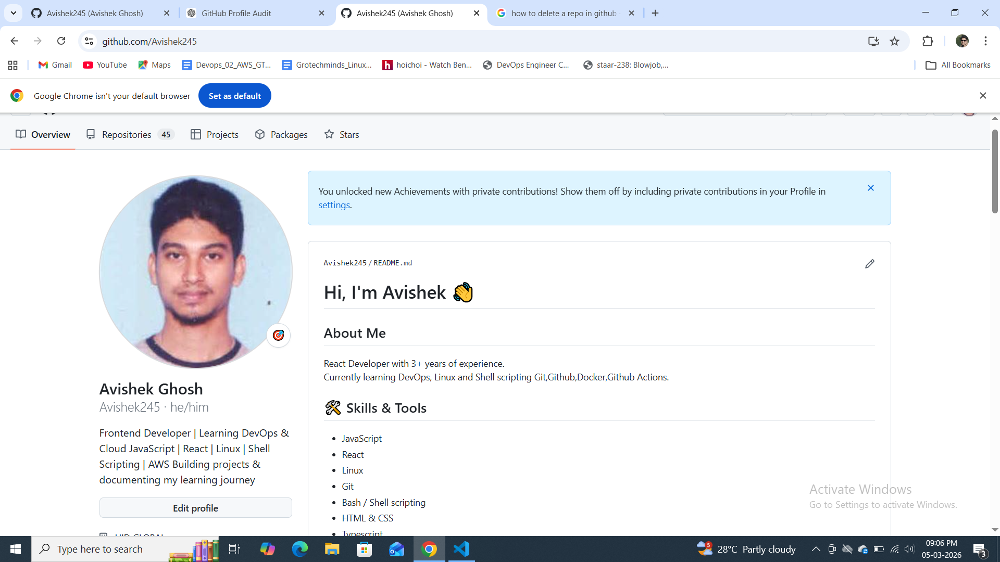
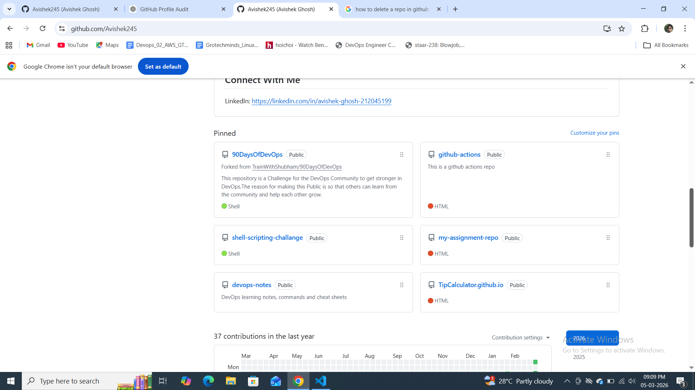

### Day‑27 Notes – GitHub Profile Makeover

1. **Audit & initial state**  
   - Viewed my profile as a stranger; photo was casual, bio empty, pinned repos were random forks, many repositories had no description or README.  
   - Took a “before” screenshot for comparison.

2. **Profile README**  
   - Created repo named exactly as my GitHub username and added a `README.md`.  
   - Included a brief intro (who I am/what I’m learning), current focus (90 Days of DevOps), core skills (Linux, Git, Python, shell, etc.), links to important repositories, and contact info (LinkedIn/email).  
   - Kept formatting clean – headers, bullets, minimal badges.

3. **Repository organisation**  
   - Made/renamed four main repos:  
     * `90-days-of-devops` – contains the daily submissions with a clear overview.  
     * `shell-scripts` – moved all Day 16‑21 scripts; added a README listing each script.  
     * `python-scripts` – migrated Day 7‑15 projects with a descriptive README.  
     * `devops-notes` – added notes and cheat‑sheets (shell cheatsheet, git‑commands.md); structured by topic.  
   - Ensured every repo has a one‑line description, a proper README and sensible `.gitignore`.

4. **Pinning & cleanup**  
   - Chose six repos that best showcase my work and pinned them on my profile.  
   - Deleted/archived empty or irrelevant repos and renamed unclear ones.  
   - Scanned commit history to make sure no secrets were exposed.

5. **Before & after**  
   - Captured after‑screenshot.  
   - Three key improvements:  
     1. Profile now gives a professional first impression (photo, filled bio).  
     2. Repos are organised, named clearly and documented – much easier for recruiters to understand.  
     3. Profile README tells my story and points visitors to the right projects.

> **Result:** polished developer identity, easier to browse and more recruiter‑friendly.
> .png>)

