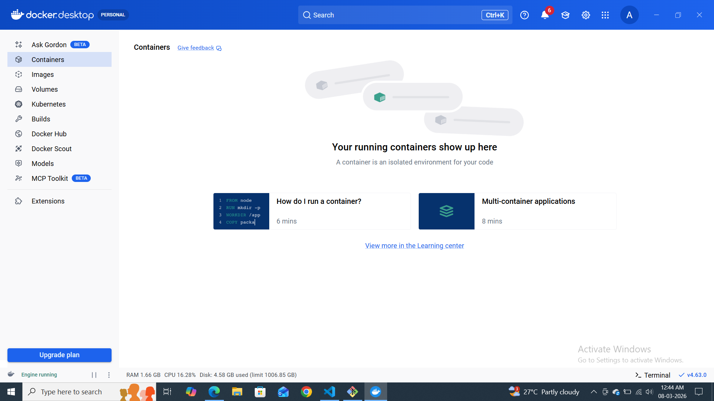
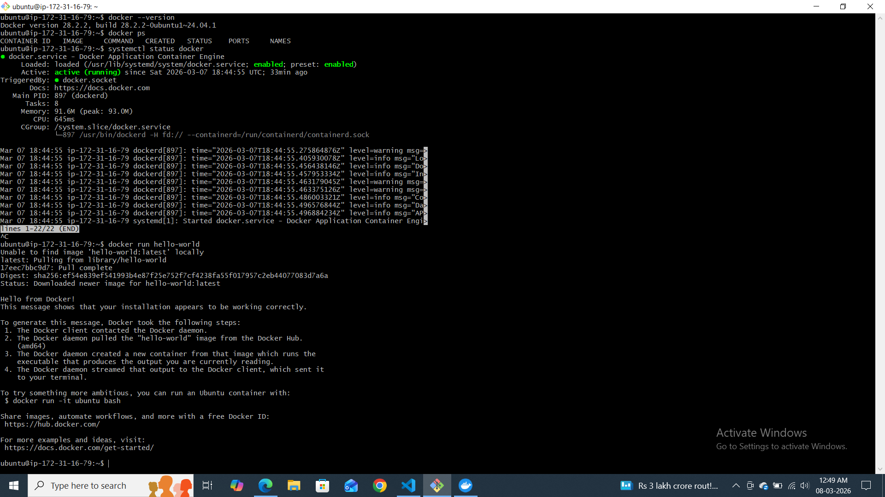
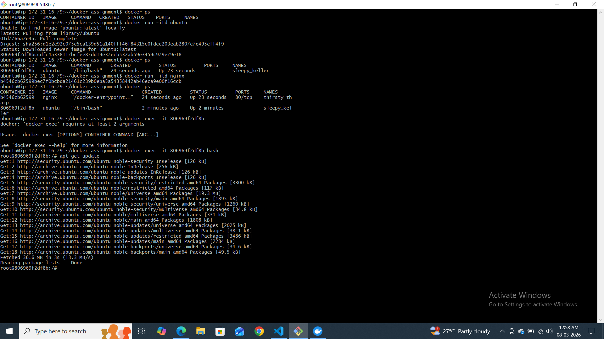
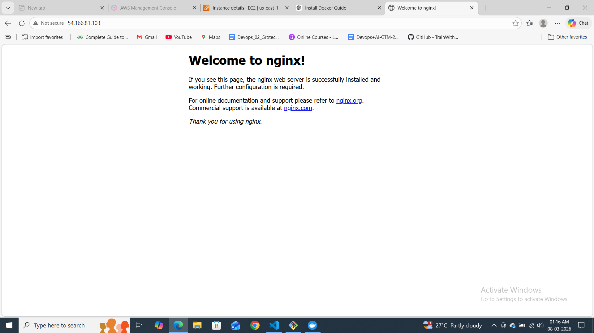
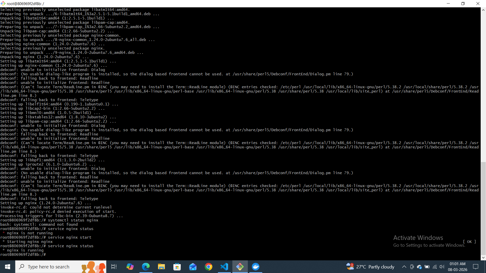
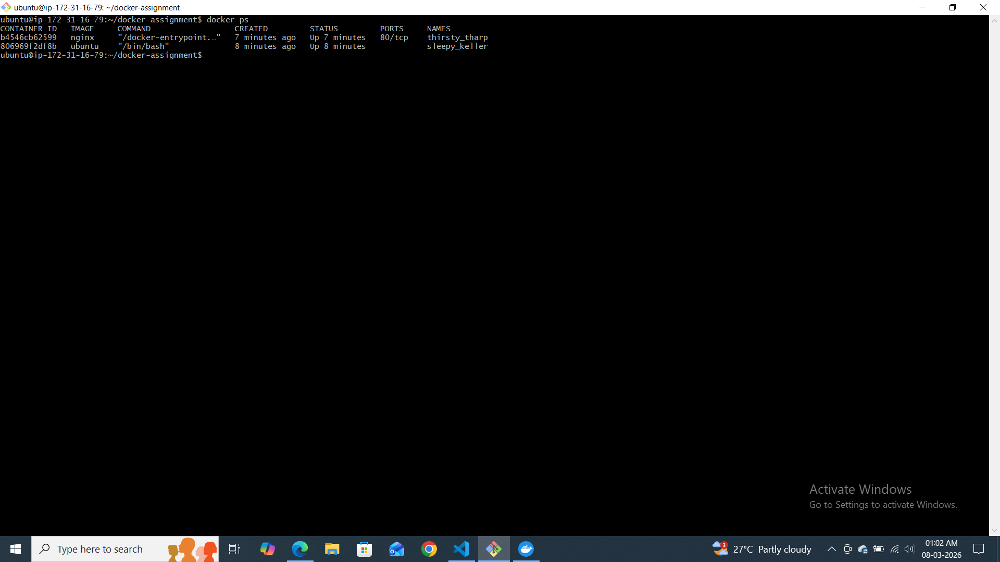
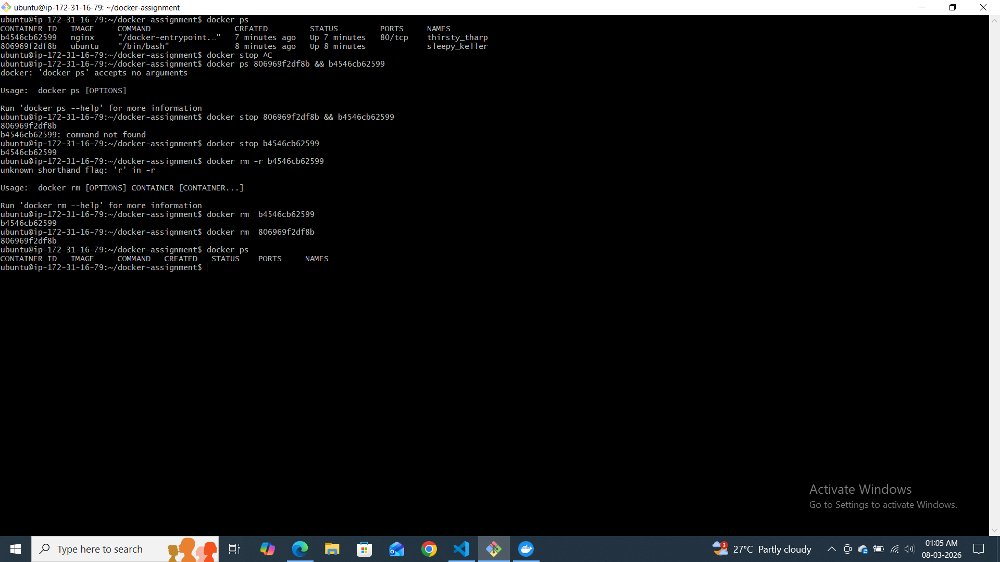
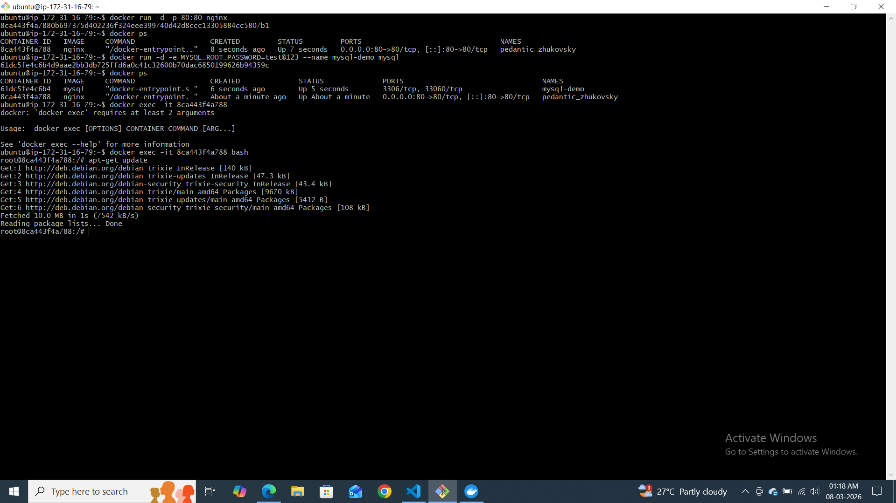

# Day 29 – Introduction to Docker

## Task 1: What is Docker?

### What is a container and why do we need them?
A container is a lightweight, standalone executable package that includes everything needed to run a piece of software: code, runtime, system tools, libraries, and settings. Containers share the host OS kernel but run in isolated user spaces (via namespaces and cgroups) so they behave like independent machines. We need them because they provide:

- **Consistency**: "It works on my machine" becomes "it works everywhere" since the container encapsulates dependencies.
- **Efficiency**: Containers are far lighter than full virtual machines, with fast startup and less resource overhead.
- **Portability**: A container image can run on any system with Docker (or a compatible runtime) without modification.
- **Isolation**: Applications run in their own sandbox, reducing conflicts and improving security.

### Containers vs Virtual Machines — what's the real difference?
| Feature | Containers | Virtual Machines |
|---------|------------|------------------|
| OS overhead | Share host kernel, only user-space components | Include full guest OS per VM
| Size | Typically tens to hundreds of MB | Several GB for a full OS image
| Startup time | Seconds or less | Minutes (booting an OS)
| Resource usage | Lightweight, efficient | Heavier, includes OS overhead
| Isolation level | Process-level isolation (namespaces, cgroups) | Stronger isolation via hardware virtualization

In short, containers virtualize the **operating system** so multiple apps can run on the same OS instance, while VMs virtualize the **hardware**, running separate OS instances on a hypervisor.

### What is the Docker architecture?
Docker has several core components:

- **Docker client**: CLI (`docker` command) used by developers/administrators to build, run, and manage containers.
- **Docker daemon** (`dockerd`): Server-side process that handles container lifecycle, image management, networking, and storage. The client talks to the daemon over a REST API (usually via a UNIX socket).
- **Images**: Read-only templates (built from a Dockerfile) layered using a union filesystem. Each image contains the filesystem for a container.
- **Containers**: Runtime instances of images. A container adds a writable layer on top of an image and executes processes.
- **Registry**: A repository for storing and distributing images. Docker Hub is the default public registry, but private registries can be used as well.

#### Docker architecture (described)
The user runs `docker` commands on the client. Those commands are translated into API calls sent to the Docker daemon. The daemon manages local image storage (pulling from a registry, building from Dockerfiles) and container runtime. When you `docker run`, the daemon creates a container from an image, sets up networking and mounts, and starts the process inside the container. If the image is not local, the daemon fetches it from the configured registry.

```
[Docker CLI] <--> [Docker Daemon]
                     |-- manages Images (storage, pull/push)
                     |-- manages Containers (create, start, stop)
                     |-- communicates with OS kernel (namespaces, cgroups)

Registry (Docker Hub or private)
   ^
   | pull/push images
```

In essence, Docker provides a client-server architecture with a centralized daemon orchestrating container operations and a remote registry for image sharing.

------------

### Task 2: Install Docker
1. Install Docker on your machine (or use a cloud instance)
2. Verify the installation
3. Run the `hello-world` container
Docker Installation & Hello World Test
1. Install Docker

Installed Docker on the Ubuntu EC2 instance using:

sudo apt update
sudo apt install docker.io -y

2. Verify Docker Installation

Checked Docker version:

docker --version


Output:

Docker version 28.2.2, build 28.2.2-0ubuntu1~24.04.1


Checked Docker service status:

sudo systemctl status docker


Result:
Docker service was active (running).

3. Run Hello World Container

Command used:

docker run hello-world

4. Output Observed

Docker pulled the hello-world image and displayed the message:

Hello from Docker!
This message shows that your installation appears to be working correctly.

5. What Happened Internally

When the command docker run hello-world was executed:

Docker client contacted the Docker daemon.

Docker daemon pulled the hello-world image from Docker Hub.

Docker created a container from that image.

The container executed a program that printed the message.

The output was displayed in the terminal.

6. Conclusion

Docker was successfully installed and verified by running the hello-world container. The test confirmed that the Docker client, daemon, and container runtime are working correctly.


---
### Task 3: Run Real Containers
1. Run an **Nginx** container and access it in your browser
2. Run an **Ubuntu** container in interactive mode — explore it like a mini Linux machine
3. List all running containers
4. List all containers (including stopped ones)
5. Stop and remove a container
6. 







### Task 4: Explore
1. Run a container in **detached mode** — what's different?
2. Give a container a custom **name**
3. Map a **port** from the container to your host
4. Check **logs** of a running container
5. Run a command **inside** a running container
   
   