## Challenge Tasks

### Task 1: Docker Images
1. Pull the `nginx`, `ubuntu`, and `alpine` images from Docker Hub
2. List all images on your machine — note the sizes
3 . Ubuntu vs Alpine
Ubuntu is a full Linux distribution
Alpine is a minimal Linux distribution
Alpine uses BusyBox and musl libc

That's why Alpine (8MB) is much smaller than Ubuntu (~78MB)
4. Inspect an image — what information can you see?
5. Ans :- You will see:
Image ID
Created date
Environment variables
OS / architecture
Layers
6. Remove an image you no longer need
   :Removed mysql images which is not needed.
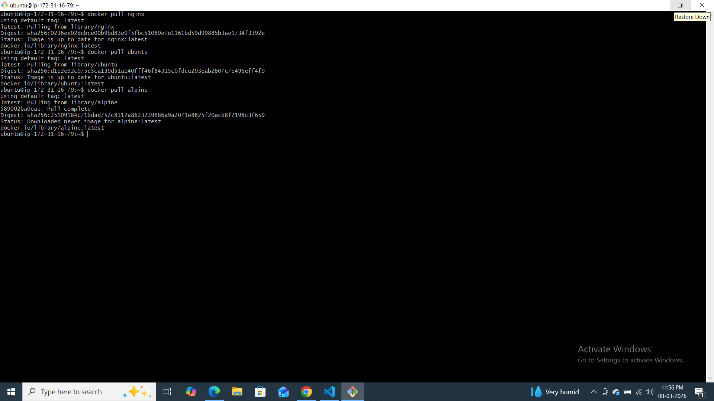
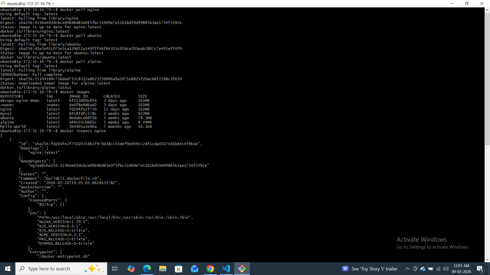
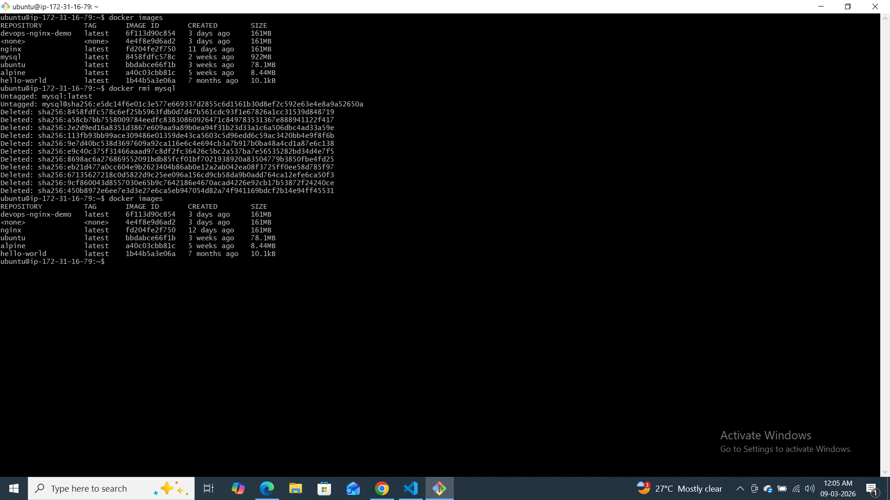
---

### Task 2: Image Layers
1. Run `docker image history nginx` — what do you see?
2. Each line is a **layer**. Note how some layers show sizes and some show 0B
<missing>      12 days ago   ENV DYNPKG_RELEASE=1~trixie                     0B        buildkit.dockerfi
<missing>      12 days ago   ENV PKG_RELEASE=1~trixie                        0B        buildkit.dockerfi
<missing>      12 days ago   ENV ACME_VERSION=0.3.1                          0B        buildkit.dockerfi
<missing>      12 days ago   ENV NJS_RELEASE=1~trixie                        0B        buildkit.dockerfi
<missing>      12 days ago   ENV NJS_VERSION=0.9.5                           0B        buildkit.dockerfi
<missing>      12 days ago   ENV NGINX_VERSION=1.29.5                        0B        buildkit.dockerfi
<missing>      12 days ago   LABEL maintainer=NGINX Docker Maintainers <d…   0B  

3. Write in your notes: What are layers and why does Docker use them?
Ans:-
What are Docker Layers?
Docker images are built using layers.
Each instruction in a Dockerfile creates a new layer.
Benefits:
Faster builds due to caching
Reusable layers
Smaller downloads (only changed layers are pulled)
Example:
Base Image
   ↓
Install Packages
   ↓
Copy Files
   ↓
Run Commands

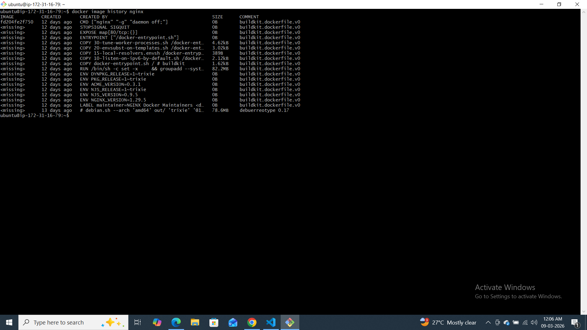
---
### Task 3: Container Lifecycle
Practice the full lifecycle on one container:
1. **Create** a container (without starting it)
2. **Start** the container
3. **Pause** it and check status
4. **Unpause** it
5. **Stop** it
6. **Restart** it
7. **Kill** it
8. **Remove** it

Check `docker ps -a` after each step — observe the state changes.

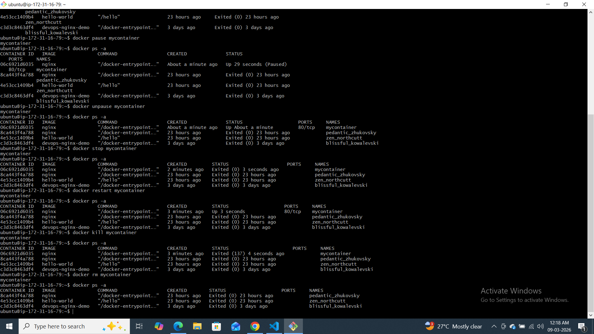
---

### Task 4: Working with Running Containers
1. Run an Nginx container in detached mode
2. View its **logs**
3. View **real-time logs** (follow mode)
4. docker logs

Command:

docker logs container-name

What it does:

Shows the existing logs once

Prints the logs and returns you to the terminal

It does not continue watching

Example:

docker logs nginx-test

Output example:

GET / HTTP/1.1 200
GET /favicon.ico 404

After showing this, the command ends.

docker logs -f

Command:

docker logs -f container-name

-f means follow.

What it does:

Shows logs continuously in real time

Keeps listening for new logs

Similar to Linux tail -f

5. **Exec** into the container and look around the filesystem
6. Run a single command inside the container without entering it
7. **Inspect** the container — find its IP address, port mappings, and mounts
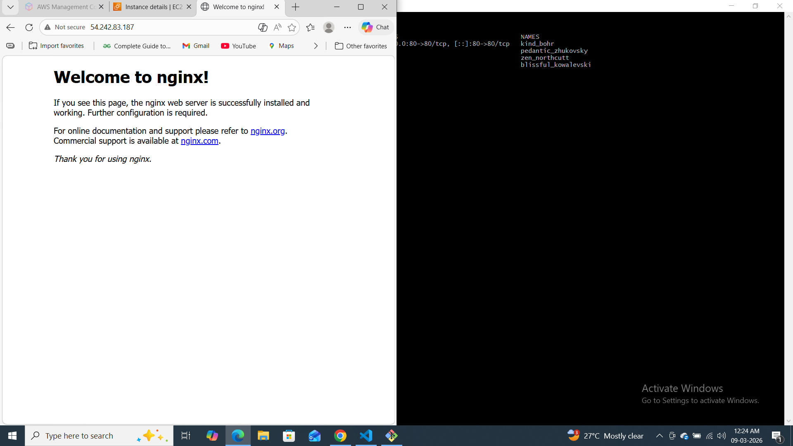
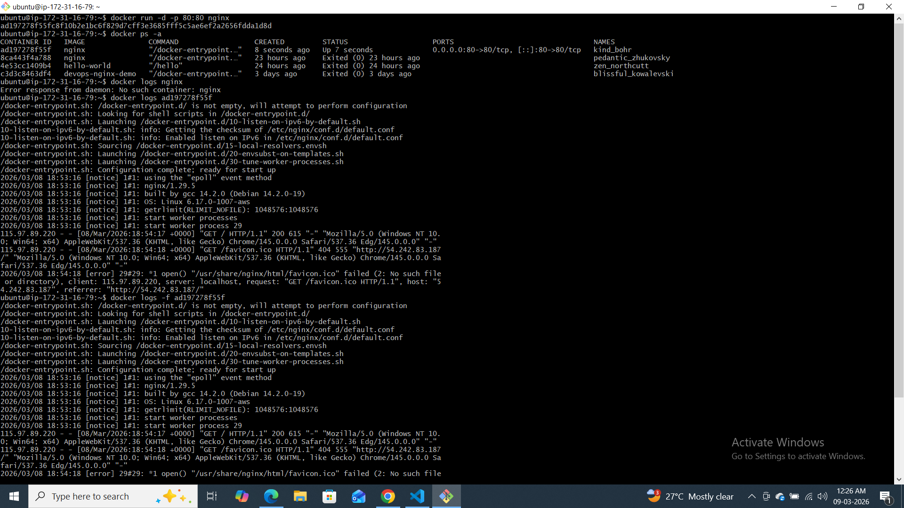
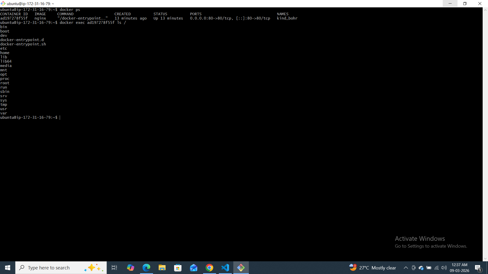
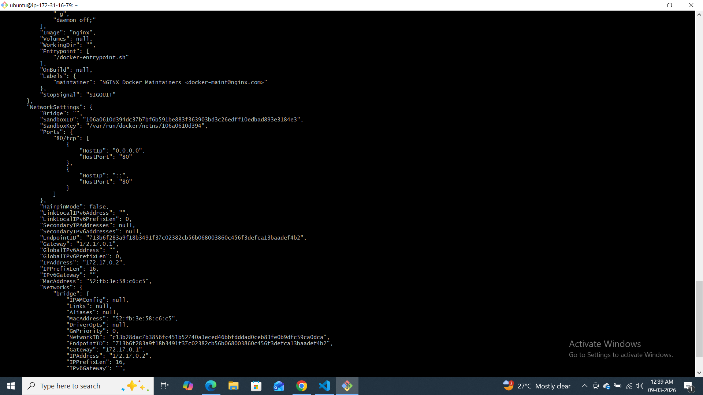
---

### Task 5: Cleanup
1. Stop all running containers in one command
2. Remove all stopped containers in one command
3. Remove unused images
4. Check how much disk space Docker is using
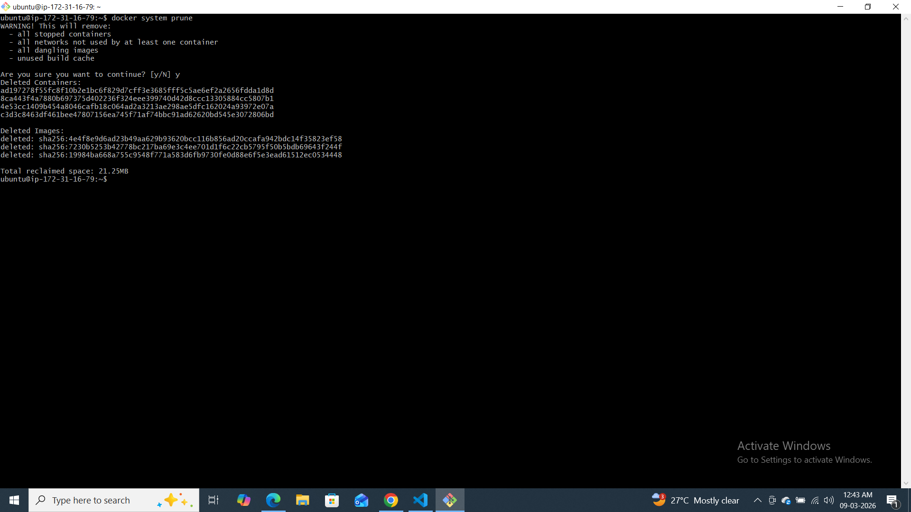
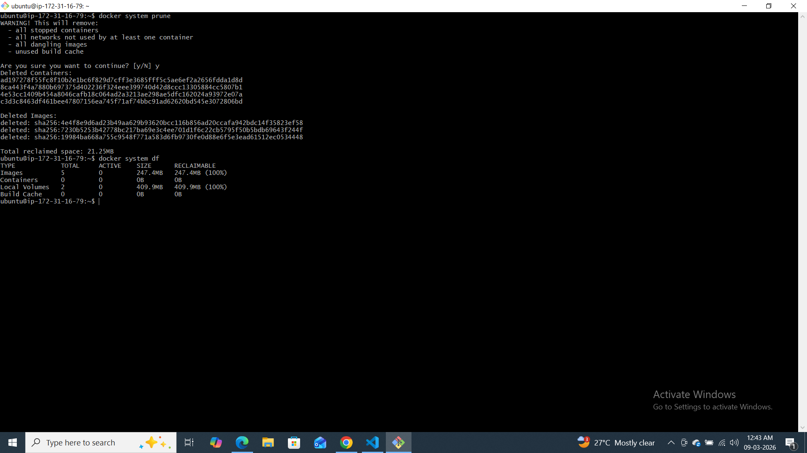
---