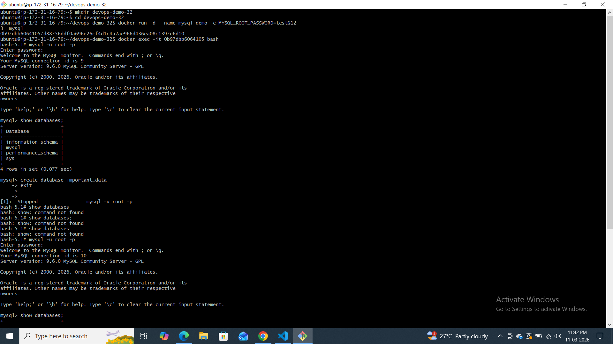
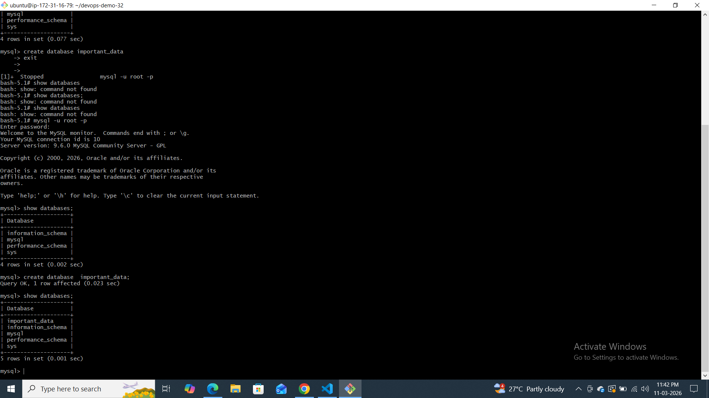
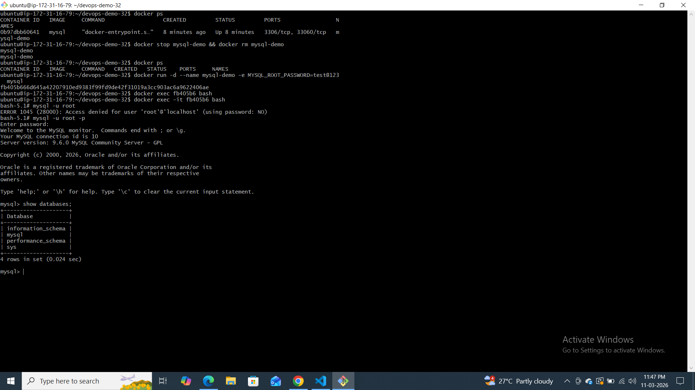
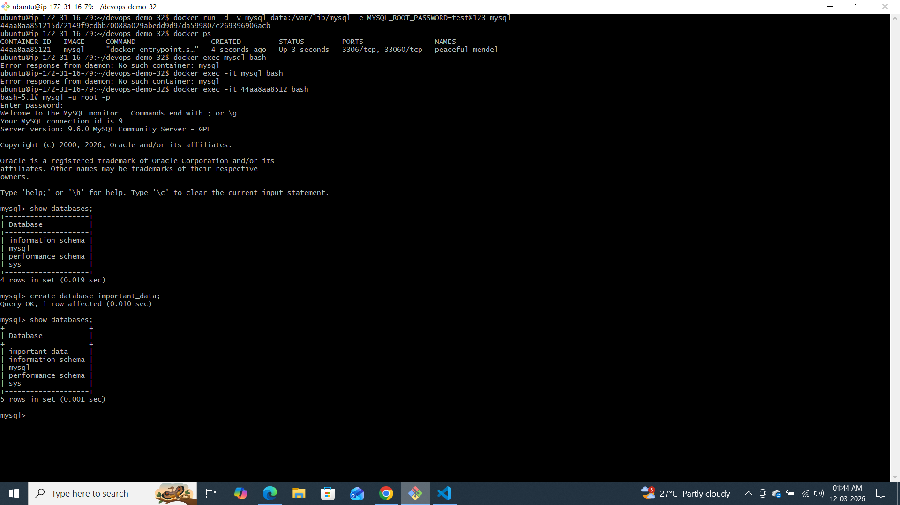
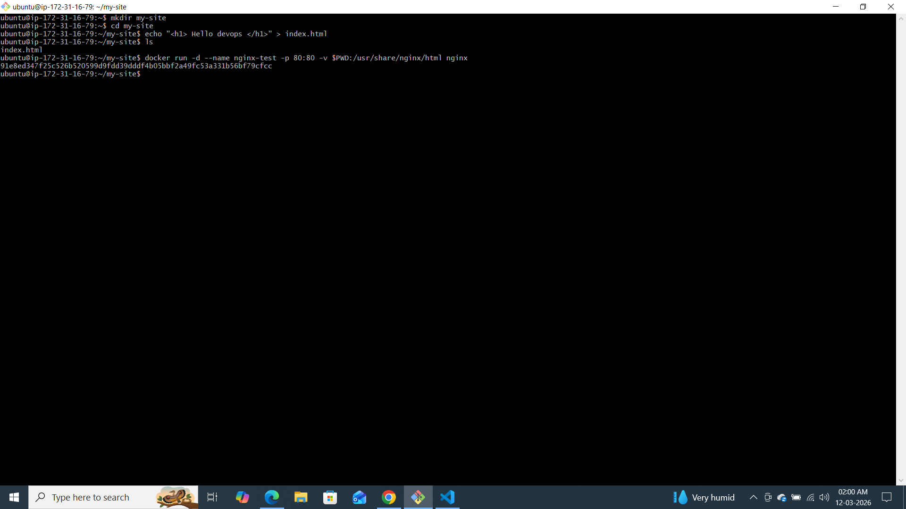
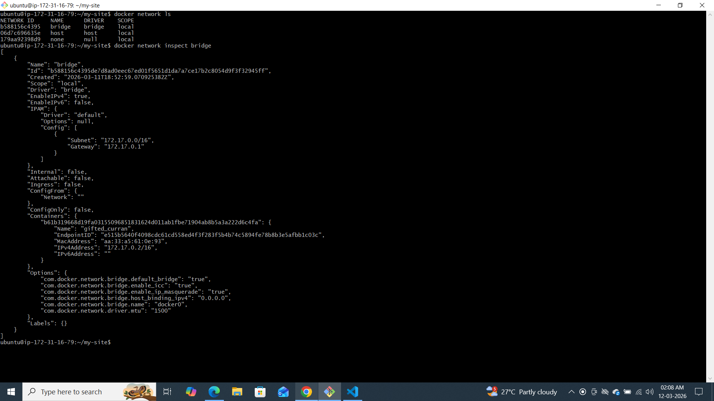
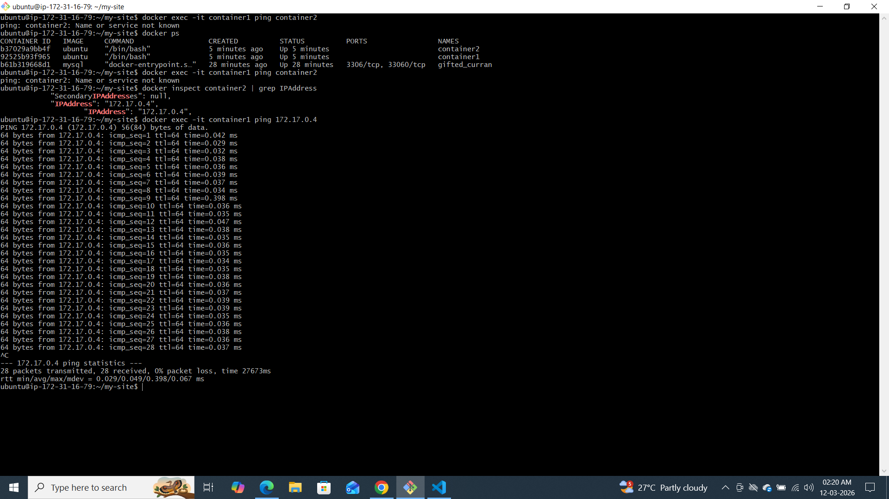
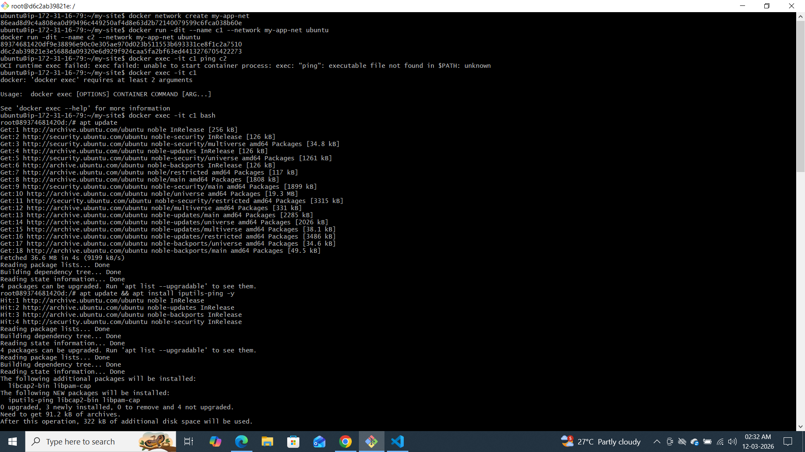
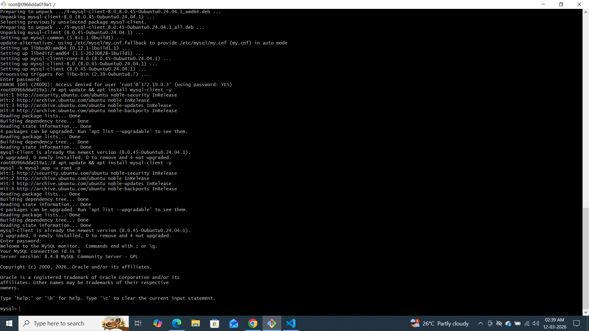

## Challenge Tasks

### Task 1: The Problem
1. Run a Postgres or MySQL container
2. Create some data inside it (a table, a few rows — anything)
3. Stop and remove the container
4. Run a new one — is your data still there?

👉 No. Data is gone.

📌 Why?

Because containers are ephemeral.

The writable layer is destroyed when the container is removed.

By default, Docker stores container data inside the container filesystem. When the container is removed, that layer is deleted, causing data loss.

---

### Task 2: Named Volumes
1. Create a named volume
2. Run the same database container, but this time **attach the volume** to it
3. Add some data, stop and remove the container
4. Run a brand new container with the **same volume**
5. Is the data still there?

DATA IS STILL THERE.

Verify
docker volume inspect mysql-data

📌 Why it works?
Named volumes are stored in:
/var/lib/docker/volumes/
They exist independently from containers.
---

### Task 3: Bind Mounts
1. Create a folder on your host machine with an `index.html` file
2. Run an Nginx container and **bind mount** your folder to the Nginx web directory
3. Access the page in your browser
4. Edit the `index.html` on your host — refresh the browser

Write in your notes: What is the difference between a named volume and a bind mount?

📌 Difference: Named Volume vs Bind Mount
Named Volume	Bind Mount
Managed by Docker	Managed by Host
Stored in Docker directory	Stored in your filesystem
Good for databases	Good for development
Portable	Machine dependent

Interview line:

Volumes are Docker-managed persistent storage, while bind mounts directly map host paths into containers.
---

### Task 4: Docker Networking Basics
1. List all Docker networks on your machine
2. Inspect the default `bridge` network
3. Run two containers on the default bridge — can they ping each other by **name**?
4. Run two containers on the default bridge — can they ping each other by **IP**?

docker exec expects a container name or container ID, NOT an IP address.

Correct syntax:

docker exec -it <container-name> <command>

Example:

docker exec -it container2 ping 172.17.0.3

NOT:

docker exec -it 172.17.0.4 ...

Because 172.17.0.4 is an IP, not a container name.

🧠 Think Like This

Docker world:

Containers are identified by name or ID

Networking world:

Containers communicate via IP

Name resolution depends on network type

So:

✔ Use container name with docker exec
✔ Use IP inside ping command
---

### Task 5: Custom Networks
1. Create a custom bridge network called `my-app-net`
2. Run two containers on `my-app-net`
3. Can they ping each other by **name** now?
4. Write in your notes: Why does custom networking allow name-based communication but the default bridge doesn't?

User-defined bridge networks have built-in DNS server.

Docker automatically resolves container names.

Interview answer:

Custom bridge networks provide automatic service discovery via embedded DNS
---

### Task 6: Put It Together
1. Create a custom network
2. Run a **database container** (MySQL/Postgres) on that network with a volume for data
3. Run an **app container** (use any image) on the same network
4. Verify the app container can reach the database by container name
 

It connects using container NAME.

That is real microservice communication.
---