# Day 33 – Docker Compose: Multi-Container Basics
### Task 1: Install & Verify
1. Check if Docker Compose is available on your machine
2. Verify the version
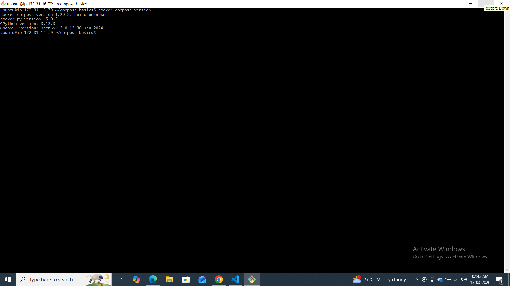
command i use :- docker-compose version
---

### Task 2: Your First Compose File
1. Create a folder `compose-basics`
2. Write a `docker-compose.yml` that runs a single **Nginx** container with port mapping
3. Start it with `docker compose up`
4. Access it in your browser
5. Stop it with `docker compose down`
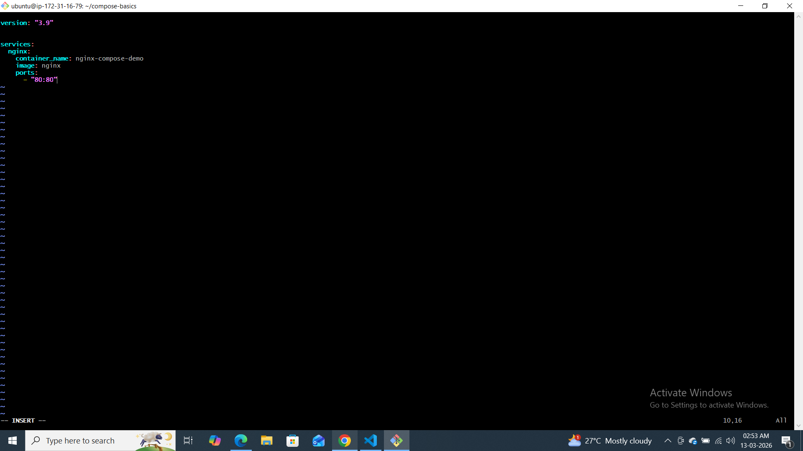
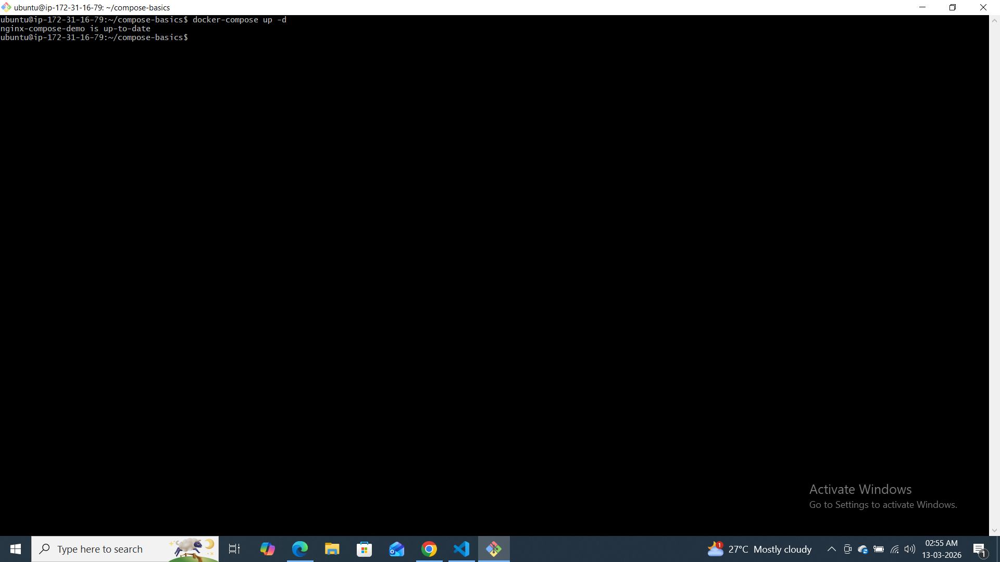
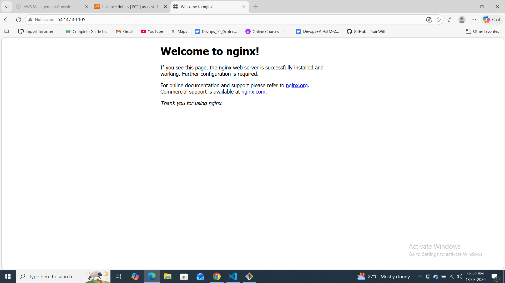
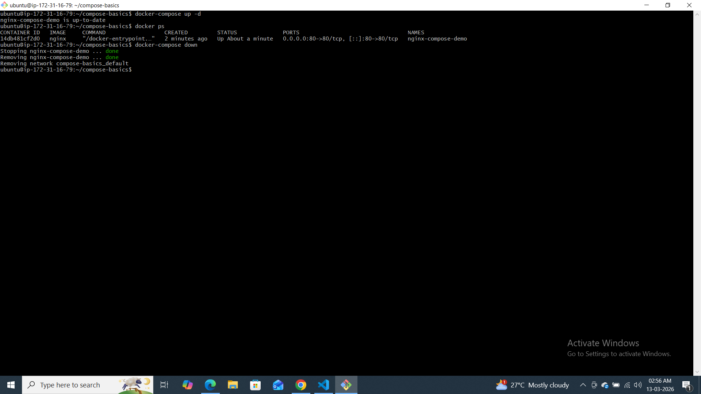
---

### Task 3: Two-Container Setup
Write a `docker-compose.yml` that runs:
- A **WordPress** container
- A **MySQL** container

They should:
- Be on the same network (Compose does this automatically)
- MySQL should have a named volume for data persistence
- WordPress should connect to MySQL using the service name

Start it, access WordPress in your browser, and set it up.

**Verify:** Stop and restart with `docker compose down` and `docker compose up` — is your WordPress data still there?
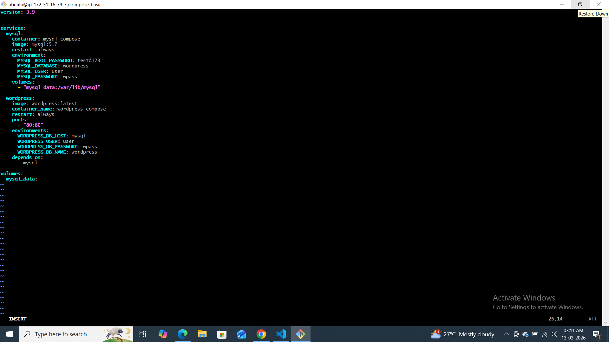
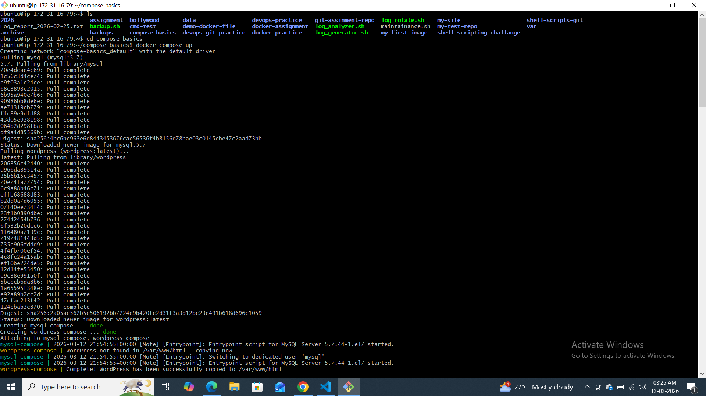
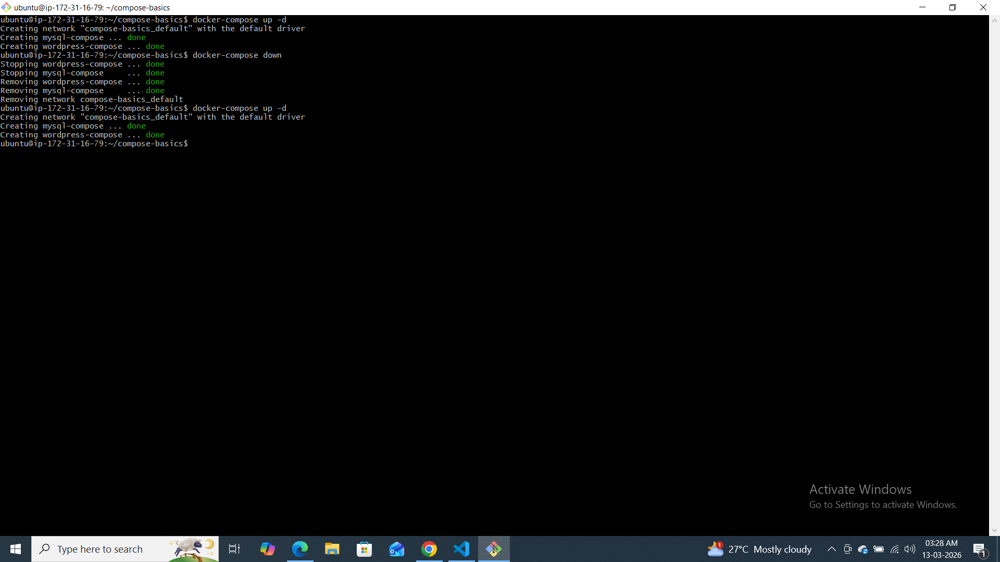
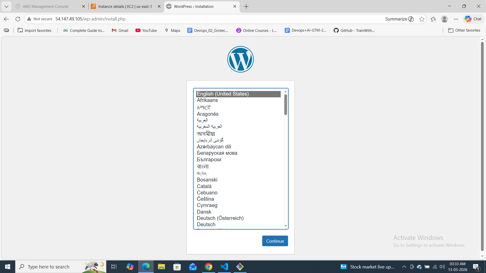

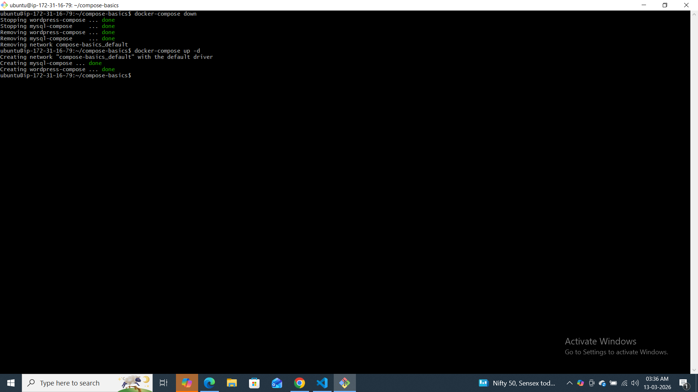
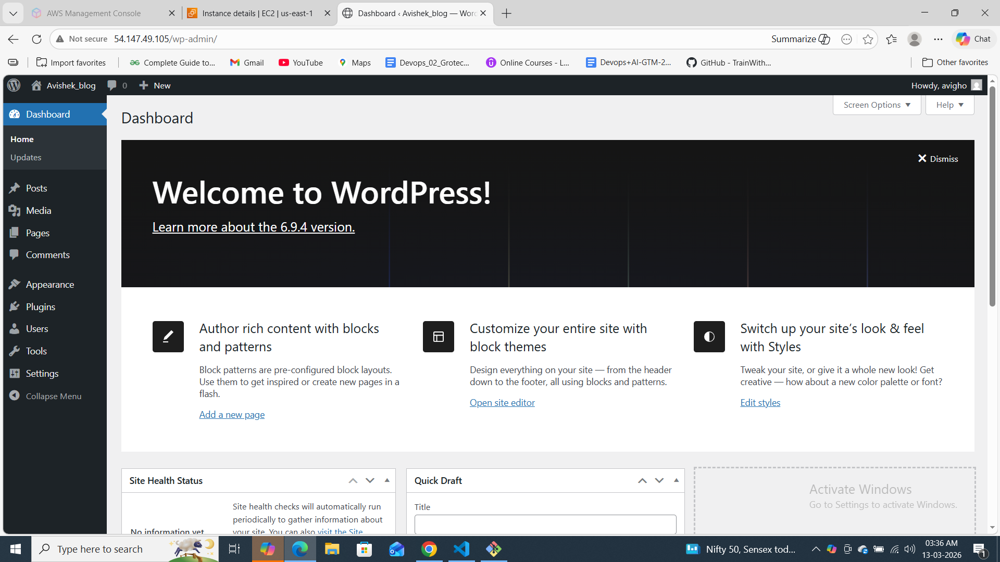
---

### Task 4: Compose Commands
Practice and document these:
1. Start services in **detached mode**
2. View running services
3. View **logs** of all services
4. View logs of a **specific** service
5. **Stop** services without removing
6. **Remove** everything (containers, networks)
7. **Rebuild** images if you make a change
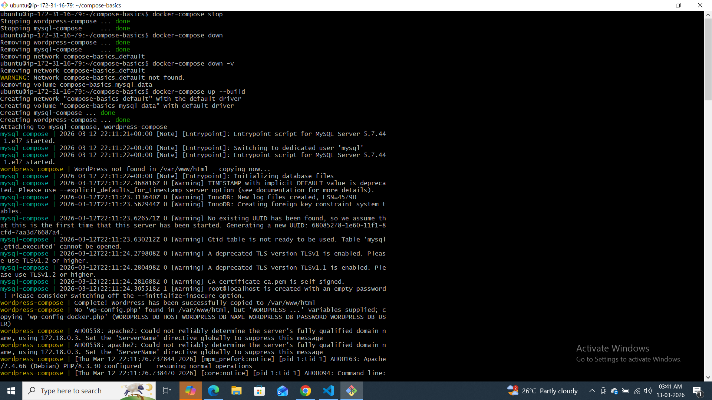
---

### Task 5: Environment Variables
1. Add environment variables directly in your `docker-compose.yml`
2. Create a `.env` file and reference variables from it in your compose file
3. Verify the variables are being picked up
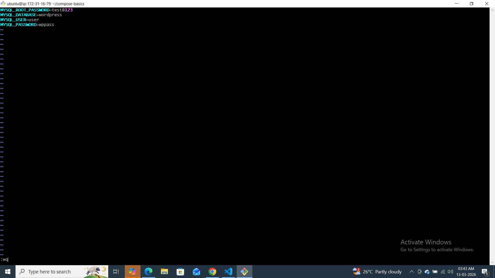
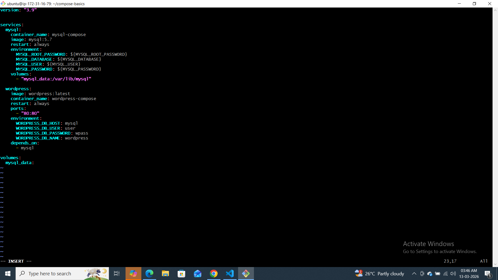
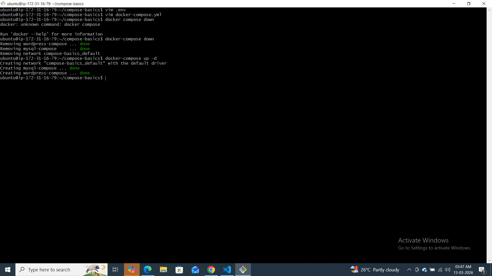
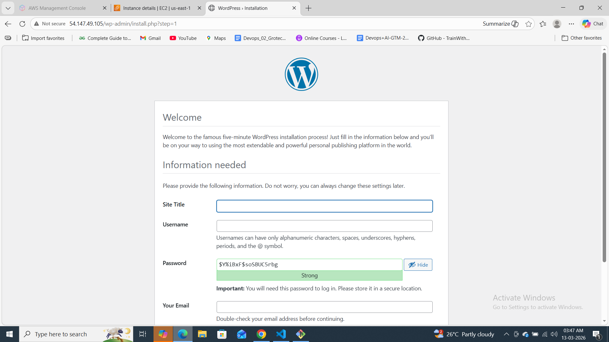
---
# Day 33 – Docker Compose Basics

## What I Learned
- Docker Compose runs multi-container apps
- Single YAML file defines services, networks, volumes
- Service names work as DNS
- Named volumes persist data

## Commands Practiced
- docker compose up -d
- docker compose down
- docker compose logs
- docker compose ps
- docker compose stop

## Challenges Faced
- (Write your errors if any)

## Key Understanding
Compose automatically:
- Creates network
- Connects containers
- Manages volumes