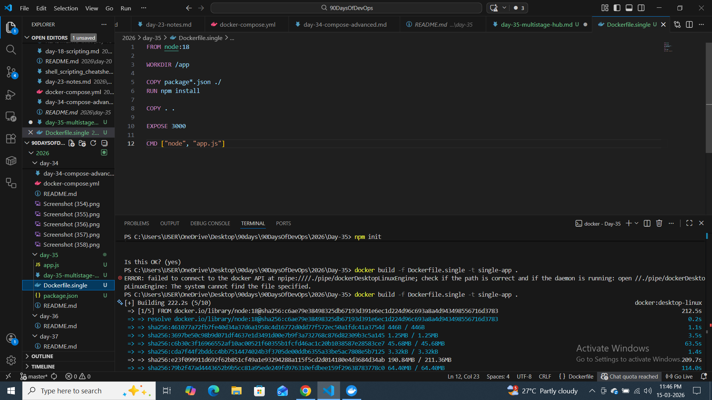
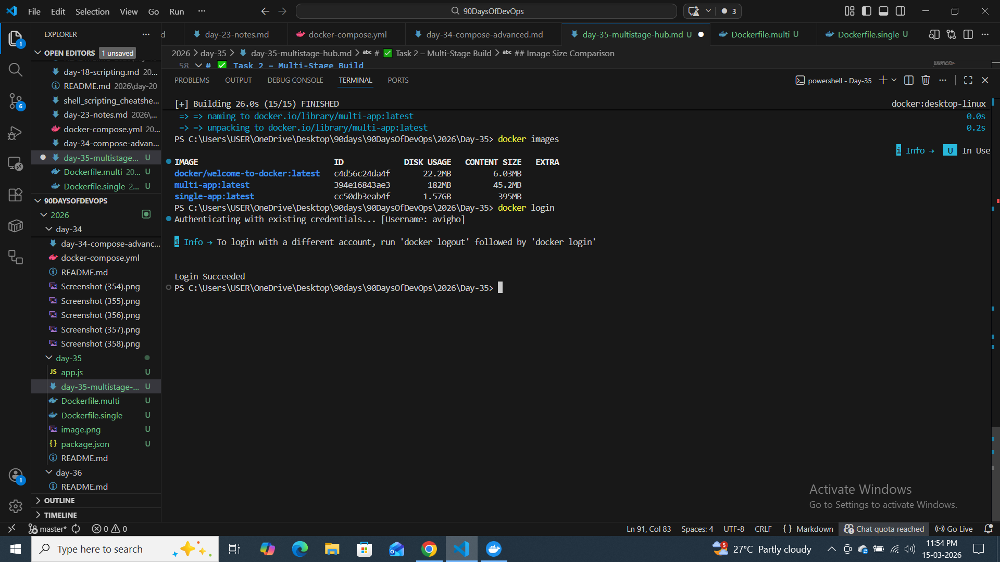
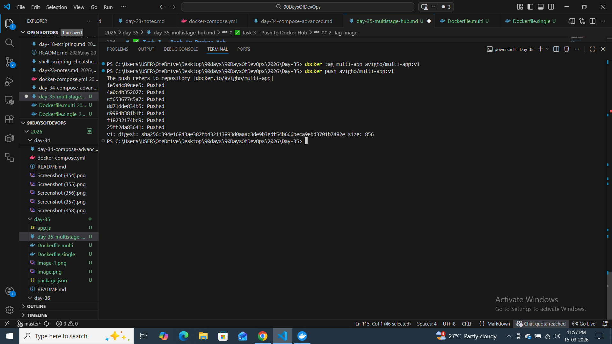
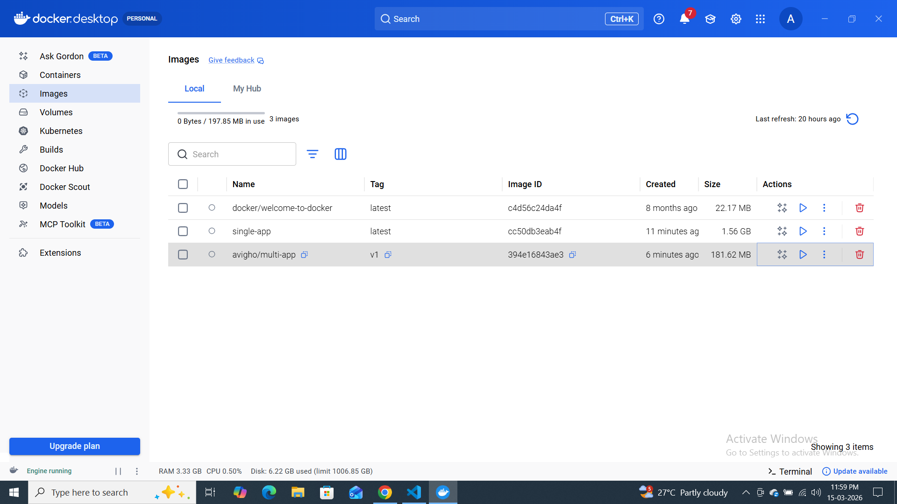
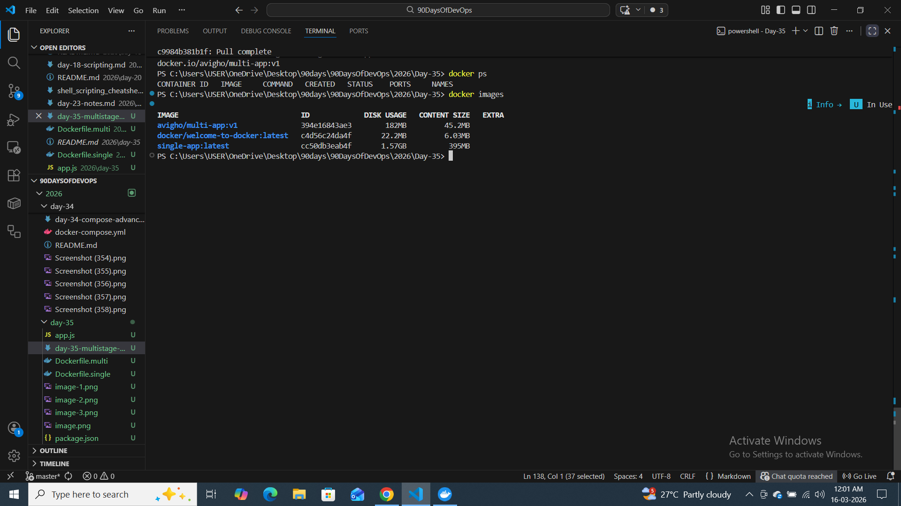
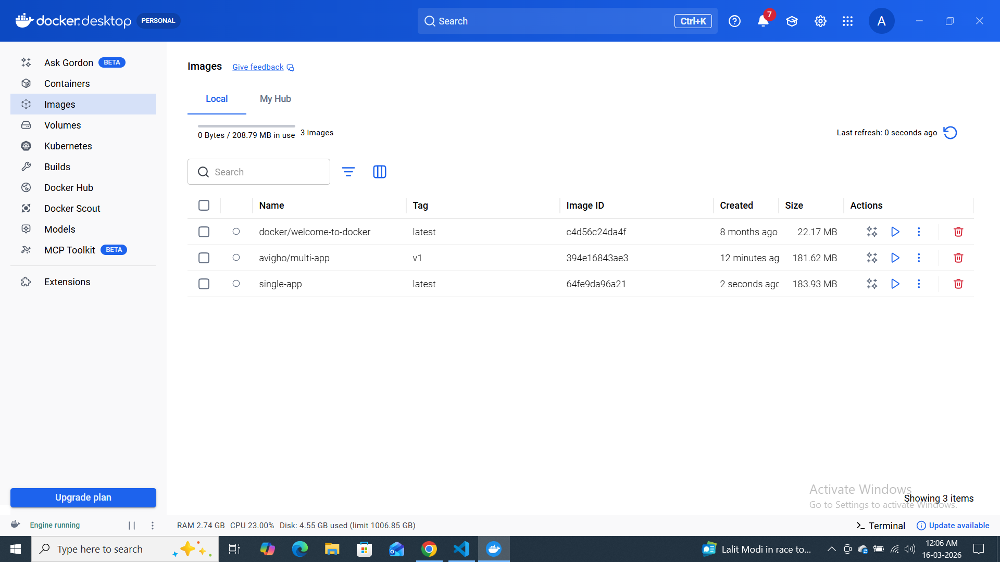

# Day 35 – Multi-Stage Builds & Docker Hub

## 🎯 Goal

Learn how to:

* Build optimized Docker images using Multi-Stage builds
* Reduce image size
* Push images to Docker Hub
* Follow image best practices

---

# ✅ Task 1 – Single Stage Build

## Application

Simple Node.js HTTP server.

## Dockerfile (Single Stage)

```dockerfile
FROM node:18

WORKDIR /app

COPY package*.json ./
RUN npm install

COPY . .

EXPOSE 3000

CMD ["node", "app.js"]
```

## Build Command

```bash
docker build -f Dockerfile.single -t single-app .
```

## Image Size

IMAGE                             ID             DISK USAGE   CONTENT SIZE   EXTRA
docker/welcome-to-docker:latest   c4d56c24da4f       22.2MB         6.03MB
single-app:latest                 cc50db3eab4f       1.57GB          395MB

## Why So Large?

* Full Node base image
* Includes development tools
* Includes npm cache
* Contains unnecessary build dependencies
 
---

# ✅ Task 2 – Multi-Stage Build

## Dockerfile (Multi-Stage)

```dockerfile
# Stage 1 - Builder
FROM node:18 AS builder

WORKDIR /app
COPY package*.json ./
RUN npm install --production

COPY . .

# Stage 2 - Production
FROM node:18-alpine

WORKDIR /app

COPY --from=builder /app /app

EXPOSE 3000

CMD ["node", "app.js"]
```

## Build Command

```bash
docker build -f Dockerfile.multi -t multi-app .
```

## Image Size Comparison
IMAGE                             ID             DISK USAGE   CONTENT SIZE   EXTRA
multi-app:latest                  394e16843ae3        182MB         45.2MB
single-app:latest                 cc50db3eab4f       1.57GB          395MB

## 🔍 Why Multi-Stage Is Smaller?

* Build tools removed in final image
* Only required application files copied
* Using minimal base image (`node:18-alpine`)
* Reduced layers and unnecessary files

---

# ✅ Task 3 – Push to Docker Hub

## 1. Login

```bash
docker login
```

## 2. Tag Image

```bash
docker tag multi-app yourusername/multi-app:v1
```

## 3. Push Image

```bash
docker push yourusername/multi-app:v1
```


## 4. Verify



Remove local image:

```bash
docker rmi yourusername/multi-app:v1
```

Pull again:

```bash
docker pull yourusername/multi-app:v1
```

---

# ✅ Task 4 – Understanding Tags

* `v1` → Specific version
* `latest` → Default tag (if not specified)

## Pull Specific Version

```bash
docker pull yourusername/multi-app:v1
```

## Pull Latest

```bash
docker pull yourusername/multi-app:latest
```

### Why Avoid `latest` in Production?

* Version becomes unpredictable
* Can cause unexpected production issues
* Hard to track deployments

---

# ✅ Task 5 – Image Best Practices

## Improved Production Dockerfile

```dockerfile
FROM node:18-alpine AS builder

WORKDIR /app
COPY package*.json ./
RUN npm install --production
COPY . .

FROM node:18-alpine

WORKDIR /app

RUN addgroup -S appgroup && adduser -S appuser -G appgroup

COPY --from=builder /app /app

USER appuser

EXPOSE 3000

CMD ["node", "app.js"]
```

## Best Practices Applied

✔ Used minimal base image
✔ Used `--production` flag
✔ Added non-root user
✔ Avoided `latest` tag
✔ Reduced image layers
✔ Smaller attack surface

---

# 📊 Final Comparison

avigho/multi-app:v1               394e16843ae3        182MB         45.2MB
docker/welcome-to-docker:latest   c4d56c24da4f       22.2MB         6.03MB
single-app:latest                 64fe9da96a21        184MB         46.3MB

---

# 💡 Interview Notes

### What is Multi-Stage Build?

A technique that uses multiple `FROM` statements in one Dockerfile to separate build and runtime environments.

### Why Use Alpine?

* Smaller size
* Minimal packages
* Faster deployment

### Why Not Run as Root?

Running as root increases security risks if container is compromised.

### Why Avoid Latest Tag?

Ensures predictable deployments and proper version tracking.

---


---

# 🚀 What I Learned

* How Docker layers work
* How to reduce image size drastically
* How to push and manage images on Docker Hub
* Why optimization matters in real-world DevOps

---


---

**Day 35 Completed ✅**
