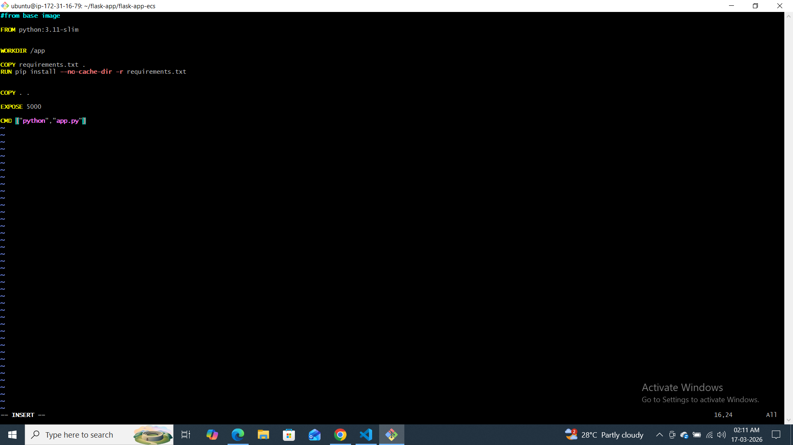
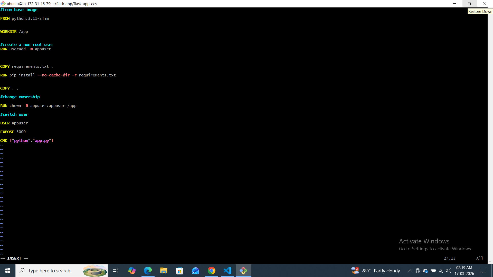
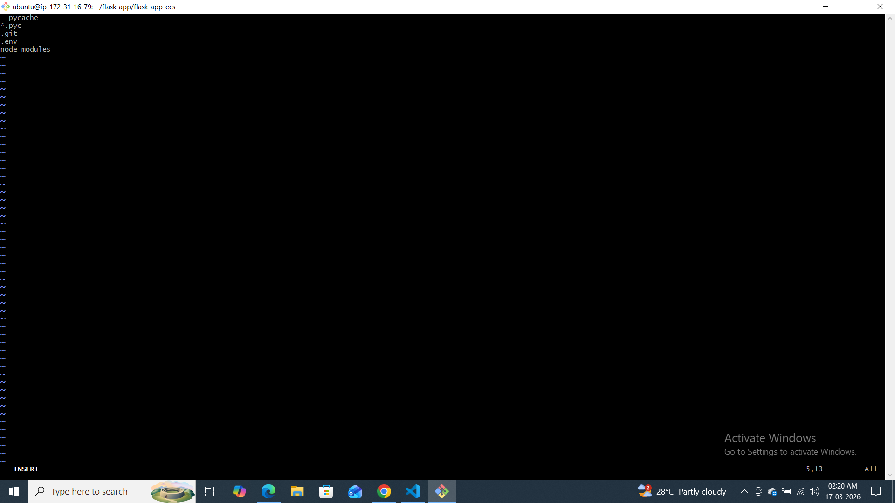
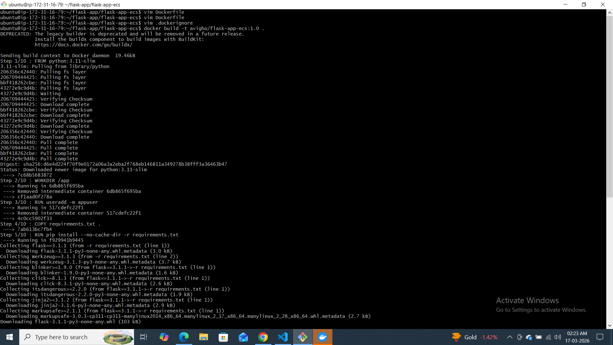
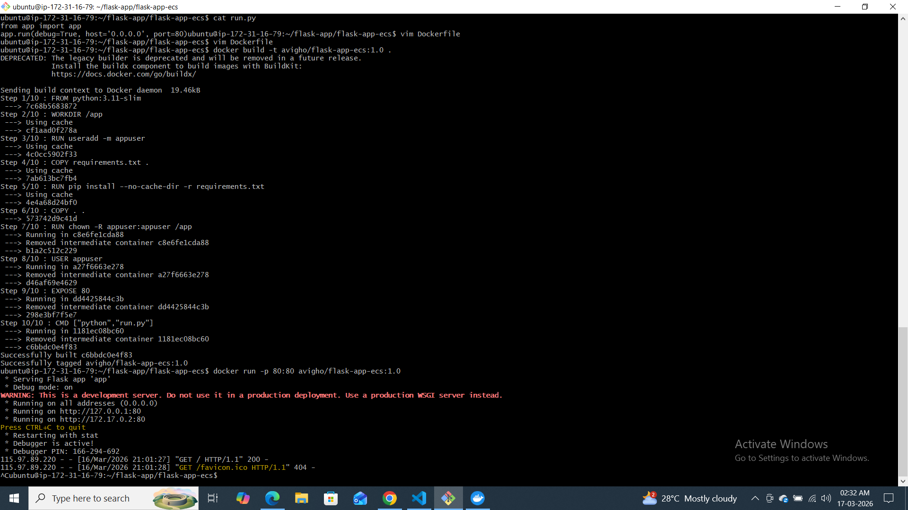
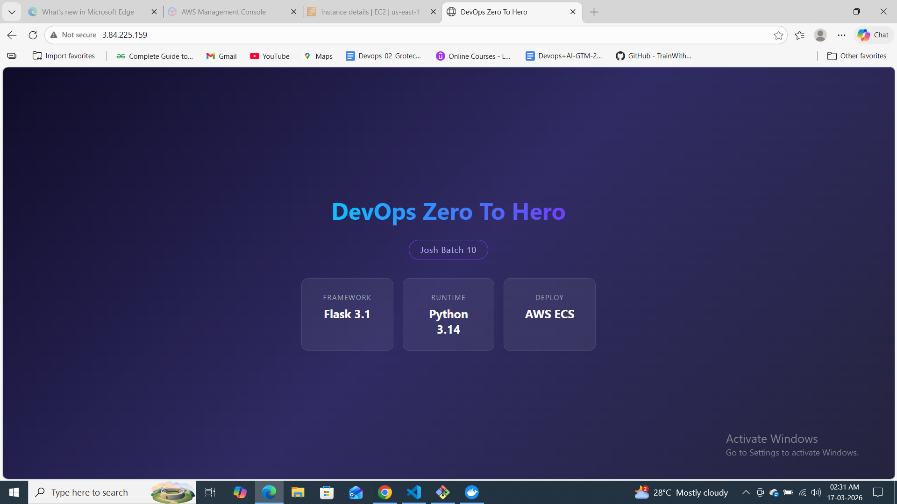
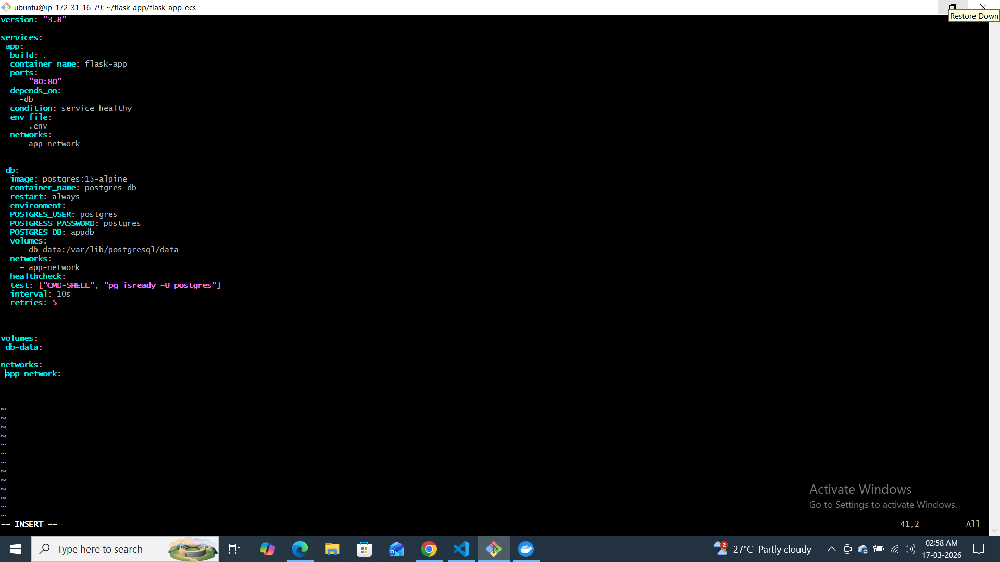
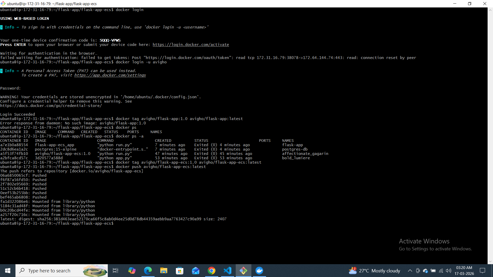
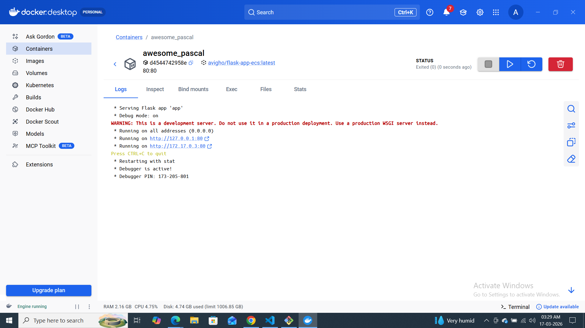
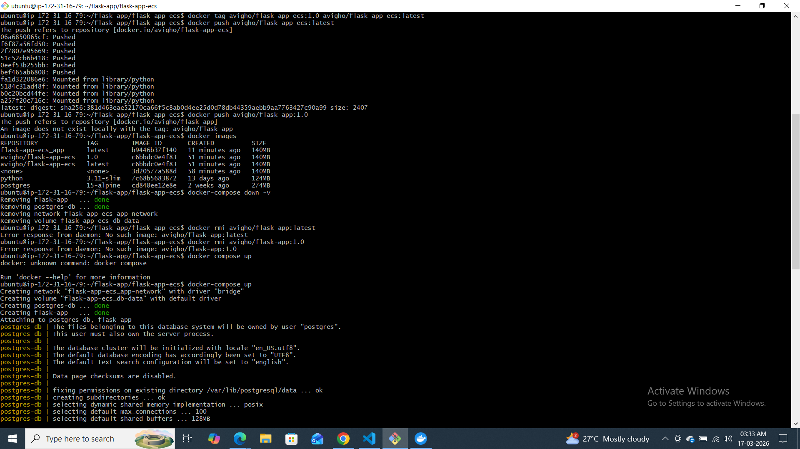

# Day 36 – Dockerize a Full Application

## App Chosen
I cloned a Flask application from Shubham Londhe GitHub.

## Why This App?
To practice real-world backend + database containerization.

## Dockerfile Explanation
- Used python:3.11-slim for small image
- Used non-root user for security
- Used layered caching for faster builds

## Docker Compose Setup
- App service
- Postgres service
- Volume for DB persistence
- Custom network
- Healthchecks added

## Challenges Faced
- DB connection error
- Container dependency timing issue
- Fixed using healthcheck + depends_on

## folder structure
flask-app/
 └── flask-app-ecs/
     ├── Dockerfile
     ├── docker-compose.yml
     ├── .dockerignore
     ├── .env
     ├── app code
     └── day-36-docker-project.md
## Final Image Size
flask-app-ecs_app      latest      b9446b37f140   27 minutes ago      140MB
avigho/flask-app-ecs   1.0         c6bbdc0e4f83   About an hour ago   140MB
avigho/flask-app-ecs   latest      c6bbdc0e4f83   About an hour ago   140MB

### Dockerhub-link

https://hub.docker.com/r/avigho/flask-app-ecs

## screenshot

