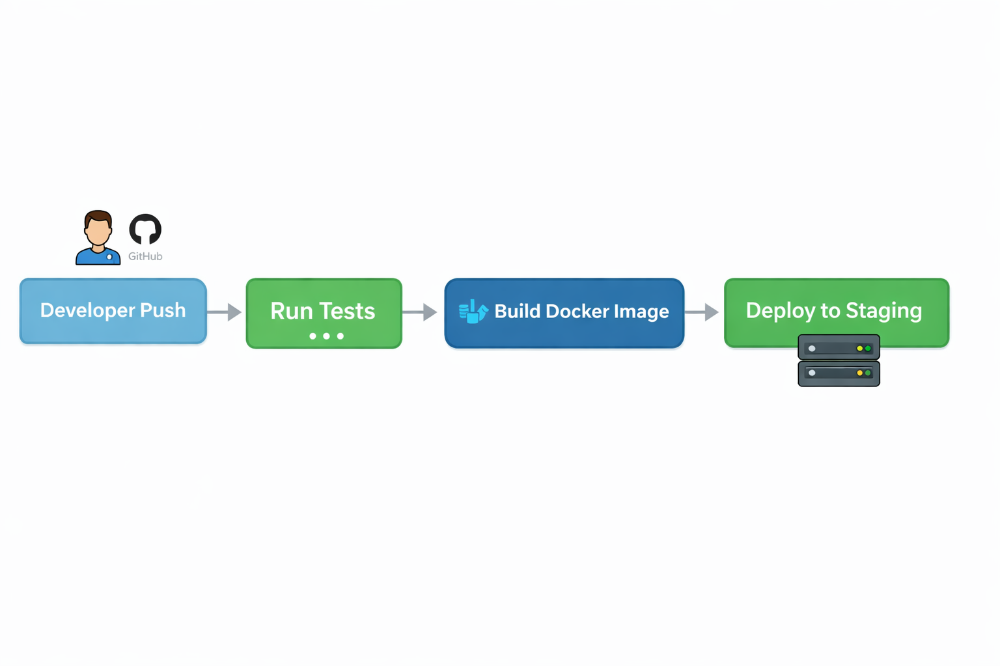

# Day 39 – CI/CD Concepts

## 🔥 Task 1: The Problem

### 1. What can go wrong?

If 5 developers manually push and deploy:

- Code conflicts
- Broken production
- No automated testing
- Human errors during deployment
- Overwriting someone else's changes
- No rollback mechanism
- Downtime

### 2. What does “It works on my machine” mean?

It means the code works in the developer’s local environment but fails in staging or production.

Why?

- Different OS
- Different dependency versions
- Missing environment variables
- Different database setups

This causes delays and blame culture.

### 3. How many times can a team safely deploy manually?

Realistically:
- 1–2 times per day
- Requires coordination
- High risk

Manual deployment does NOT scale.

---

# 🚀 Task 2: CI vs CD

## 1️⃣ Continuous Integration (CI)

Continuous Integration is the practice of automatically testing and validating code whenever developers push changes.

- Runs on every commit or pull request
- Catches bugs early
- Ensures main branch stays stable

Example:
A developer pushes code to GitHub → tests run automatically → build fails if tests fail.

---

## 2️⃣ Continuous Delivery (CD)

Continuous Delivery ensures code is always in a deployable state.

- After CI passes
- Builds are ready for production
- Manual approval required before release

Example:
After tests pass → app is built → stored as artifact → team manually clicks "Deploy".

---

## 3️⃣ Continuous Deployment

Continuous Deployment automatically releases code to production after CI passes.

- No manual approval
- Fully automated
- Used by high-maturity teams

Example:
Push → Tests pass → Auto deploy to production.

---

# 🏗 Task 3: Pipeline Anatomy

## Trigger
Event that starts pipeline.
Example: push, pull_request, schedule.

## Stage
A logical phase.
Example: build, test, deploy.

## Job
A unit of work inside a stage.
Example: run tests, build Docker image.

## Step
A single command.
Example:
- npm install
- docker build

## Runner
The machine that executes jobs.
Example:
- GitHub-hosted runner
- Self-hosted runner

## Artifact
Output produced by job.
Example:
- Docker image
- Compiled binary
- Test report

---

# 📊 Task 4: Pipeline Diagram

Scenario:
Developer pushes code → App tested → Docker image built → Deploy to staging

Text Diagram:

Developer Push
      ↓
GitHub Trigger
      ↓
───────────────
Stage 1: Test
───────────────
  Job: Run Tests
    - Install dependencies
    - Run unit tests
      ↓
───────────────
Stage 2: Build
───────────────
  Job: Build Docker Image
    - docker build
    - tag image
      ↓
───────────────
Stage 3: Deploy
───────────────
  Job: Deploy to Staging
    - push image
    - restart container

---

# 🌍 Task 5: Explore in the Wild

Repository explored:
FastAPI (example)

Observations:

Trigger:
- push
- pull_request

Jobs:
- Lint
- Test
- Build

What it does:
- Installs dependencies
- Runs lint checks
- Runs tests
- Ensures PR quality

Conclusion:
CI prevents broken code from being merged.

