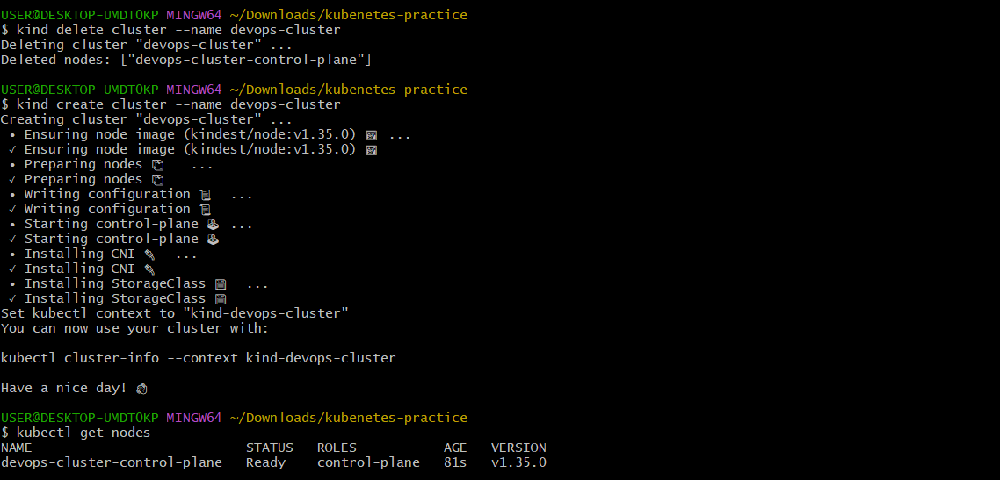
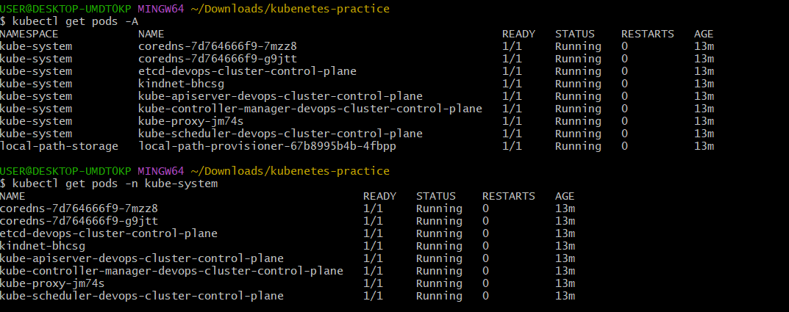
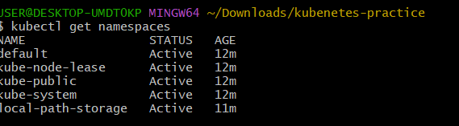
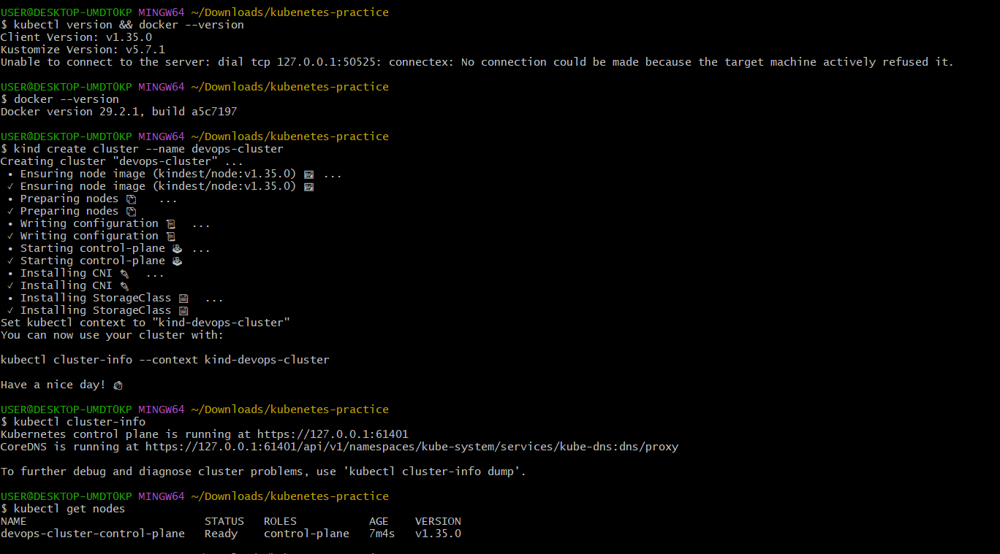
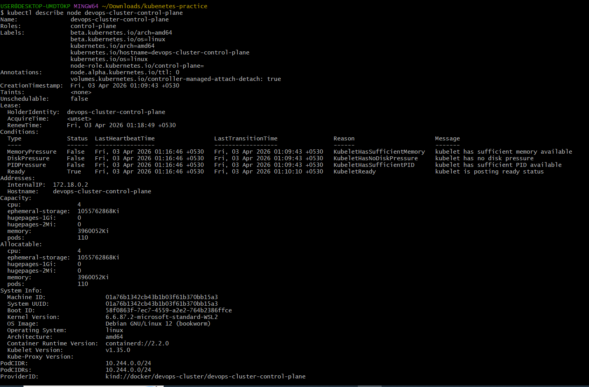
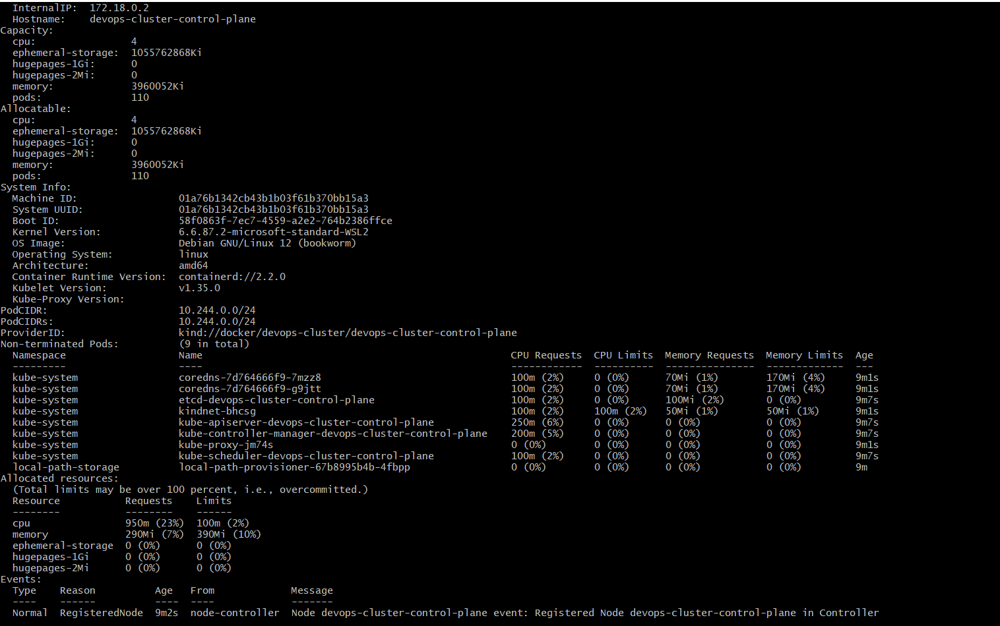
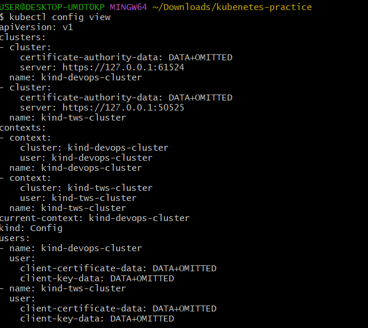

# Day 50 – Kubernetes Architecture and Cluster Setup

## 🚀 Introduction

Today I started my Kubernetes journey.  
After working with Docker containers, I learned why container orchestration is necessary when running applications at scale.

---

# 📖 1️⃣ Kubernetes History (In My Own Words)

Kubernetes was created to manage containers at scale across multiple servers.  
While Docker can run containers, it cannot handle orchestration like auto-scaling, self-healing, and load balancing across many machines.  

Kubernetes was originally created by Google and inspired by their internal system called Borg.  
The word "Kubernetes" means "Helmsman" (a ship pilot), and it is commonly abbreviated as **K8s**.

---

# 🏗 2️⃣ Kubernetes Architecture

## 🔹 Control Plane (Master Node)

- **API Server** – Entry point to the cluster. All commands go through it.
- **etcd** – Database that stores the cluster’s state.
- **Scheduler** – Decides which worker node a pod should run on.
- **Controller Manager** – Ensures the desired state matches the actual state.

## 🔹 Worker Node

- **kubelet** – Agent that communicates with API server and runs pods.
- **kube-proxy** – Handles networking and service communication.
- **Container Runtime** – Runs containers (containerd).

---

## 📊 Architecture Diagram
.png>)

⚙ 3️⃣ What Happens When I Run:

kubectl apply -f pod.yaml

kubectl sends request to API Server
API Server stores desired state in etcd
Scheduler selects a worker node
kubelet on that node creates the pod
Container Runtime runs the container

🖥 4️⃣ Local Cluster Setup
✅ Tool Chosen: kind

I chose kind (Kubernetes in Docker) because:

It is lightweight
It runs inside Docker
Fast to create and delete clusters
Good for DevOps practice
🔍 5️⃣ Cluster Verification
📌 kubectl get nodes

📌 kube-system Pods

Command used:

kubectl get pods -n kube-system

🧠 6️⃣ kube-system Pods Explanation

| Pod Name                | Purpose                    |
| ----------------------- | -------------------------- |
| kube-apiserver          | Entry point to the cluster |
| etcd                    | Stores cluster data        |
| kube-scheduler          | Assigns pods to nodes      |
| kube-controller-manager | Maintains desired state    |
| kube-proxy              | Manages networking         |
| coredns                 | Internal DNS for services  |

🔁 7️⃣ Cluster Lifecycle Practice

Commands used:
kind delete cluster --name devops-cluster
kind create cluster --name devops-cluster
kubectl get nodes
This helped me understand cluster recreation and lifecycle management.

🔐 8️⃣ What is kubeconfig?
kubeconfig is a configuration file used by kubectl
It stores cluster details, user credentials, and context information
Default location (Windows):
C:\Users\<your-username>\.kube\config

🎯 Conclusion

Today I:

Understood Kubernetes architecture
Set up a local cluster using kind
Explored control plane components
Practiced cluster lifecycle operations
Learned how kubectl communicates with the cluster

This marks the beginning of my Kubernetes journey 🚀

### Other screenshots:- 
   
