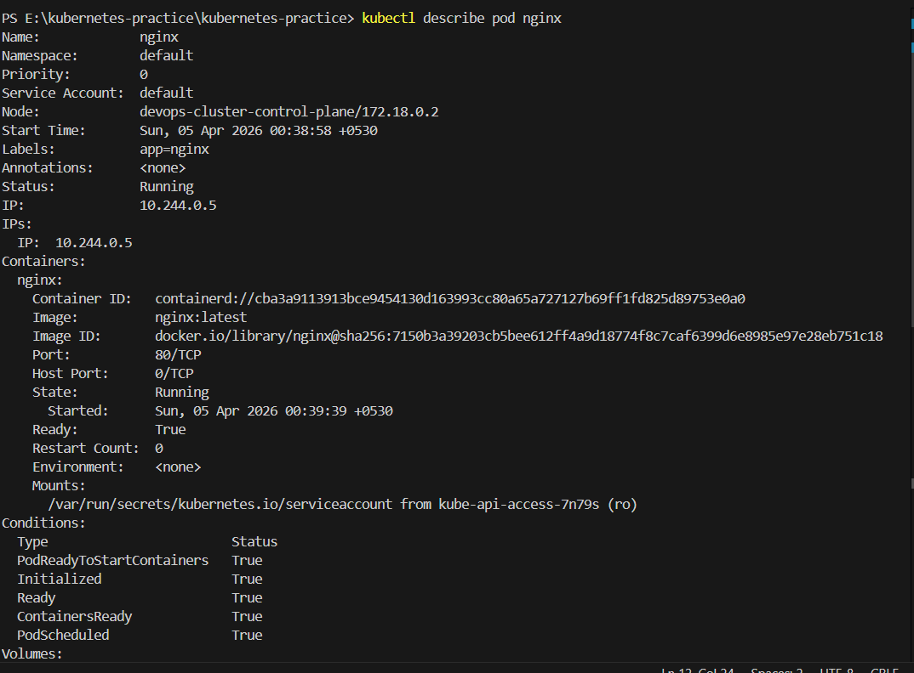
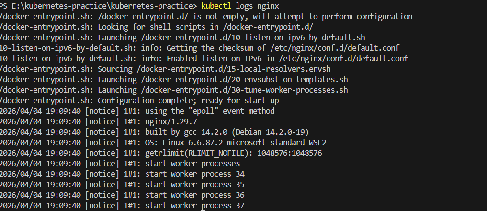
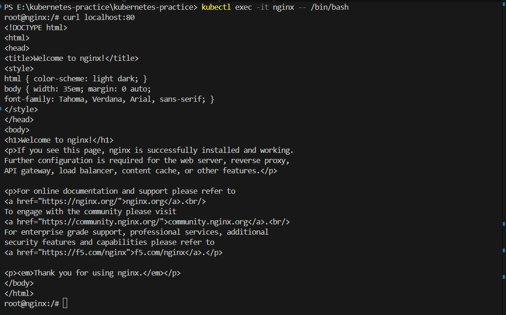
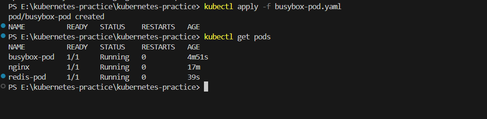
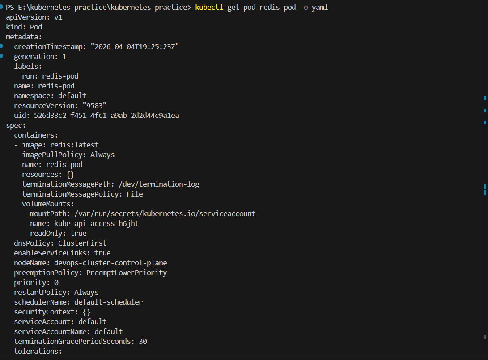
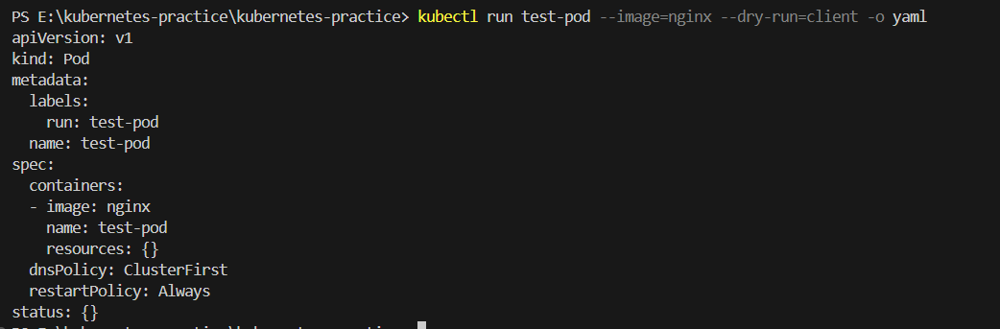
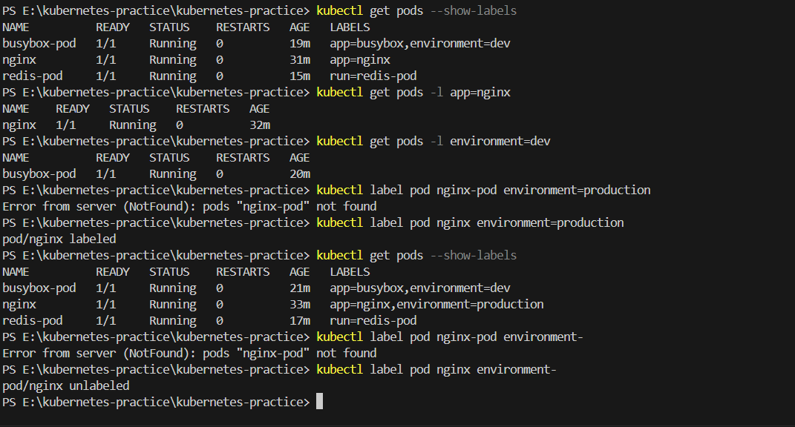
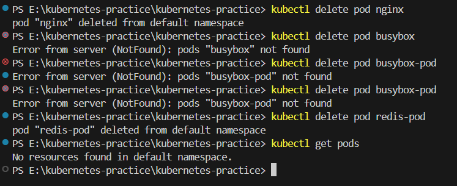

Day 51 – Kubernetes Manifests and First Pods
📌 Objective

Today I learned how to write Kubernetes Pod manifests from scratch and deploy them into my cluster using kubectl apply.

I created:

3 Pod manifests
Used labels and filtering
Compared imperative vs declarative approaches
Explored Pods using describe, logs, and exec
🔹 The Four Required Fields in a Kubernetes Manifest

Every Kubernetes resource requires four top-level fields:

1️⃣ apiVersion

Defines which Kubernetes API version to use.

For Pods:

apiVersion: v1
2️⃣ kind

Specifies the type of resource.

For this task:

kind: Pod
3️⃣ metadata

Defines identity information like name and labels.

metadata:
  name: nginx-pod
  labels:
    app: nginx
name → Unique identifier of the resource
labels → Key-value pairs used for grouping and filtering
4️⃣ spec

Defines the desired state (containers, image, ports, commands, etc.)

spec:
  containers:
  - name: nginx
    image: nginx:latest
🔹 Pod 1 – Nginx Pod

File: nginx-pod.yaml

apiVersion: v1
kind: Pod
metadata:
  name: nginx-pod
  labels:
    app: nginx
spec:
  containers:
  - name: nginx
    image: nginx:latest
    ports:
    - containerPort: 80

Commands used:

kubectl apply -f nginx-pod.yaml
kubectl get pods
kubectl describe pod nginx-pod
kubectl logs nginx-pod
kubectl exec -it nginx-pod -- /bin/sh

Inside the container:

curl localhost:80

I was able to see the Nginx welcome page HTML.

🔹 Pod 2 – BusyBox Pod

File: busybox-pod.yaml

apiVersion: v1
kind: Pod
metadata:
  name: busybox-pod
  labels:
    app: busybox
    environment: dev
spec:
  containers:
  - name: busybox
    image: busybox:latest
    command: ["sh", "-c", "echo Hello from BusyBox && sleep 3600"]

Commands used:

kubectl apply -f busybox-pod.yaml
kubectl logs busybox-pod

Output:

Hello from BusyBox

The command field keeps the container running. Without it, BusyBox would exit immediately.

🔹 Pod 3 – Redis Pod with Multiple Labels

File: third-pod.yaml

apiVersion: v1
kind: Pod
metadata:
  name: redis-pod
  labels:
    app: redis
    environment: staging
    team: backend
spec:
  containers:
  - name: redis
    image: redis:latest
    ports:
    - containerPort: 6379

Filtering using labels:

kubectl get pods --show-labels
kubectl get pods -l app=redis
kubectl get pods -l environment=dev
kubectl get pods -l team=backend
🔹 Imperative vs Declarative
Imperative Approach

Create resource directly using command:

kubectl run redis-imperative --image=redis:latest
Quick
Good for testing
Not version controlled
Declarative Approach

Create resource using YAML file:

kubectl apply -f file.yaml
Version controlled
Git friendly
Production standard
Repeatable and scalable

Declarative is preferred in real-world DevOps.

🔹 Dry Run Validation

Validate without creating resource:

kubectl apply -f nginx-pod.yaml --dry-run=client
kubectl apply -f nginx-pod.yaml --dry-run=server

If required fields (like image) are missing, Kubernetes throws validation errors.

🔹 What Happens When You Delete a Standalone Pod?

If you delete a standalone Pod:

kubectl delete pod nginx-pod

It is permanently deleted.

It does NOT recreate automatically because:

No controller manages it
No Deployment is attached to it

This is why in production we use Deployments instead of standalone Pods.

🔹 Screenshot
.png>)          .png>) .png>) .png>)

kubectl get pods
✅ Key Learnings
Understood Kubernetes manifest structure
Learned YAML indentation importance
Practiced label-based filtering
Compared imperative vs declarative
Explored container inside Pod
Learned why controllers are important