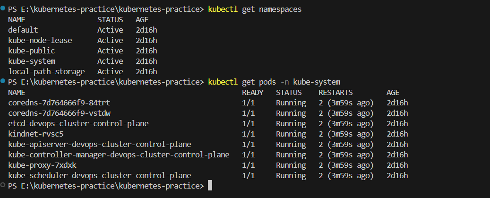
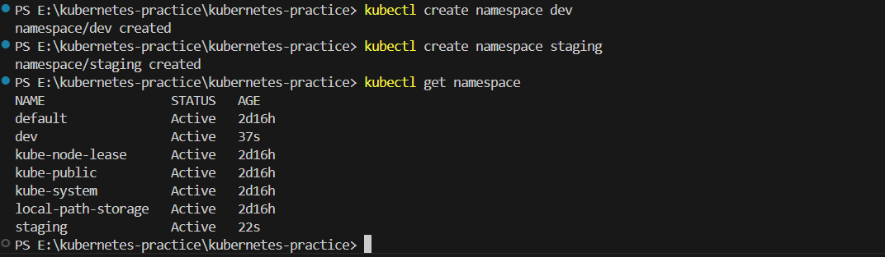
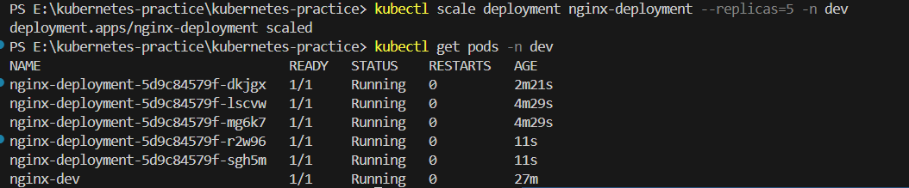
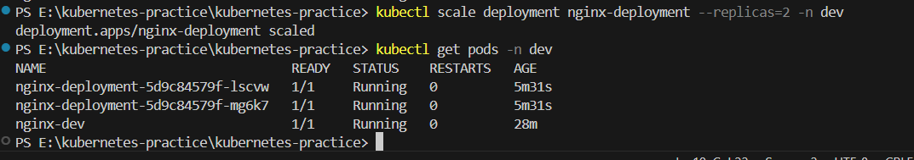
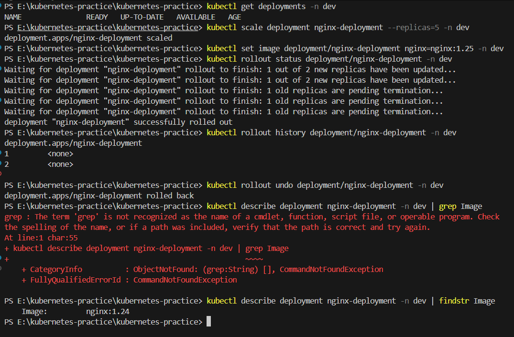
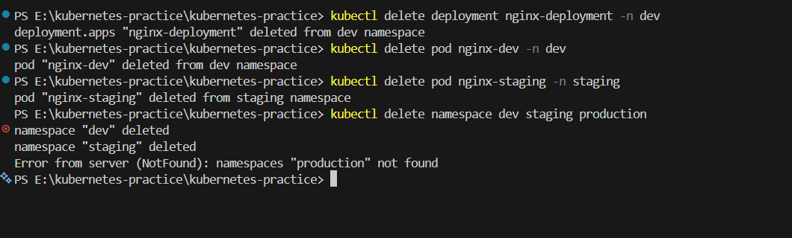
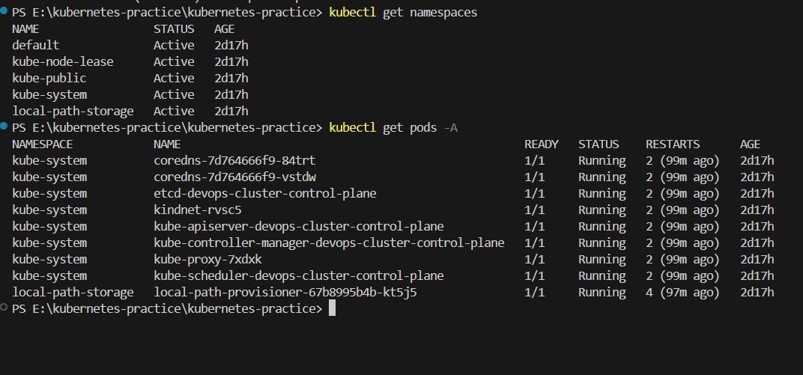

Day 52 – Kubernetes Namespaces and Deployments
📌 Introduction

Today I learned about Namespaces and Deployments in Kubernetes.

Yesterday, I created standalone Pods. The problem with standalone Pods is that if they are deleted or crash, Kubernetes does NOT recreate them automatically.

Deployments solve this problem by ensuring:

Desired number of replicas are always running
Self-healing capability
Scaling support
Rolling updates with zero downtime
Easy rollback
🧩 What Are Namespaces?

Namespaces are a way to organize and isolate resources inside a Kubernetes cluster.

They are useful for:

Separating environments (dev, staging, production)
Multi-team projects
Resource management
Avoiding naming conflicts
🔹 Default Namespaces in Kubernetes

When I ran:

kubectl get namespaces

I saw:

default – Default workspace
kube-system – Internal Kubernetes components
kube-public – Public resources
kube-node-lease – Node heartbeat tracking

To see system pods:

kubectl get pods -n kube-system
🏗️ Creating Custom Namespaces

I created two namespaces:

kubectl create namespace dev
kubectl create namespace staging

Verified:

kubectl get namespaces

I also created a namespace using YAML:

apiVersion: v1
kind: Namespace
metadata:
  name: production

Applied with:

kubectl apply -f namespace.yaml
🚀 Running Pods in Specific Namespaces
kubectl run nginx-dev --image=nginx:latest -n dev
kubectl run nginx-staging --image=nginx:latest -n staging

To view all pods across namespaces:

kubectl get pods -A

Without -n, kubectl only shows resources from the default namespace.

🔥 Creating My First Deployment
nginx-deployment.yaml
apiVersion: apps/v1
kind: Deployment
metadata:
  name: nginx-deployment
  namespace: dev
  labels:
    app: nginx
spec:
  replicas: 3
  selector:
    matchLabels:
      app: nginx
  template:
    metadata:
      labels:
        app: nginx
    spec:
      containers:
      - name: nginx
        image: nginx:1.24
        ports:
        - containerPort: 80
🔎 Explanation of Each Section
apiVersion: apps/v1 → Required for Deployments
kind: Deployment → Defines resource type
replicas: 3 → Ensures 3 Pods always run
selector.matchLabels → Connects Deployment to Pods
template → Pod blueprint
image: nginx:1.24 → Container image
namespace: dev → Deployment created inside dev namespace
♻️ Self-Healing Behavior

When I deleted a pod:

kubectl delete pod <pod-name> -n dev

Kubernetes automatically recreated it.

Difference:
Standalone Pod	Deployment Pod
Deleted → Gone forever	Deleted → Recreated automatically

The replacement pod had a different name.

📈 Scaling Deployment
Scale Up
kubectl scale deployment nginx-deployment --replicas=5 -n dev
Scale Down
kubectl scale deployment nginx-deployment --replicas=2 -n dev

When scaling down:

Extra pods were terminated automatically.
Declarative Scaling

I can also edit:

replicas: 4

Then apply:

kubectl apply -f nginx-deployment.yaml
🔄 Rolling Update

Updated image version:

kubectl set image deployment/nginx-deployment nginx=nginx:1.25 -n dev

Checked rollout status:

kubectl rollout status deployment/nginx-deployment -n dev

Kubernetes replaced pods one by one with zero downtime.

⏪ Rollback

Checked history:

kubectl rollout history deployment/nginx-deployment -n dev

Rolled back:

kubectl rollout undo deployment/nginx-deployment -n dev

After rollback, the image version returned to nginx:1.24.

🧠 Key Learnings
Namespaces isolate environments
Deployments maintain desired state
Pods under Deployment are self-healing
Scaling can be imperative or declarative
Rolling updates prevent downtime
Rollbacks restore previous versions instantly
🧹 Cleanup
kubectl delete deployment nginx-deployment -n dev
kubectl delete pod nginx-dev -n dev
kubectl delete pod nginx-staging -n staging
kubectl delete namespace dev staging production

Deleting a namespace deletes everything inside it.

📸 Screenshots

.png>)       

kubectl get deployments -n dev
kubectl get pods -A
✅ Conclusion

Today I learned how Kubernetes manages applications in a production-ready way using Namespaces and Deployments.

Deployments provide:

Self-healing
Scaling
Rolling updates
Rollbacks
High availability

This is the real way applications are managed in Kubernetes.