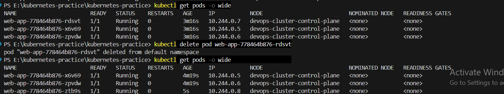
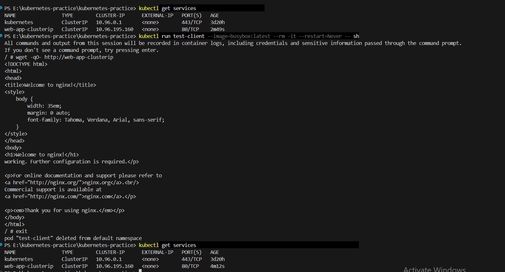
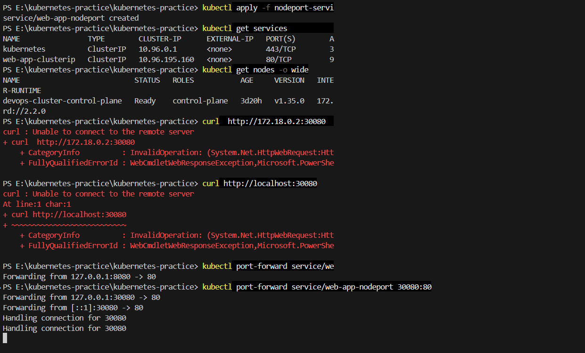
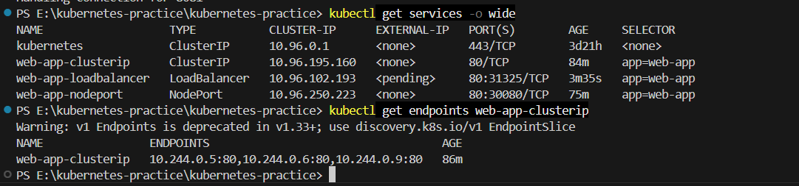

# Kubernetes Services Assignment

## Objective

Understand and implement different types of Kubernetes Services:

* ClusterIP
* NodePort
* LoadBalancer

---

# 1️⃣ Deployment Creation

Created a Deployment named `web-app` with multiple replicas.

```yaml
apiVersion: apps/v1
kind: Deployment
metadata:
  name: web-app
spec:
  replicas: 3
  selector:
    matchLabels:
      app: web-app
  template:
    metadata:
      labels:
        app: web-app
    spec:
      containers:
      - name: nginx
        image: nginx
        ports:
        - containerPort: 80
```

Apply:

```bash
kubectl apply -f app-deployment.yaml
```

Verify:

```bash
kubectl get pods
```

---

# 2️⃣ ClusterIP Service

Created an internal service to expose pods inside the cluster.

```yaml
apiVersion: v1
kind: Service
metadata:
  name: web-app-clusterip
spec:
  type: ClusterIP
  selector:
    app: web-app
  ports:
  - port: 80
    targetPort: 80
```

Apply:

```bash
kubectl apply -f clusterip-service.yaml
```

Check:

```bash
kubectl get services
kubectl get endpoints web-app-clusterip
```

Result:

* Service gets a stable ClusterIP
* Endpoints show all pod IPs
* Traffic load balances between pods

---

# 3️⃣ NodePort Service

Created a service to expose the application outside the cluster using a node port.

```yaml
apiVersion: v1
kind: Service
metadata:
  name: web-app-nodeport
spec:
  type: NodePort
  selector:
    app: web-app
  ports:
  - port: 80
    targetPort: 80
    nodePort: 30080
```

Apply:

```bash
kubectl apply -f nodeport-service.yaml
```

Access using:

```bash
http://<NodeIP>:30080
```

---

# 4️⃣ LoadBalancer Service

Created a LoadBalancer service.

```yaml
apiVersion: v1
kind: Service
metadata:
  name: web-app-loadbalancer
spec:
  type: LoadBalancer
  selector:
    app: web-app
  ports:
  - port: 80
    targetPort: 80
```

Apply:

```bash
kubectl apply -f loadbalancer-service.yaml
```

Check:

```bash
kubectl get services -o wide
```

Note:

* In local clusters (like Minikube or kind), EXTERNAL-IP may show as `<pending>`.
* In cloud environments (AWS, Azure, GCP), a public IP is automatically provisioned.

---

# 5️⃣ Verifying Endpoints

```bash
kubectl get endpoints web-app-clusterip
```

Example output:

```
10.244.0.5:80
10.244.0.6:80
10.244.0.9:80
```

This confirms:

* Service selector matches pods
* Traffic is distributed across replicas

---

# 6️⃣ Key Concepts Learned

* Pods have dynamic IPs (ephemeral)
* Services provide stable virtual IPs
* Selector connects Service to Pods
* Endpoints represent backend pods
* ClusterIP → Internal communication
* NodePort → External access via Node IP
* LoadBalancer → Cloud-managed external access

---

# 7️⃣ Interview Explanation

Why do we need a Service?

Pods are ephemeral and their IP addresses change when recreated. A Service provides:

* Stable IP address
* Stable DNS name
* Load balancing across healthy pods
* Service discovery inside cluster

---

# 8️⃣ Commands Used in Assignment

```bash
kubectl get pods
kubectl get services
kubectl get services -o wide
kubectl get endpoints
kubectl describe service web-app-clusterip
kubectl delete pod <pod-name>
```

---

# ✅ Conclusion

Successfully implemented and tested:

* Deployment with replicas
* ClusterIP Service
* NodePort Service
* LoadBalancer Service
* Verified endpoints and traffic routing

This assignment demonstrates understanding of Kubernetes networking fundamentals and service exposure methods.

 # Screenshots
  .png>)     .png>) .png>)


