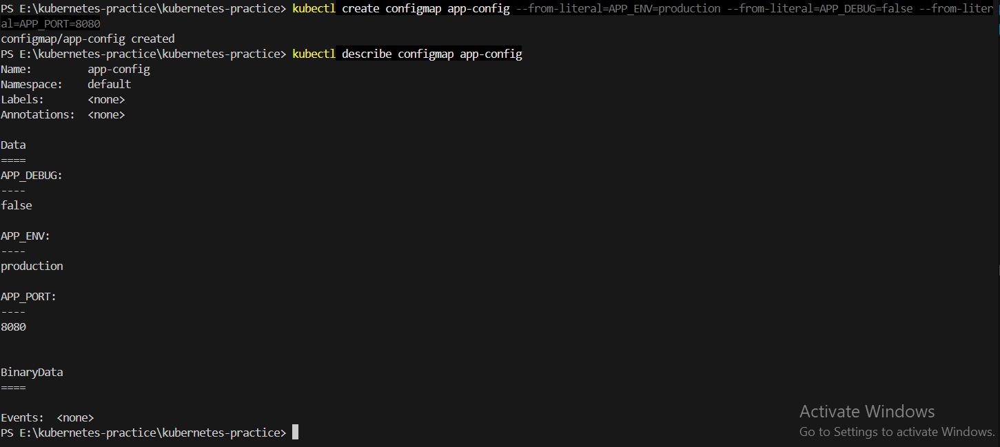
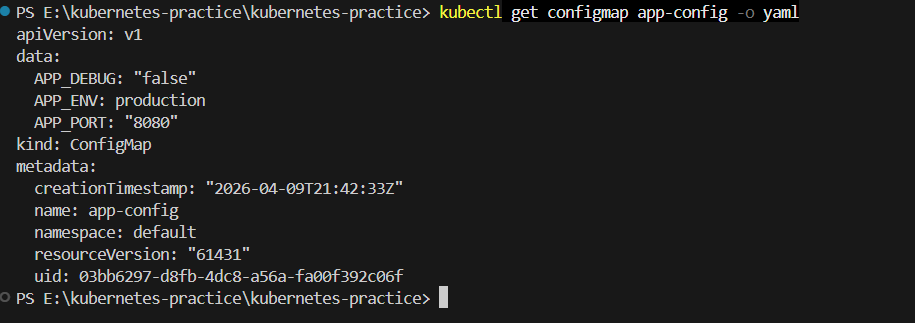
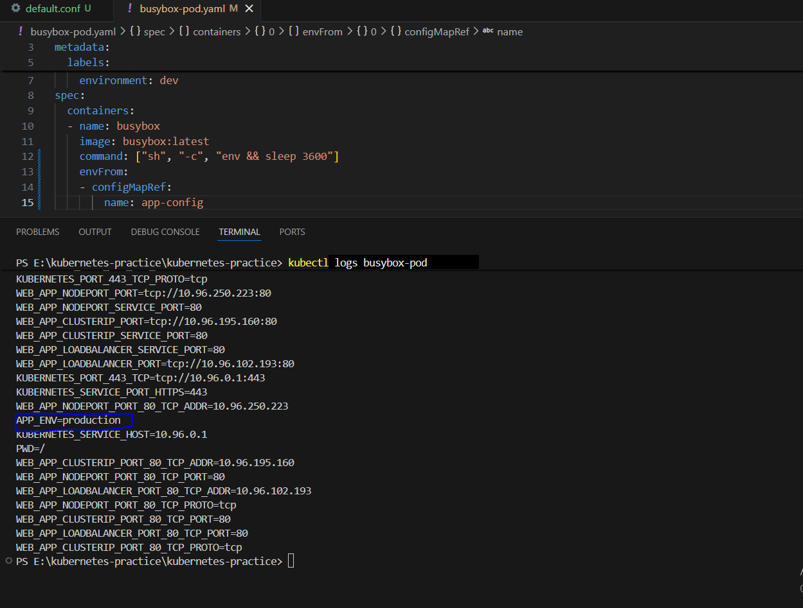
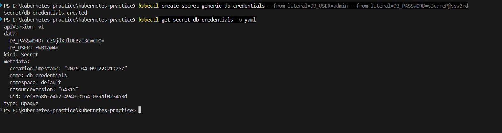
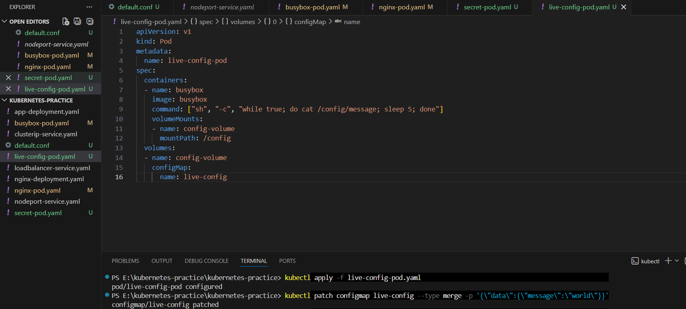

# Day 54 – Kubernetes ConfigMaps and Secrets

## 📌 Overview

In this lab, I learned how to manage application configuration in Kubernetes using **ConfigMaps** and **Secrets**. This helps avoid hardcoding values inside container images and makes applications more flexible and secure.

---

## 🔹 What are ConfigMaps?

ConfigMaps are used to store **non-sensitive configuration data** such as:

- Environment variables
- Application settings
- Configuration files

### ✅ Use Cases:
- Feature flags
- App environment (dev, prod)
- Ports and URLs

---

## 🔹 What are Secrets?

Secrets are used to store **sensitive data**, such as:

- Database credentials
- API keys
- Tokens

### ⚠️ Important:
Secrets are stored in **base64 encoded format**, not encrypted by default.

---

## 🔹 ConfigMap Creation

### From Literals:

```bash
kubectl create configmap app-config \
  --from-literal=APP_ENV=production \
  --from-literal=APP_DEBUG=false \
  --from-literal=APP_PORT=8080

From File:
kubectl create configmap nginx-config \
  --from-file=default.conf=default.conf
🔹 Using ConfigMaps in Pods
1. Environment Variables
envFrom:
  - configMapRef:
      name: app-config

✔ Injects all key-value pairs as environment variables.

2. Volume Mounts
volumeMounts:
  - name: nginx-config-volume
    mountPath: /etc/nginx/conf.d
✔ Used for full configuration files.

🔹 Environment Variables vs Volume Mounts
| Feature  | Environment Variables | Volume Mount |
| -------- | --------------------- | ------------ |
| Use Case | Simple key-value      | Config files |
| Updates  | ❌ Not dynamic         | ✅ Auto अपडेट |
| Access   | Env variables         | File system  |

🔹 Secret Creation
kubectl create secret generic db-credentials \
  --from-literal=DB_USER=admin \
  --from-literal=DB_PASSWORD=s3cureP@ssw0rd
🔹 Decoding Secret
kubectl get secret db-credentials -o jsonpath='{.data.DB_PASSWORD}' | base64 --decode

✔ Output:

s3cureP@ssw0rd
🔹 Why Base64 is NOT Encryption
Base64 is just encoding, not security
Anyone with access can decode it easily
Real security comes from:
RBAC (access control)
Encryption at rest (optional)
Restricted access
🔹 Using Secrets in Pods
As Environment Variable
env:
  - name: DB_USER
    valueFrom:
      secretKeyRef:
        name: db-credentials
        key: DB_USER
As Volume
volumes:
  - name: secret-volume
    secret:
      secretName: db-credentials

✔ Each key becomes a file
✔ Values are automatically decoded

🔹 Live ConfigMap Update (Important Concept)
Step 1: Create ConfigMap
kubectl create configmap live-config --from-literal=message=hello
Step 2: Mount in Pod

Pod continuously reads file every 5 seconds.

Step 3: Update ConfigMap
kubectl patch configmap live-config \
  --type merge \
  -p "{\"data\":{\"message\":\"world\"}}"
🔹 Observations
✅ Volume-mounted ConfigMap updated automatically
❌ Environment variables did NOT update
No pod restart required for volume updates
🎯 Key Learnings
ConfigMaps store non-sensitive data
Secrets store sensitive data (base64 encoded)
Env variables are static (set at pod start)
Volume mounts update dynamically
Base64 is encoding, not encryption
🧹 Cleanup
kubectl delete pod --all
kubectl delete configmap --all
kubectl delete secret --all
 
 ## Screenshots 
 .png>)      .png>) .png>)