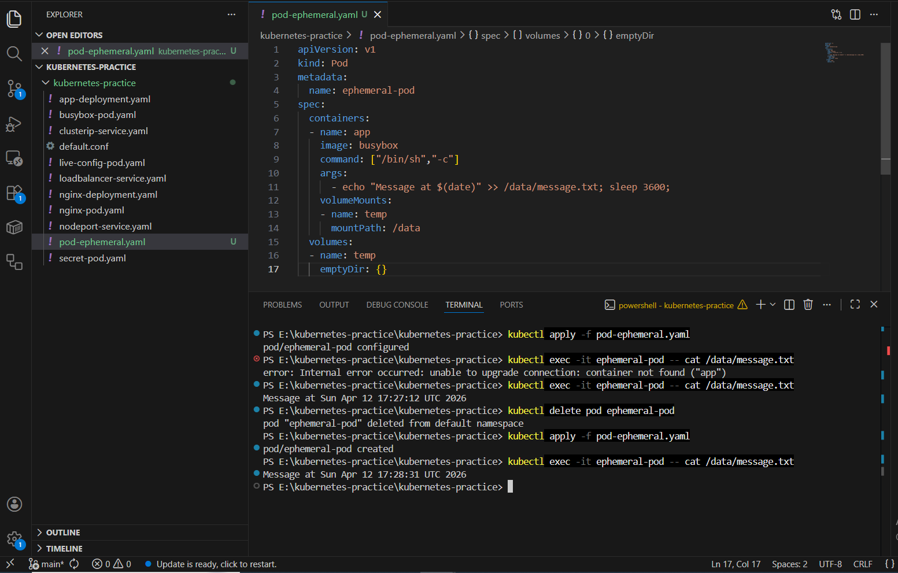
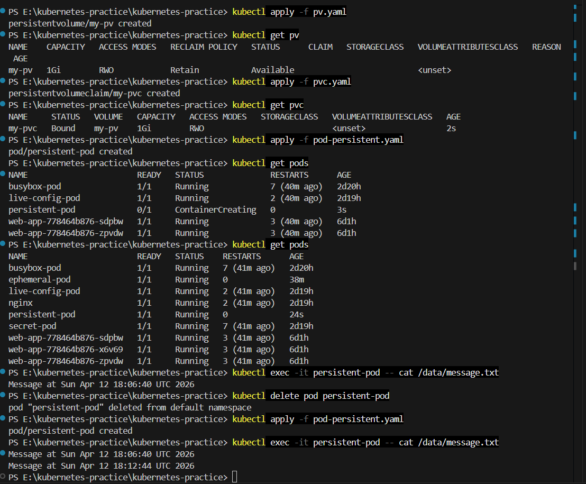
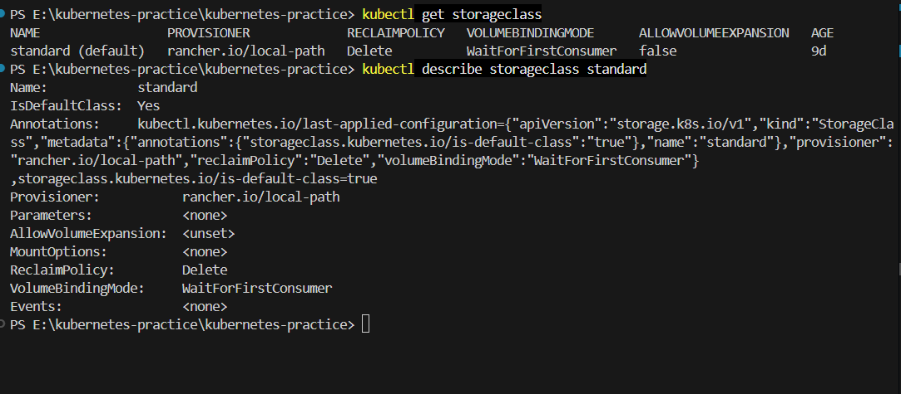

📦 Day 55 – Persistent Volumes (PV) and Persistent Volume Claims (PVC)
🚀 Objective

Understand how Kubernetes handles storage and solve the problem of data loss in containers using:

Persistent Volumes (PV)
Persistent Volume Claims (PVC)
🔴 Task 1: Ephemeral Storage Problem
Pod using emptyDir
apiVersion: v1
kind: Pod
metadata:
  name: ephemeral-pod
spec:
  containers:
  - name: app
    image: busybox
    command: ["/bin/sh","-c"]
    args:
      - echo "Message at $(date)" >> /data/message.txt; sleep 3600;
    volumeMounts:
    - name: temp
      mountPath: /data
  volumes:
  - name: temp
    emptyDir: {}

Commands
kubectl apply -f pod-ephemeral.yaml
kubectl exec -it ephemeral-pod -- cat /data/message.txt

kubectl delete pod ephemeral-pod
kubectl apply -f pod-ephemeral.yaml
kubectl exec -it ephemeral-pod -- cat /data/message.txt

✅ Observation
Timestamp changes → ❌ Data lost
🟢 Task 2: Create Persistent Volume (PV)
apiVersion: v1
kind: PersistentVolume
metadata:
  name: my-pv
spec:
  storageClassName: ""   # Important for static provisioning
  capacity:
    storage: 1Gi
  accessModes:
    - ReadWriteOnce
  persistentVolumeReclaimPolicy: Retain
  hostPath:
    path: /tmp/k8s-pv-data

Commands
kubectl apply -f pv.yaml
kubectl get pv

✅ Observation
STATUS → Available

🔵 Task 3: Create PersistentVolumeClaim (PVC)
apiVersion: v1
kind: PersistentVolumeClaim
metadata:
  name: my-pvc
spec:
  storageClassName: ""   # Must match PV
  accessModes:
    - ReadWriteOnce
  resources:
    requests:
      storage: 500Mi
Commands
kubectl apply -f pvc.yaml
kubectl get pvc
kubectl get pv
✅ Observation
PVC → Bound
PV → Bound
VOLUME → my-pv
🟣 Task 4: Use PVC in Pod
apiVersion: v1
kind: Pod
metadata:
  name: persistent-pod
spec:
  containers:
  - name: app
    image: busybox
    command: ["/bin/sh","-c"]
    args:
      - echo "Message at $(date)" >> /data/message.txt; sleep 3600;
    volumeMounts:
    - mountPath: /data
      name: persistent-storage
  volumes:
  - name: persistent-storage
    persistentVolumeClaim:
      claimName: my-pvc
Commands
kubectl apply -f pod-persistent.yaml
kubectl exec -it persistent-pod -- cat /data/message.txt

kubectl delete pod persistent-pod
kubectl apply -f pod-persistent.yaml

kubectl exec -it persistent-pod -- cat /data/message.txt
✅ Observation
Data persists across Pod restart ✅
🟡 Task 5: StorageClass
Commands
kubectl get storageclass
kubectl describe storageclass
✅ Observation
Default StorageClass → standard
Key fields:
Provisioner
ReclaimPolicy
VolumeBindingMode
🟠 Task 6: Dynamic Provisioning
Dynamic PVC
apiVersion: v1
kind: PersistentVolumeClaim
metadata:
  name: dynamic-pvc
spec:
  accessModes:
    - ReadWriteOnce
  resources:
    requests:
      storage: 500Mi
  storageClassName: standard
Commands
kubectl apply -f dynamic-pvc.yaml
kubectl get pv
✅ Observation
New PV created automatically
🔵 Pod using Dynamic PVC
apiVersion: v1
kind: Pod
metadata:
  name: dynamic-pod
spec:
  containers:
  - name: app
    image: busybox
    command: ["/bin/sh","-c"]
    args:
      - echo "Dynamic data $(date)" >> /data/message.txt; sleep 3600;
    volumeMounts:
    - mountPath: /data
      name: storage
  volumes:
  - name: storage
    persistentVolumeClaim:
      claimName: dynamic-pvc
Commands
kubectl apply -f pod-dynamic.yaml
kubectl exec -it dynamic-pod -- cat /data/message.txt
🧹 Task 7: Cleanup
kubectl delete pod --all
kubectl delete pvc --all
kubectl get pv
✅ Observation
Dynamic PV → ❌ Deleted
Manual PV → ✅ Released (Retained)
📘 Concepts
🔹 PersistentVolume (PV)
Cluster-level storage resource
🔹 PersistentVolumeClaim (PVC)
Request for storage by user
⚖️ Static vs Dynamic Provisioning
Feature	Static	Dynamic
PV Creation	Manual	Automatic
StorageClass	Not required	Required
🔐 Access Modes
ReadWriteOnce (RWO)
ReadOnlyMany (ROX)
ReadWriteMany (RWX)
🔁 Reclaim Policies
Policy	Behavior
Retain	Keeps data
Delete	Deletes storage
🧠 Key Learnings
Containers are ephemeral
PV + PVC provide persistent storage
StorageClass enables automation
Dynamic provisioning simplifies storage management
🎯 Final Answers
Ephemeral Pod → ❌ Data lost
PV Status → Available → Bound
PVC Volume → my-pv
Persistent Pod → ✅ Data persists
Default StorageClass → standard
PV count → 2 (manual + dynamic)
Cleanup:
Dynamic PV → Deleted
Manual PV → Retained
🔥 Summary

👉 PVC requests storage → PV provides storage → StorageClass automates it

screenshot:- 
   .png>) .png>) .png>) .png>)