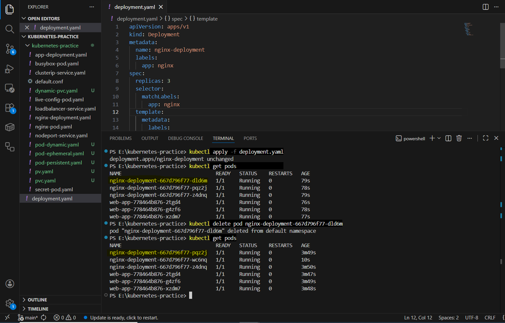
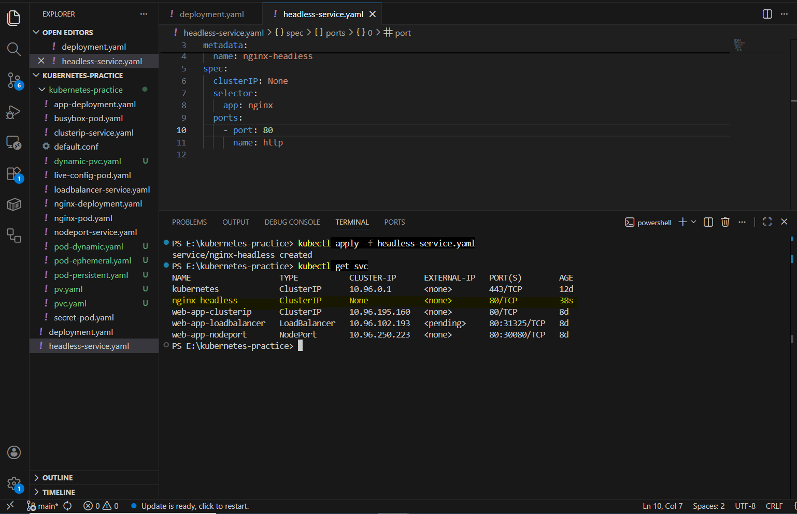
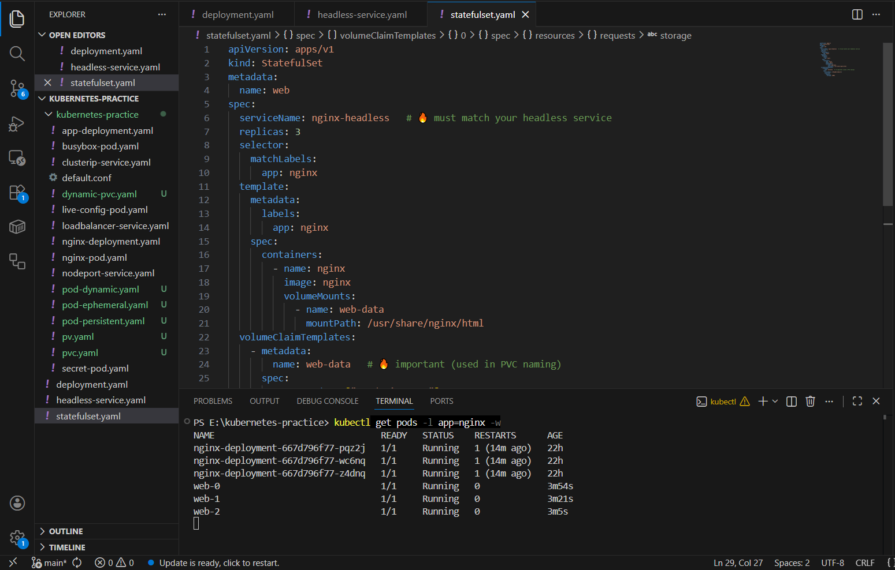
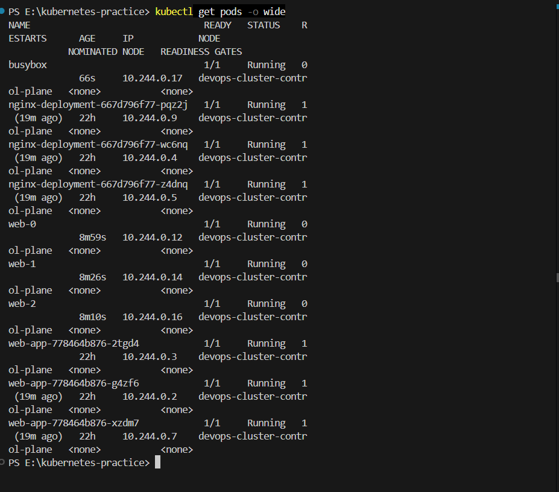
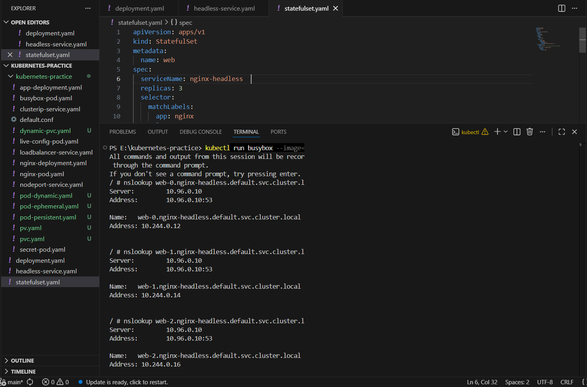
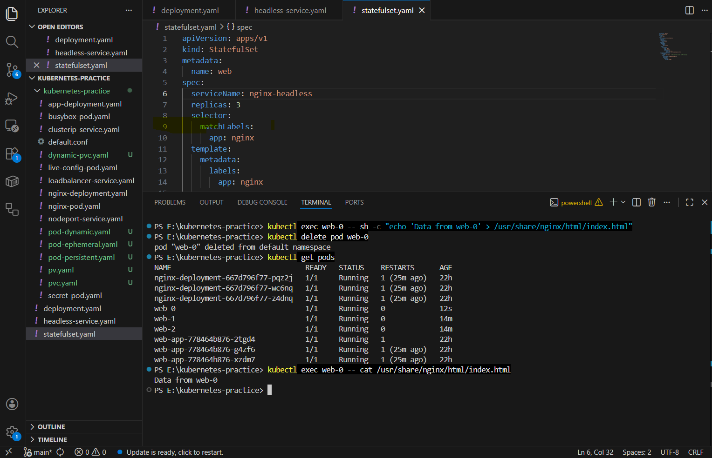
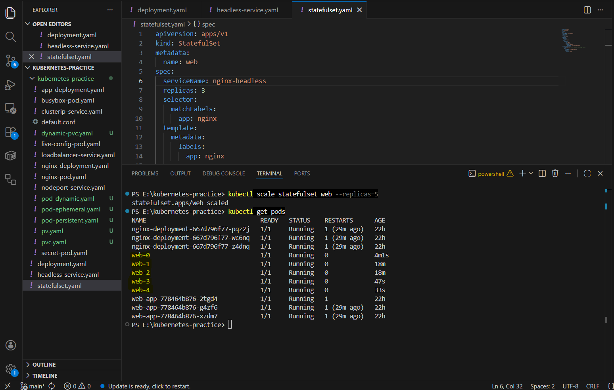
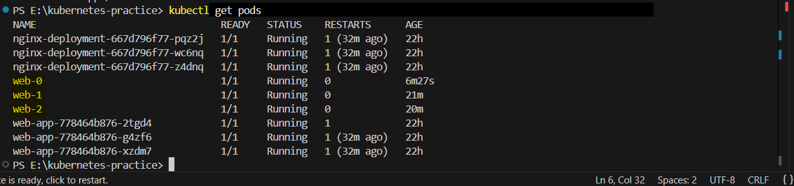
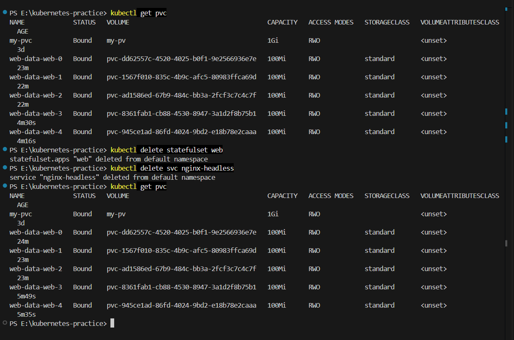
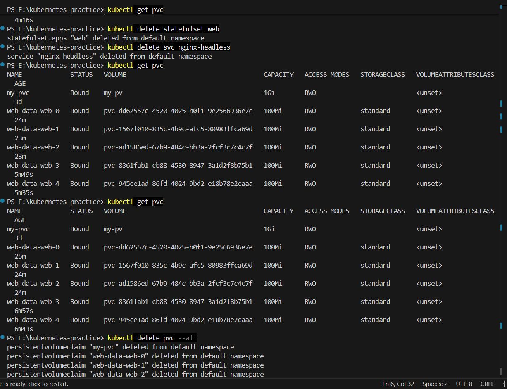

# Day 56 – Kubernetes StatefulSets

## 📌 Objective
Learn how StatefulSets work and why they are required for stateful applications like databases, Kafka, and distributed systems.

---

## 🔍 Task 1: Deployment Limitation

Created a Deployment with 3 replicas using nginx.

### Observation:
- Pod names were random:
  - nginx-deploy-xxxxx
- After deleting a pod, a new pod was created with a different name.

### ❗ Problem:
- No stable identity
- Not suitable for database clusters
- Breaks communication and replication

---

## 📊 Deployment vs StatefulSet

| Feature | Deployment | StatefulSet |
|--------|----------|-------------|
| Pod names | Random | Stable (`pod-0`, `pod-1`) |
| Startup | Parallel | Ordered |
| Storage | Shared | Dedicated per pod |
| DNS | Unstable | Stable |

---

## 🚀 Task 2: Headless Service

Created a Headless Service using:

```yaml
clusterIP: None
Result:
No Cluster IP assigned
Enabled direct DNS resolution per pod
Verification:

kubectl get svc

Output:
CLUSTER-IP: None

🚀 Task 3: StatefulSet Creation

Created StatefulSet with:

3 replicas
nginx image
volumeClaimTemplates (100Mi storage)
Pod Names:
web-0
web-1
web-2
PVC Names:
web-data-web-0
web-data-web-1
web-data-web-2

🌐 Task 4: Stable Network Identity

Tested DNS using busybox:
nslookup web-0.nginx-headless.default.svc.cluster.local
Result:
DNS resolved correctly
IP matched kubectl get pods -o wide
Verification:

✅ Yes, nslookup IP matched pod IP

💾 Task 5: Stable Storage
Steps:
Wrote data into pod
Deleted pod web-0
Pod recreated automatically
Checked data again
Result:
Data from web-0
Verification:

✅ Data remained intact after pod recreation

📈 Task 6: Ordered Scaling
Scale Up:
kubectl scale statefulset web --replicas=5
Pods created in order:
web-3 → web-4
Scale Down:
kubectl scale statefulset web --replicas=3
Pods deleted in reverse order:
web-4 → web-3
PVC Check:
kubectl get pvc
Result:
5 PVCs still existed
Verification:

✅ PVCs are NOT deleted during scale down

🧹 Task 7: Cleanup
Deleted:
StatefulSet
Headless Service
Checked PVC: kubectl get pvc

Result:
PVCs still existed
Deleted manually:kubectl delete pvc --all
Verification:

❌ PVCs are NOT auto-deleted with StatefulSet

🎯 Key Learnings
StatefulSets provide:
Stable pod identity
Persistent storage
Ordered deployment & scaling
Headless Service enables:
Direct pod DNS
No load balancing
Kubernetes ensures:
Data safety
Storage persistence
✅ Conclusion

Deployments are ideal for stateless applications, but StatefulSets are essential for applications where identity, storage, and order matter.

🔥 Final Insight:
“Pods can restart anytime, but data must always persist.”


  ### Screenshot
           