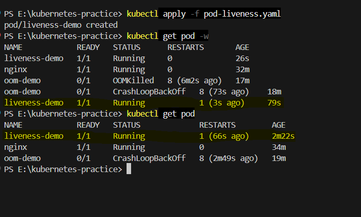
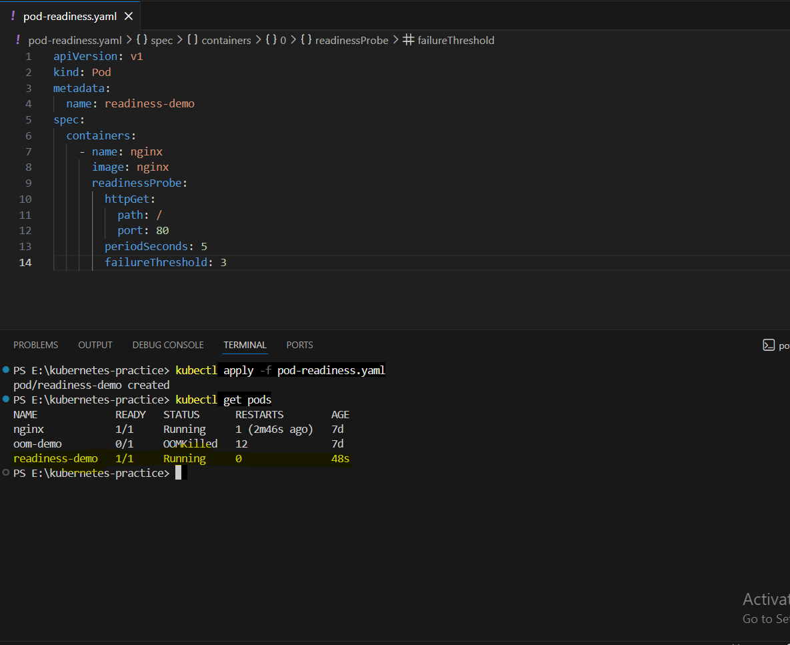
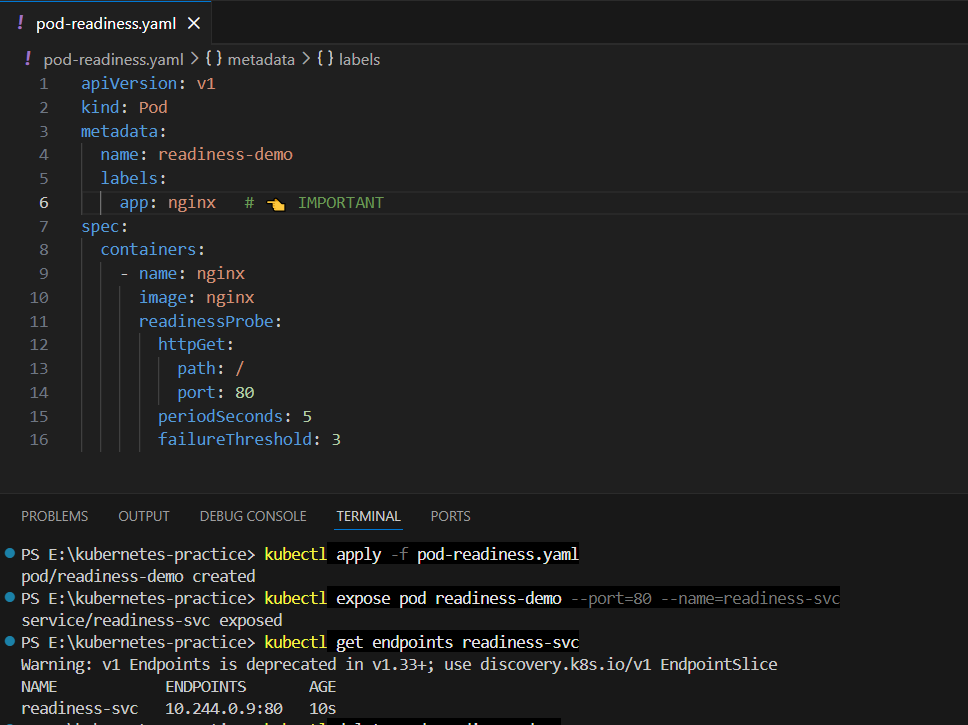
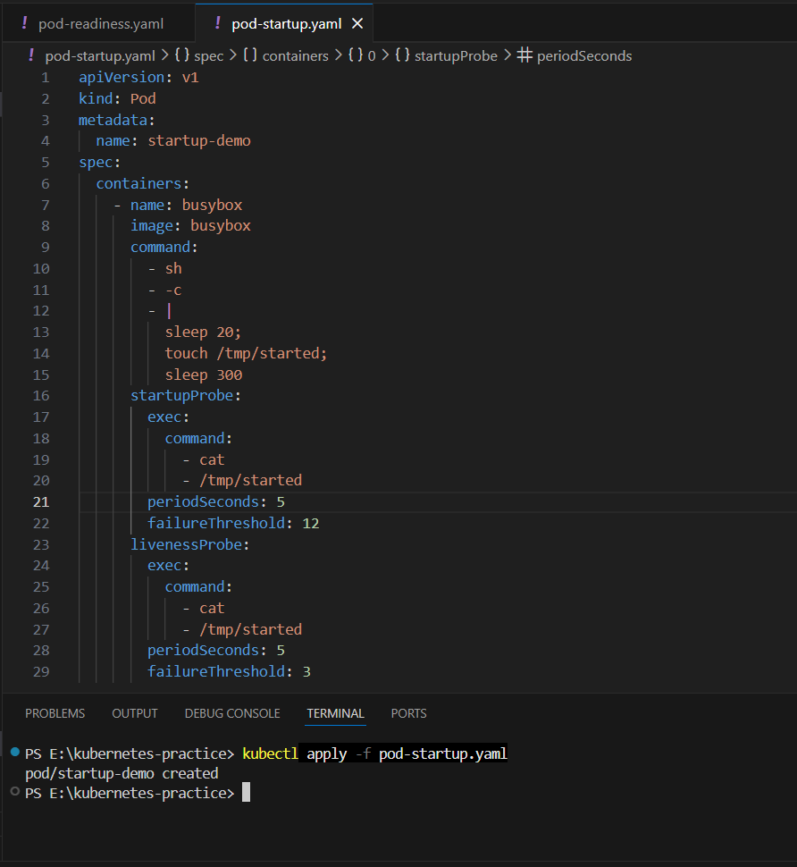
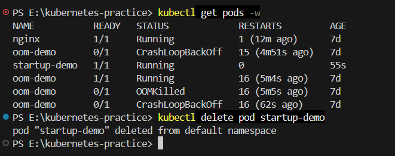
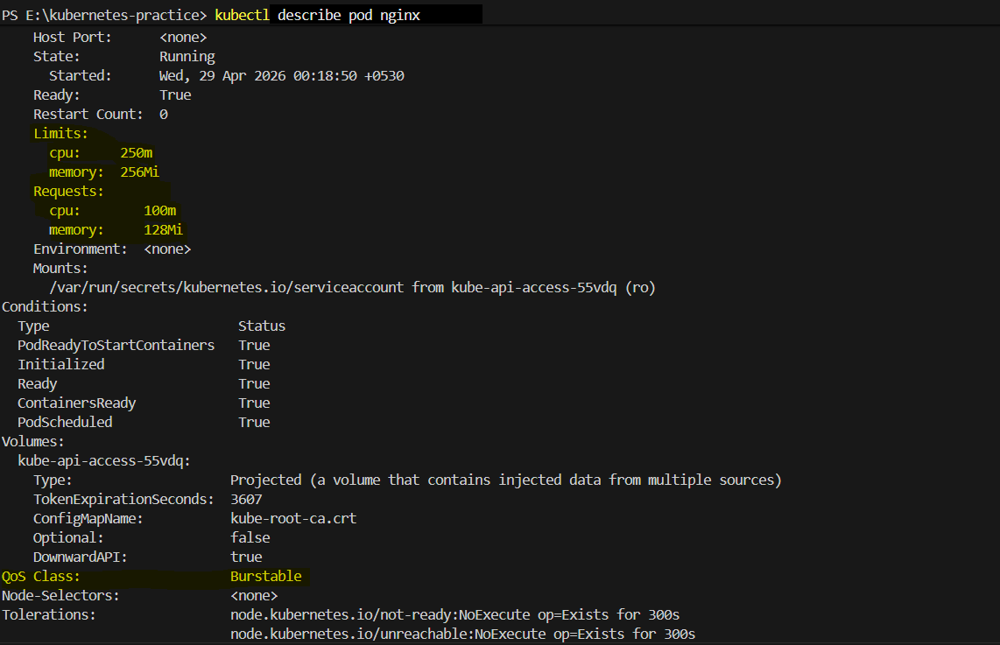
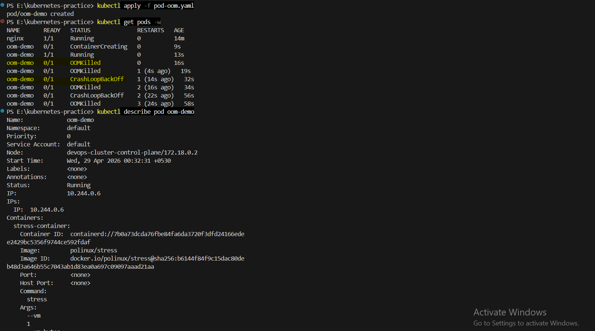
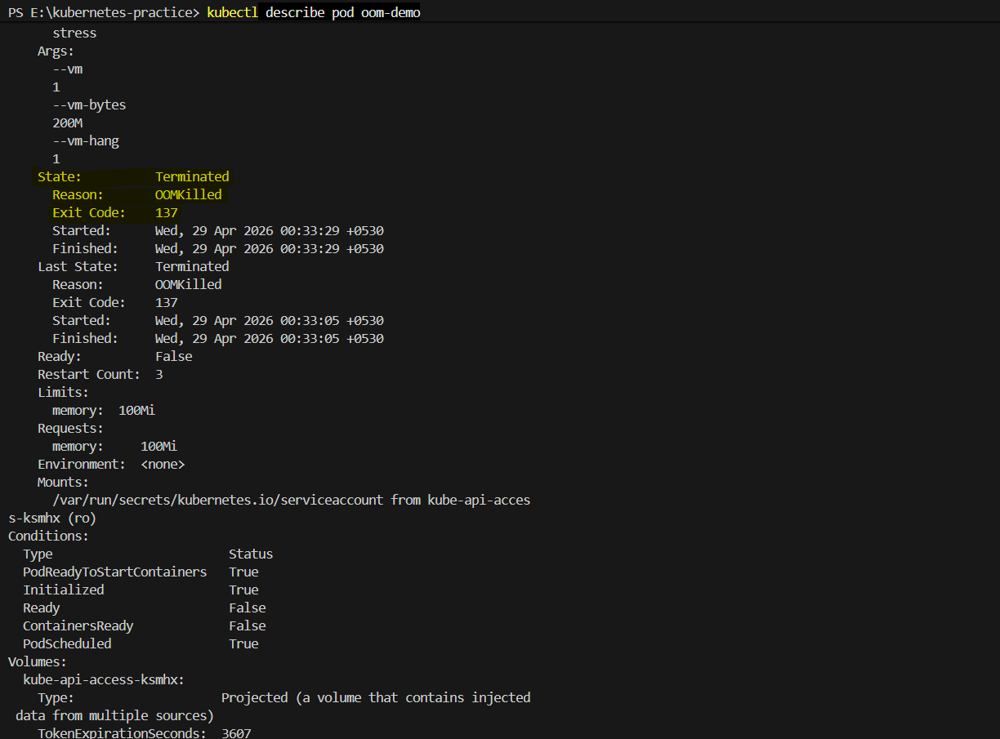
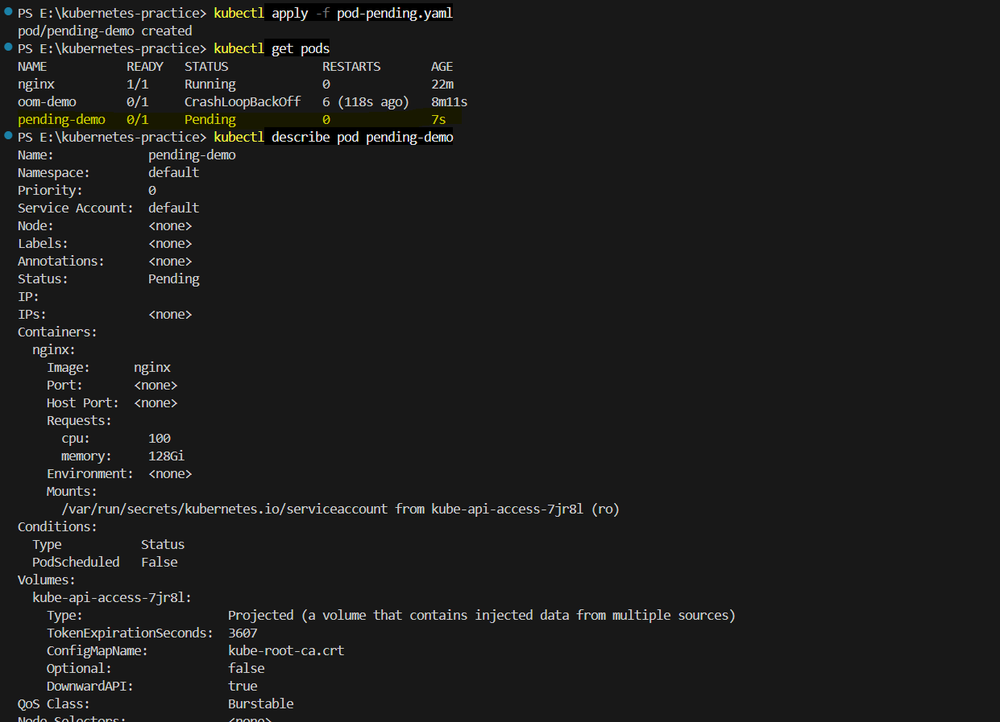
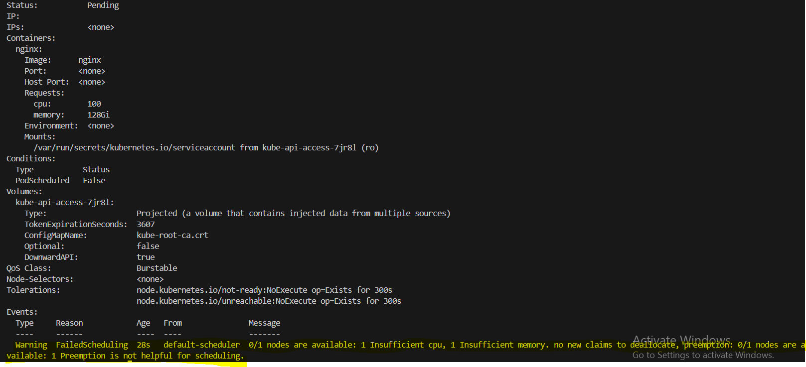

# Day 57 – Resource Requests, Limits, and Probes

## 📌 Overview

Today’s task focused on understanding how Kubernetes manages resources and ensures application health using **requests, limits, and probes**.

---

## 🔹 Task 1: Resource Requests and Limits

### ✅ What I Did

* Created a Pod with:

  * `requests`: cpu = 100m, memory = 128Mi
  * `limits`: cpu = 250m, memory = 256Mi

### 📖 Key Concepts

* **Requests** → Minimum guaranteed resources (used by scheduler)
* **Limits** → Maximum allowed resources (enforced by kubelet)

### 🔍 Observation

* QoS Class: **Burstable**

### 🧠 QoS Classes

* Guaranteed → requests == limits
* Burstable → requests < limits
* BestEffort → no requests/limits

---

## 🔹 Task 2: OOMKilled — Exceeding Memory Limits

### ✅ What I Did

* Used `polinux/stress` image
* Set memory limit: `100Mi`
* Forced container to allocate: `200M`

### 🔍 Observation

* Container terminated with:

  * **Reason:** OOMKilled
  * **Exit Code:** 137

### 📖 Key Concepts

* CPU → throttled when exceeded
* Memory → container killed immediately

---

## 🔹 Task 3: Pending Pod — Requesting Too Much

### ✅ What I Did

* Requested:

  * CPU: 100
  * Memory: 128Gi

### 🔍 Observation

* Pod stayed in **Pending** state

### 📖 Scheduler Event

```
0/1 nodes are available: insufficient cpu, insufficient memory
```

### 🧠 Key Concept

* Scheduler only places Pods if sufficient resources are available

---

## 🔹 Task 4: Liveness Probe

### ✅ What I Did

* Created a file `/tmp/healthy`
* Deleted it after 30 seconds
* Added liveness probe (`cat /tmp/healthy`)

### 🔍 Observation

* After 3 failures → container restarted

### 📖 Key Concept

* Liveness probe detects **stuck containers**
* Failure → **container restart**

---

## 🔹 Task 5: Readiness Probe

### ✅ What I Did

* Used nginx with HTTP readiness probe (`/`)
* Exposed Pod as a Service
* Deleted `index.html` to break probe

### 🔍 Observation

* Pod became **0/1 READY**
* Removed from **Service endpoints**
* Container was **NOT restarted**

### 📖 Key Concept

* Readiness probe controls **traffic flow**
* Failure → **no traffic**, but container keeps running

---

## 🔹 Task 6: Startup Probe

### ✅ What I Did

* Simulated slow start (`sleep 20`)
* Added startup probe for `/tmp/started`
* Added liveness probe after startup

### 🔍 Observation

* Startup probe allowed container to initialize safely

### ❓ What if `failureThreshold = 2`?

* Total allowed time = 5 × 2 = 10 seconds
* App needs 20 seconds → container killed early
* Result → **CrashLoopBackOff**

### 📖 Key Concept

* Startup probe provides **grace period**
* Prevents premature restarts

---

## 🔥 Key Learnings

* Requests vs Limits:

  * Requests → scheduling
  * Limits → enforcement

* Resource Behavior:

  * CPU → throttled
  * Memory → OOMKilled

* Probes:

  * Liveness → restart container
  * Readiness → remove from traffic
  * Startup → delay health checks

---

## 📸 Suggested Screenshots
     .png>) .png>) .png>) .png>) .png>)     
* OOMKilled Pod (`kubectl describe pod`)
* Pending Pod Events
* Liveness restart count
* Readiness endpoints removal

---

## 🚀 Conclusion

This assignment helped me understand how Kubernetes:

* Manages resources efficiently
* Prevents system overload
* Automatically recovers from failures
* Controls traffic flow intelligently

---

## 🔖 Hashtags

#90DaysOfDevOps #DevOpsKaJosh #TrainWithShubham
