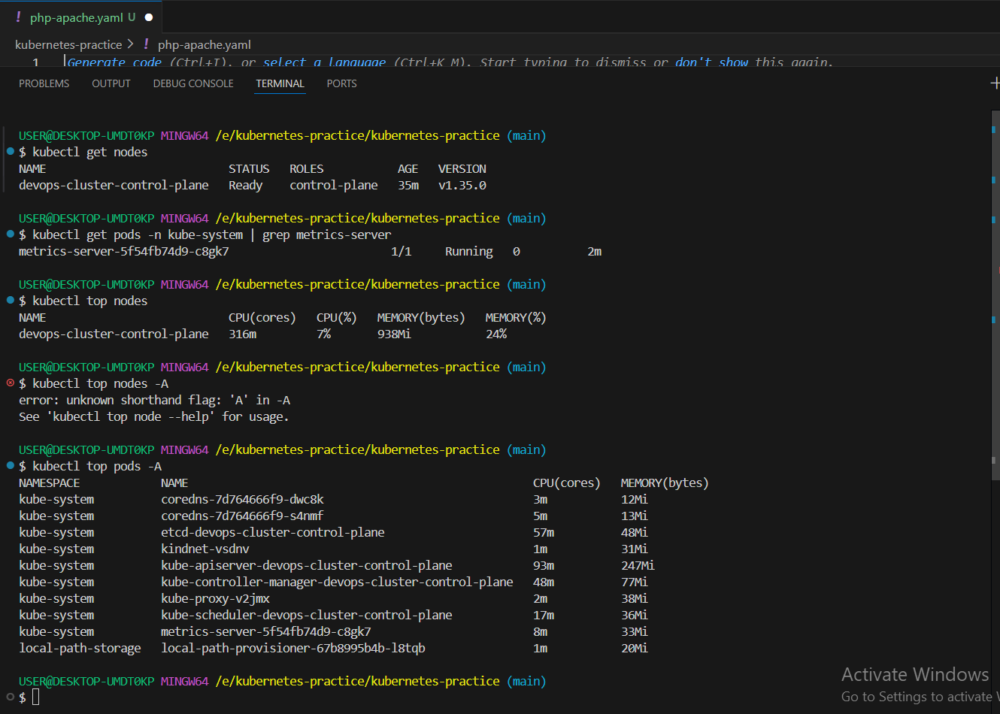
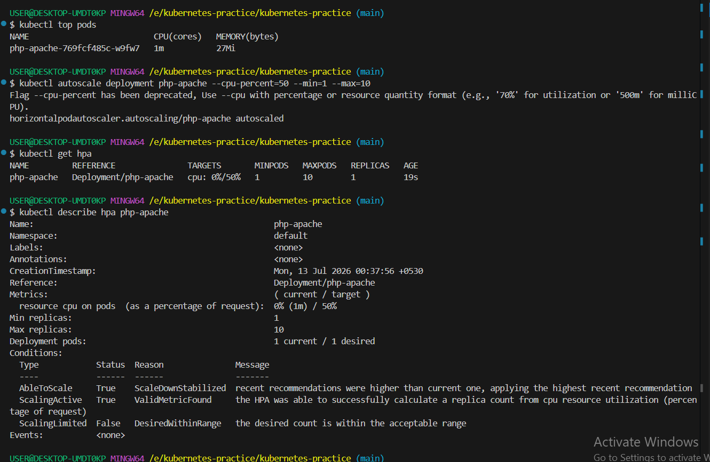
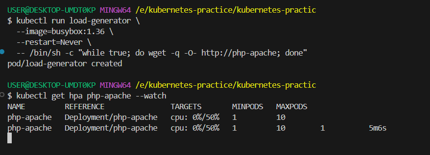
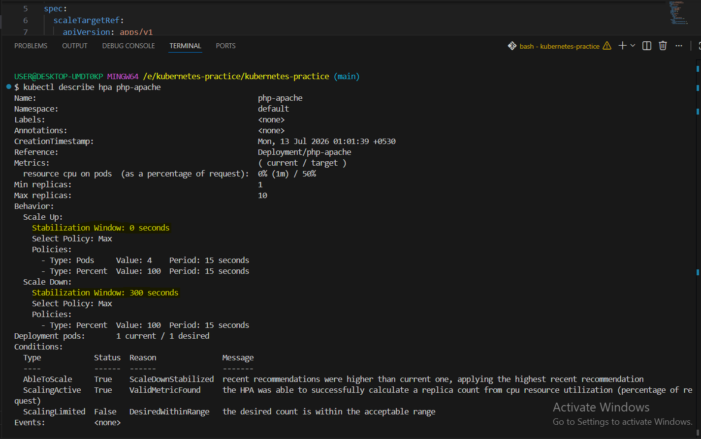

# Day 58 – Metrics Server and Horizontal Pod Autoscaler (HPA)

## Objective

Learn how to install the Kubernetes Metrics Server and configure a Horizontal Pod Autoscaler (HPA) to automatically scale application pods based on CPU utilization.

---

# Environment
- Kubernetes: Kind Cluster
- Kubernetes Version: v1.35.0
- OS: Windows
- Runtime: Docker Desktop

---

# Task 1 – Install Metrics Server

## Check if Metrics Server Exists

```bash
kubectl get pods -n kube-system | grep metrics-server
```

No Metrics Server pod was found.

## Install Metrics Server

```bash
kubectl apply -f https://github.com/kubernetes-sigs/metrics-server/releases/latest/download/components.yaml
```

The Metrics Server pod was successfully created.

## Issue Encountered

Running:

```bash
kubectl top nodes
```

returned:

```
error: Metrics API not available
```

Checking the logs:

```bash
kubectl logs -n kube-system deployment/metrics-server
```

showed:

```
tls: failed to verify certificate
x509: cannot validate certificate because it doesn't contain any IP SANs
```

This is a common issue with Kind clusters.

## Solution

Added the following argument to the Metrics Server deployment:

```yaml
- --kubelet-insecure-tls
```

After the deployment restarted:

```bash
kubectl rollout status deployment metrics-server -n kube-system
```

Metrics became available.

Verify:

```bash
kubectl top nodes
kubectl top pods -A
```

---

# Task 2 – Explore kubectl top

Commands:

```bash
kubectl top nodes

kubectl top pods -A

kubectl top pods -A --sort-by=cpu
```

## Learned

- Displays real CPU and Memory usage
- Uses Metrics Server
- Refreshes approximately every 15 seconds
- Different from resource requests and limits

---

# Task 3 – Deploy CPU-intensive Application

Created Deployment:

```yaml
image: registry.k8s.io/hpa-example
```

Configured CPU Request:

```yaml
resources:
  requests:
    cpu: 200m
```

Applied:

```bash
kubectl apply -f php-apache.yaml
```

Exposed Service:

```bash
kubectl expose deployment php-apache --port=80
```

---

# Task 4 – Create HPA

Created HPA:

```bash
kubectl autoscale deployment php-apache --cpu-percent=50 --min=1 --max=10
```

Verification:

```bash
kubectl get hpa

kubectl describe hpa php-apache
```

Observed:

- ScalingActive = True
- ValidMetricFound = True
- CPU Target = 50%

---

# Task 5 – Generate Load

Started load generator:

```bash
kubectl run load-generator \
--image=busybox:1.36 \
--restart=Never \
-- /bin/sh -c "while true; do wget -q -O- http://php-apache; done"
```

Watched scaling:

```bash
kubectl get hpa php-apache --watch
```

Observed Deployment replicas increasing automatically when CPU usage crossed 50%.

Stopped load:

```bash
kubectl delete pod load-generator
```

Scale-down occurred after the stabilization window.

---

# Task 6 – Declarative HPA

Created HPA using autoscaling/v2 API.

Features used:

- CPU Utilization Metric
- Scale Up Behavior
- Scale Down Stabilization Window
- Min Replicas
- Max Replicas

Applied:

```bash
kubectl apply -f hpa.yaml
```

Verified:

```bash
kubectl describe hpa php-apache
```

---

# How HPA Calculates Desired Replicas

Formula:

```
desiredReplicas = ceil(currentReplicas × currentCPUUtilization / targetCPUUtilization)
```

Example:

Current Replicas = 1

Current CPU = 100%

Target CPU = 50%

Result:

```
ceil(1 × 100 / 50) = 2
```

---

# Difference Between autoscaling/v1 and autoscaling/v2

| autoscaling/v1 | autoscaling/v2 |
|---------------|----------------|
| CPU Metrics Only | CPU, Memory & Custom Metrics |
| Basic Scaling | Advanced Scaling |
| No Behavior Configuration | Supports Scale Up/Down Behavior |
| Simple API | Production Ready |

---

# What I Learned

- Why Metrics Server is required
- Difference between requests, limits and actual usage
- How HPA calculates replica count
- Importance of CPU Requests
- Difference between autoscaling/v1 and autoscaling/v2
- How Kubernetes automatically scales applications
- Troubleshooting Metrics Server TLS issues on Kind clusters

---

# Screenshots
    .png>) .png>) .png>)