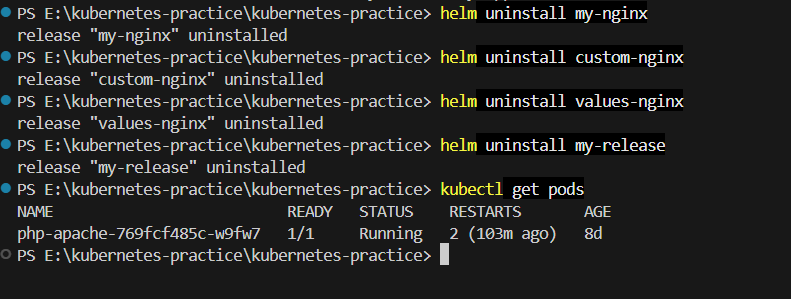

# Day 59 – Helm Basics & Chart Development

## 📌 Objective

Learn the fundamentals of **Helm**, the package manager for Kubernetes, by deploying applications using Helm charts, customizing deployments, managing releases, performing upgrades and rollbacks, and creating a custom Helm chart.

---

## 🛠 Prerequisites

- Docker Desktop / Kind Cluster
- Kubernetes
- kubectl
- Helm
- VS Code

---

# Task 1 – Verify Helm Installation

Verified that Helm was successfully installed.

```bash
helm version
```

---

# Task 2 – Add Bitnami Repository

Added the Bitnami Helm repository and updated it.

```bash
helm repo add bitnami https://charts.bitnami.com/bitnami

helm repo update
```

---

# Task 3 – Search Available Charts

Searched for the NGINX Helm chart.

```bash
helm search repo nginx
```

---

# Task 4 – Install NGINX Chart

Installed the Bitnami NGINX chart.

```bash
helm install my-nginx bitnami/nginx
```

Verified deployment:

```bash
kubectl get pods

kubectl get svc

helm list
```

---

# Task 5 – Inspect Helm Release

Viewed the generated Kubernetes manifests.

```bash
helm get manifest my-nginx
```

---

# Task 6 – Install with Custom Values

Installed another NGINX release with custom settings.

```bash
helm install custom-nginx bitnami/nginx \
  --set replicaCount=3 \
  --set service.type=NodePort
```

Verified deployment.

```bash
kubectl get pods

kubectl get svc
```

Result:

- 3 replicas created
- Service exposed as NodePort

---

# Task 7 – Deploy Using Custom values.yaml

Created a custom values file.

**custom-values.yaml**

```yaml
replicaCount: 2

service:
  type: NodePort

resources:
  requests:
    cpu: 100m
    memory: 128Mi

  limits:
    cpu: 200m
    memory: 256Mi
```

Installed using:

```bash
helm install values-nginx bitnami/nginx -f custom-values.yaml
```

Verified custom values.

```bash
helm get values values-nginx
```

Verified Pods.

```bash
kubectl get pods
```

---

# Task 8 – Upgrade & Rollback

Checked release history.

```bash
helm history my-nginx
```

Rolled back to Revision 1.

```bash
helm rollback my-nginx 1
```

Verified rollback.

```bash
helm history my-nginx

kubectl get pods
```

Rollback completed successfully.

---

# Task 9 – Create a Custom Helm Chart

Generated a new Helm chart.

```bash
helm create my-app
```

Customized the following files:

- Chart.yaml
- values.yaml
- templates/deployment.yaml
- templates/service.yaml

Installed the chart.

```bash
helm install my-release ./my-app
```

Verified deployment.

```bash
kubectl get pods
```

Result:

- Application deployed successfully.
- 3 Pods created according to the configured replica count.

---

# Commands Used

```bash
helm version

helm repo add bitnami https://charts.bitnami.com/bitnami

helm repo update

helm search repo nginx

helm install my-nginx bitnami/nginx

helm list

helm get manifest my-nginx

helm install custom-nginx bitnami/nginx \
--set replicaCount=3 \
--set service.type=NodePort

helm install values-nginx bitnami/nginx \
-f custom-values.yaml

helm get values values-nginx

helm history my-nginx

helm rollback my-nginx 1

helm create my-app

helm install my-release ./my-app

kubectl get pods

kubectl get svc
```

---

# Key Learnings

- Understood the purpose of Helm in Kubernetes.
- Added and managed Helm repositories.
- Installed applications using Helm charts.
- Customized deployments using command-line values.
- Managed configurations using a custom `values.yaml`.
- Viewed rendered Kubernetes manifests.
- Learned Helm release management.
- Performed upgrades and rollbacks.
- Created and customized a reusable Helm chart.
- Verified Kubernetes resources using `kubectl`.

---

# Outcome

Successfully completed Helm Basics by:

- Installing and configuring Helm
- Deploying NGINX using Helm
- Customizing deployments
- Using custom values files
- Managing Helm releases
- Performing rollbacks
- Creating and deploying a custom Helm chart

This exercise provided hands-on experience with Helm, making Kubernetes application deployment simpler, reusable, and easier to manage.

---

# 📸 Screenshots

.png>) .png>) .png>) .png>) .png>) .png>) .png>) .png>) .png>) .png>) .png>) .png>) .png>) .png>) .png>) .png>) .png>) .png>) 

`#90DaysOfDevOps` `#DevOpsKaJosh` `#TrainWithShubham`