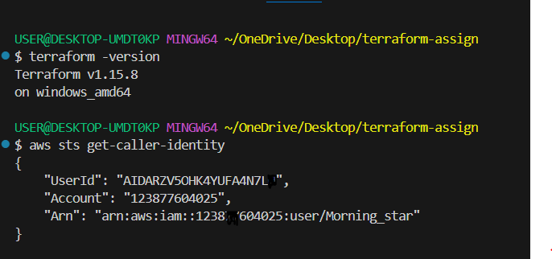
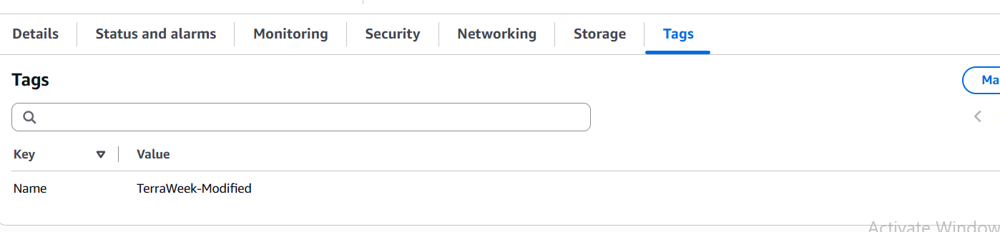

# 🚀 Day 61 – Introduction to Terraform and Your First AWS Infrastructure

**Date:** 22nd July 2026

## 📖 Objective

Today I started my Infrastructure as Code (IaC) journey using **Terraform**. Instead of manually creating AWS resources through the AWS Console, I learned how to define infrastructure using code and provision it automatically.

The objective of today's challenge was to understand the fundamentals of Terraform, configure AWS credentials, create cloud resources, inspect Terraform state, modify infrastructure, and finally destroy all resources using Terraform commands.

---

# 🎯 Learning Goals

- Understand Infrastructure as Code (IaC)
- Install and verify Terraform
- Configure AWS CLI
- Create AWS resources using Terraform
- Understand Terraform workflow
- Learn how Terraform State works
- Modify existing infrastructure
- Destroy infrastructure safely

---

# 📚 What is Infrastructure as Code (IaC)?

Infrastructure as Code (IaC) is the process of managing and provisioning infrastructure using code instead of manually configuring resources through a cloud provider's console.

Using IaC allows infrastructure to become:

- Version controlled
- Repeatable
- Consistent
- Automated
- Easy to collaborate on

Instead of clicking through the AWS Console every time, Terraform allows us to describe our infrastructure in configuration files, making deployments faster and less error-prone.

---

# ❓ Problems Solved by Infrastructure as Code

Creating infrastructure manually can lead to several problems:

- Human errors during configuration
- Inconsistent environments
- Time-consuming deployments
- Difficult collaboration among team members
- Lack of version control
- Hard to reproduce environments

Terraform solves these problems by allowing infrastructure to be defined in code and recreated consistently whenever required.

---

# ⚖️ Terraform vs Other Tools

| Tool | Purpose |
|-------|----------|
| Terraform | Provision and manage cloud infrastructure |
| AWS CloudFormation | AWS-only Infrastructure as Code service |
| Ansible | Configuration management and software provisioning |
| Pulumi | Infrastructure as Code using programming languages |

---

# 🌍 Why Terraform is Declarative

Terraform is declarative because we describe **what infrastructure we want**, not the individual steps required to create it.

Terraform automatically determines:

- What needs to be created
- What needs to be modified
- What needs to be destroyed

---

# ☁️ Why Terraform is Cloud Agnostic

Terraform supports multiple cloud providers such as:

- AWS
- Azure
- Google Cloud
- Oracle Cloud
- DigitalOcean
- VMware

The same Terraform syntax can be used across different cloud platforms by simply changing the provider.

---

# 🛠️ Environment Setup

## Terraform Verification

Verified Terraform installation:

```bash
terraform version
```

Output:

- Terraform v1.15.8
- windows_amd64

---

## AWS CLI Verification

Verified AWS CLI installation:

```bash
aws --version
```

Verified AWS credentials:

```bash
aws sts get-caller-identity
```

Successfully authenticated with AWS and confirmed the configured account.

---

# 🗂️ Project Structure

```
terraform-basics/
│
├── main.tf
├── terraform.tfstate
├── terraform.tfstate.backup
├── .terraform/
└── .terraform.lock.hcl
```

---

# 📝 Writing the First Terraform Configuration

Created a `main.tf` file containing:

- Terraform block
- AWS Provider block
- AWS S3 Bucket resource
- EC2 Instance resource

The configuration included:

- AWS Provider
- Required Provider configuration
- S3 Bucket
- EC2 Instance
- Resource Tags

---

# 🚀 Terraform Workflow

## 1. terraform fmt

```bash
terraform fmt
```

Automatically formats Terraform configuration files according to Terraform formatting standards.

---

## 2. terraform validate

```bash
terraform validate
```

Checks the syntax and validates the configuration before communicating with AWS.

---

## 3. terraform init

```bash
terraform init
```

Initialized the working directory by:

- Downloading the AWS Provider plugin
- Creating the `.terraform` directory
- Creating `.terraform.lock.hcl`

This command only prepares the project; it does not create any infrastructure.

---

## 4. terraform plan

```bash
terraform plan
```

Generated an execution plan showing what Terraform intended to create before making any changes.

This allowed me to review the infrastructure safely before deployment.

---

## 5. terraform apply

```bash
terraform apply
```

Provisioned the AWS infrastructure successfully.

Resources created:

- Amazon S3 Bucket
- Amazon EC2 Instance

Verified both resources from the AWS Management Console.

---

# ☁️ AWS Resources Created

## Amazon S3 Bucket

Created an S3 bucket with:

- Globally unique bucket name
- Tags
- Default server-side encryption

Verified successfully in the AWS Console.

---

## Amazon EC2 Instance

Created an EC2 instance with:

- Amazon Linux AMI
- t2.micro instance type
- Name tag:
  ```
  TerraWeek-Day1
  ```

Verified the running instance in the AWS Console.

---

# 📄 Understanding Terraform State

Terraform stores infrastructure information inside:

```
terraform.tfstate
```

The state file keeps track of all resources Terraform manages.

It stores information such as:

- Resource IDs
- Resource ARNs
- Public and Private IPs
- Instance IDs
- Bucket Names
- Tags
- Regions
- Current resource attributes

Terraform uses this file to compare the desired configuration with the actual infrastructure and determine what changes are required.

---

# 🔍 Terraform State Commands

## terraform show

```bash
terraform show
```

Displays all resources managed by Terraform in a human-readable format, including every attribute returned by AWS.

---

## terraform state list

```bash
terraform state list
```

Lists every resource currently tracked by Terraform.

Output included:

- aws_instance.my_ec2_instance
- aws_s3_bucket.my_bucket

---

## terraform state show

```bash
terraform state show aws_instance.my_ec2_instance
```

Displays detailed information for a specific resource only.

Unlike `terraform show`, this command focuses on a single resource instead of the entire state.

---

# ✏️ Modifying Infrastructure

Updated the EC2 instance tag from:

```
TerraWeek-Day1
```

to

```
TerraWeek-Modified
```

Executed:

```bash
terraform plan
```

Terraform displayed:

```
~ update in-place
```

This indicated that only the EC2 tag would be updated without destroying and recreating the instance.

Terraform Plan Summary:

```
Plan: 0 to add, 1 to change, 0 to destroy.
```

Applied the changes successfully and verified the updated tag in the AWS Console.

---

# 🗑️ Destroying Infrastructure

Executed:

```bash
terraform destroy
```

Terraform displayed all resources that would be removed.

After confirmation, both the EC2 instance and S3 bucket were deleted successfully.

Verified in the AWS Console that all resources had been removed.

---

# 💡 Key Learnings

- Infrastructure can be managed entirely using code.
- Terraform follows a declarative approach.
- Providers allow Terraform to communicate with cloud platforms.
- Terraform State is critical for tracking infrastructure.
- `terraform plan` provides a safe preview of infrastructure changes.
- `terraform apply` creates or updates resources.
- `terraform destroy` removes all managed infrastructure.
- Even small configuration changes are detected accurately through Terraform's planning process.

---

# 📸 Screenshots

> **Add the following screenshots here:**

   .png>) .png>) .png>) .png>) .png>) .png>) .png>) .png>) .png>) .png>) .png>) .png>) .png>) .png>) .png>) .png>) .png>)  .png>)

---

# ✅ Conclusion

This challenge introduced the fundamentals of Infrastructure as Code using Terraform. I learned how to provision AWS resources through code, inspect Terraform state, understand how Terraform tracks infrastructure, perform safe updates using execution plans, and cleanly destroy all managed resources. This hands-on exercise provided a strong foundation for building and managing cloud infrastructure in a reproducible and automated way.