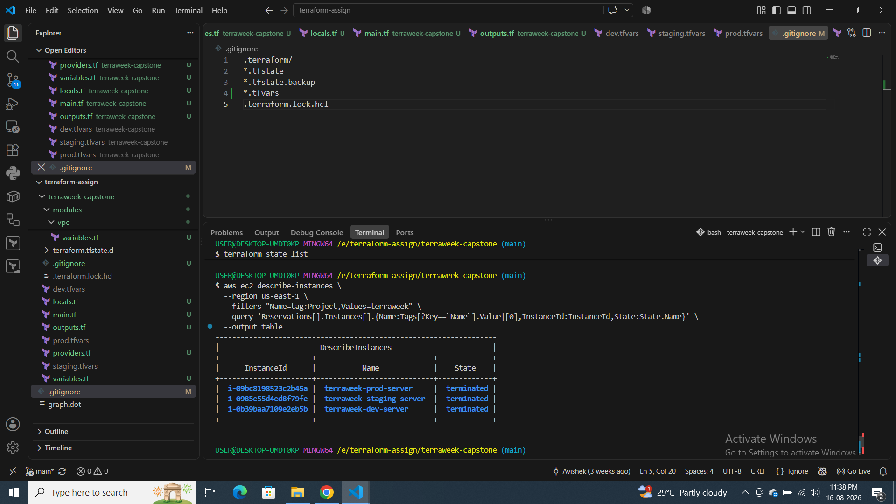

# 🚀 TerraWeek Capstone — Terraform Multi-Environment Infrastructure

## 📌 Project Overview

This capstone project demonstrates how to use Terraform modules and workspaces to provision the same AWS infrastructure across multiple environments:

- dev
- staging
- prod

The infrastructure was built using reusable Terraform modules for:

- VPC
- Security Group
- EC2 Instance

Each environment uses separate Terraform workspace state while sharing the same reusable infrastructure code.

## 🎯 Objectives

The main objectives of this capstone were:

- Build reusable Terraform modules.
- Create AWS infrastructure using Infrastructure as Code.
- Use Terraform workspaces for environment separation.
- Configure different CIDR blocks and EC2 instance types per environment.
- Deploy VPC networking components.
- Deploy an EC2 instance in a public subnet.
- Validate Terraform configurations.
- Inspect Terraform state.
- Verify infrastructure using AWS CLI.
- Destroy all provisioned infrastructure and clean up Terraform workspaces.

## 🏗️ Project Structure

```
terraweek-capstone/
│
├── main.tf
├── providers.tf
├── variables.tf
├── outputs.tf
├── terraform.tfvars
│
├── dev.tfvars
├── staging.tfvars
├── prod.tfvars
│
├── modules/
│   │
│   ├── vpc/
│   │   ├── main.tf
│   │   ├── variables.tf
│   │   └── outputs.tf
│   │
│   ├── security-group/
│   │   ├── main.tf
│   │   ├── variables.tf
│   │   └── outputs.tf
│   │
│   └── ec2-instance/
│       ├── main.tf
│       ├── variables.tf
│       └── outputs.tf
│
└── .terraform.lock.hcl
```

## 🧩 Terraform Modules

### 1. VPC Module

The VPC module creates the networking infrastructure:

- VPC
- Public Subnet
- Internet Gateway
- Public Route Table
- Route Table Association

The public subnet is configured with:

```
map_public_ip_on_launch = true
```

This allows EC2 instances launched in the subnet to receive public IP addresses.

### 2. Security Group Module

The security group module creates an EC2 security group.

The configured inbound ports were:

```
22  → SSH
80  → HTTP
443 → HTTPS
```

Outbound traffic was allowed to:

```
0.0.0.0/0
```

### 3. EC2 Instance Module

The EC2 module creates an EC2 instance using the Amazon Linux AMI discovered through a Terraform data source.

The EC2 instance type differs by environment:

| Environment | Instance Type |
|---|---|
| Dev | t2.micro |
| Staging | t2.small |
| Prod | t3.small |

## 🔧 Terraform Formatting and Validation

I formatted the complete project recursively:

```
terraform fmt -recursive
```

Then validated the root configuration:

```
terraform validate
```

Result:

```
Success! The configuration is valid.
```

I also initialized and validated each custom module individually.

**VPC**

```
terraform -chdir=modules/vpc init
terraform -chdir=modules/vpc validate
```

Result:

```
Success! The configuration is valid.
```

**Security Group**

```
terraform -chdir=modules/security-group init
terraform -chdir=modules/security-group validate
```

Result:

```
Success! The configuration is valid.
```

**EC2 Instance**

```
terraform -chdir=modules/ec2-instance init
terraform -chdir=modules/ec2-instance validate
```

Result:

```
Success! The configuration is valid.
```

## 🚀 Terraform Initialization

The root project was initialized using:

```
terraform init
```

Terraform detected and initialized the three modules:

```
- ec2_instance in modules\ec2-instance
- security_group in modules\security-group
- vpc in modules\vpc
```

The AWS provider was also installed:

```
hashicorp/aws v6.60.0
```

The initialization completed successfully.

## 🌎 Environment 1 — Dev

I created and used the dev Terraform workspace.

The plan showed:

```
Plan: 7 to add, 0 to change, 0 to destroy.
```

The infrastructure included:

- 1 VPC
- 1 Internet Gateway
- 1 Public Subnet
- 1 Route Table
- 1 Route Table Association
- 1 Security Group
- 1 EC2 Instance

**Total: 7 resources**

The VPC configuration was:

```
VPC CIDR:     10.0.0.0/16
Subnet CIDR:  10.0.1.0/24
Environment:  dev
```

Terraform successfully created the infrastructure.

**Dev Outputs**

```
environment       = "dev"
instance_id       = "i-0b39baa7109e2eb5b"
public_ip         = "100.53.97.85"
security_group_id = "sg-0cc2789ec1b28daf3"
subnet_id         = "subnet-0f36dd762520504ce"
vpc_id            = "vpc-02d57ebcb088b644b"
```

I verified the workspace using:

```
terraform workspace show
```

Result:

```
dev
```

I also inspected Terraform state:

```
terraform state list
```

The state contained:

```
data.aws_ami.amazon_linux
module.ec2_instance.aws_instance.this
module.security_group.aws_security_group.this
module.vpc.aws_internet_gateway.this
module.vpc.aws_route_table.public
module.vpc.aws_route_table_association.public
module.vpc.aws_subnet.public
module.vpc.aws_vpc.this
```

## 🌎 Environment 2 — Staging

Next, I created and selected the staging workspace.

The infrastructure was provisioned with a different CIDR configuration:

```
VPC CIDR:     10.1.0.0/16
Subnet CIDR:  10.1.1.0/24
Environment:  staging
```

The plan showed:

```
Plan: 7 to add, 0 to change, 0 to destroy.
```

**Staging Outputs**

```
environment       = "staging"
instance_id       = "i-0985e55d4ed8f79fe"
public_ip         = "100.52.221.220"
security_group_id = "sg-094bb98802c2b0626"
subnet_id         = "subnet-0b9147bf5d6771bca"
vpc_id            = "vpc-02b8836b4ac4a715e"
```

The staging EC2 instance used:

```
t2.small
```

## 🌎 Environment 3 — Production

Finally, I created the prod workspace.

Production used:

```
VPC CIDR:     10.2.0.0/16
Subnet CIDR:  10.2.1.0/24
Environment:  prod
```

The plan showed:

```
Plan: 7 to add, 0 to change, 0 to destroy.
```

**Production Outputs**

```
environment       = "prod"
instance_id       = "i-09bc8198523c2b45a"
public_ip         = "3.236.114.0"
security_group_id = "sg-03212950d2f6cdc6f"
subnet_id         = "subnet-01c22cb29c43f26c3"
vpc_id            = "vpc-00c7a0f53b1d9a527"
```

The production EC2 instance used:

```
t3.small
```

## 📊 Environment Comparison

| Environment | VPC CIDR | Subnet CIDR | EC2 Type |
|---|---|---|---|
| Dev | 10.0.0.0/16 | 10.0.1.0/24 | t2.micro |
| Staging | 10.1.0.0/16 | 10.1.1.0/24 | t2.small |
| Prod | 10.2.0.0/16 | 10.2.1.0/24 | t3.small |

This demonstrated how the same Terraform modules can be reused while environment-specific values are supplied through variables and .tfvars files.

## 🔍 AWS CLI Verification

After provisioning all three environments, I verified the EC2 instances using AWS CLI.

```
aws ec2 describe-instances \
  --region us-east-1 \
  --filters "Name=tag:Project,Values=terraweek" \
  --query 'Reservations[].Instances[].{Name:Tags[?Key==`Name`].Value|[0],InstanceType:InstanceType,InstanceId:InstanceId,State:State.Name,PrivateIP:PrivateIpAddress,PublicIP:PublicIpAddress}' \
  --output table
```

The result showed:

```
terraweek-prod-server
Instance Type: t3.small
Private IP:     10.2.1.228
Public IP:      3.236.114.0
State:          running


terraweek-staging-server
Instance Type: t2.small
Private IP:     10.1.1.224
Public IP:      100.52.221.220
State:          running


terraweek-dev-server
Instance Type: t2.micro
Private IP:     10.0.1.163
Public IP:      100.53.97.85
State:          running
```

## 🌐 VPC Verification

I also verified all TerraWeek VPCs:

```
aws ec2 describe-vpcs \
  --region us-east-1 \
  --filters "Name=tag:Project,Values=terraweek" \
  --query 'Vpcs[].{Name:Tags[?Key==`Name`].Value|[0],CIDR:CidrBlock,VPCId:VpcId}' \
  --output table
```

The result confirmed three separate VPCs:

```
terraweek-prod-vpc
CIDR: 10.2.0.0/16


terraweek-staging-vpc
CIDR: 10.1.0.0/16


terraweek-dev-vpc
CIDR: 10.0.0.0/16
```

## 🧹 Infrastructure Cleanup

After completing the verification, I cleaned up the AWS infrastructure.

**Dev**

```
terraform workspace select dev
terraform destroy
```

Result:

```
Destroy complete! Resources: 7 destroyed.
```

**Staging**

```
terraform workspace select staging
terraform destroy -var-file="staging.tfvars"
```

Result:

```
Destroy complete! Resources: 7 destroyed.
```

**Production**

The production environment was also destroyed successfully.

After cleanup, I verified the AWS resources:

```
aws ec2 describe-vpcs \
  --region us-east-1 \
  --filters "Name=tag:Project,Values=terraweek" \
  --query 'Vpcs[].{Name:Tags[?Key==`Name`].Value|[0],CIDR:CidrBlock,VPCId:VpcId}' \
  --output table
```

No TerraWeek VPCs were returned.

I also checked the EC2 instances. The previously created instances were terminated:

```
terraweek-prod-server     terminated
terraweek-staging-server  terminated
terraweek-dev-server      terminated
```

## 🗑️ Workspace Cleanup

After destroying the resources, I switched back to the default workspace:

```
terraform workspace select default
```

Then removed the environment workspaces:

```
terraform workspace delete staging
```

The final workspace list was:

```
terraform workspace list
```

Result:

```
* default
```

The Terraform state was also empty/no longer present for the cleaned-up environment:

```
No state file was found!
```

## 🧠 Key Learnings

### 1. Terraform Modules

Modules help create reusable infrastructure components instead of duplicating Terraform code.

```
modules/
├── vpc
├── security-group
└── ec2-instance
```

### 2. Terraform Workspaces

Workspaces allow the same Terraform configuration to manage different environments independently.

```
dev
staging
prod
```

Each workspace maintained its own Terraform state.

### 3. Environment-Specific Configuration

Different environments can use different values without changing the module code.

For example:

```
dev     → 10.0.0.0/16 → t2.micro
staging → 10.1.0.0/16 → t2.small
prod    → 10.2.0.0/16 → t3.small
```

### 4. Terraform State

I used:

```
terraform state list
```

to inspect resources managed by Terraform.

This helped verify that Terraform was tracking resources created through the modules.

### 5. Terraform Outputs

Outputs provided important infrastructure information such as:

- VPC ID
- Subnet ID
- Security Group ID
- EC2 Instance ID
- Public IP
- Environment

### 6. AWS CLI Verification

Terraform's output was cross-checked using AWS CLI commands to confirm that the infrastructure actually existed in AWS.

### 7. Infrastructure Cleanup

A complete Terraform workflow should include cleanup after testing:

```
Plan
  ↓
Apply
  ↓
Verify
  ↓
Destroy
  ↓
Delete Workspaces
```

## ✅ Final Result

The TerraWeek Terraform Capstone was successfully completed.

I implemented a reusable, modular AWS infrastructure architecture and deployed it across three independent environments:

```
                    Terraform
                        │
              ┌─────────┴─────────┐
              │                   │
          Reusable Modules    Workspaces
              │                   │
       ┌──────┼──────┐      ┌─────┼─────┐
       │      │      │      │     │     │
      VPC     SG     EC2    Dev  Staging Prod
```

Each environment successfully provisioned:

- 1 VPC
- 1 Public Subnet
- 1 Internet Gateway
- 1 Route Table
- 1 Route Association
- 1 Security Group
- 1 EC2 Instance

**Total resources provisioned per environment: 7**

All infrastructure was successfully verified and subsequently destroyed to avoid unnecessary AWS costs.

## 📸 Screenshots

.png>) .png>) .png>) .png>) .png>) .png>) .png>) .png>) .png>) .png>) .png>) .png>) .png>) .png>) .png>) .png>) .png>) .png>) .png>) .png>) .png>) .png>) .png>) .png>) .png>)

## 🎯 Conclusion

This capstone strengthened my understanding of Terraform Modules, Variables, Outputs, Data Sources, Terraform State, Workspaces, AWS networking, EC2 provisioning, environment separation, and infrastructure cleanup.

The biggest takeaway was learning how to build infrastructure once using reusable modules and deploy it consistently across multiple environments, rather than maintaining separate Terraform configurations for every environment.

**Terraform → Modules → Workspaces → AWS Infrastructure → Verification → Cleanup**