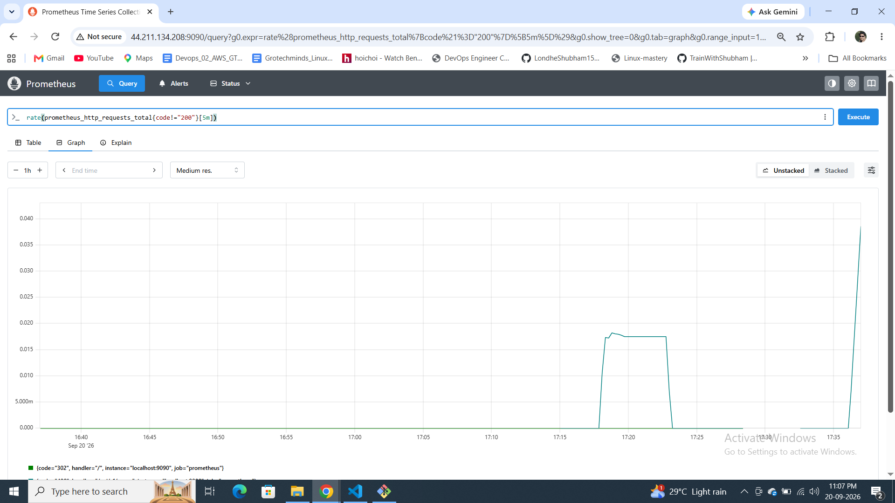
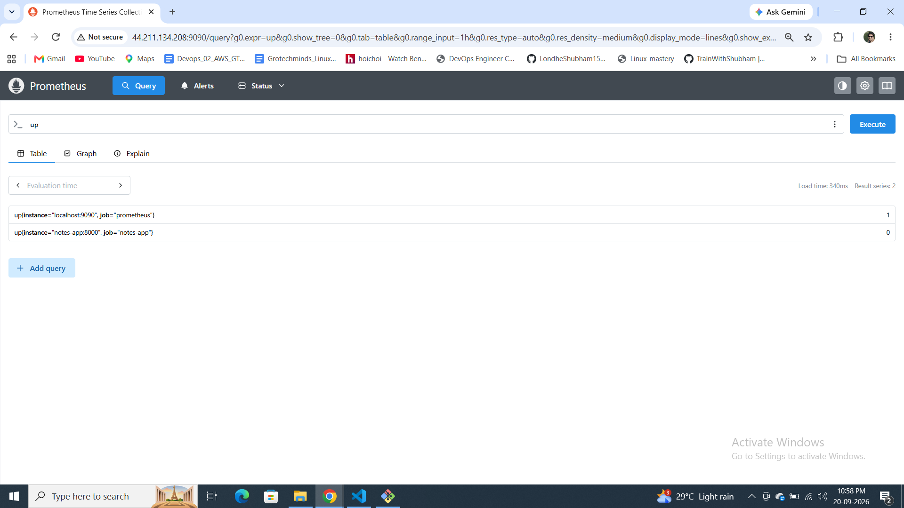
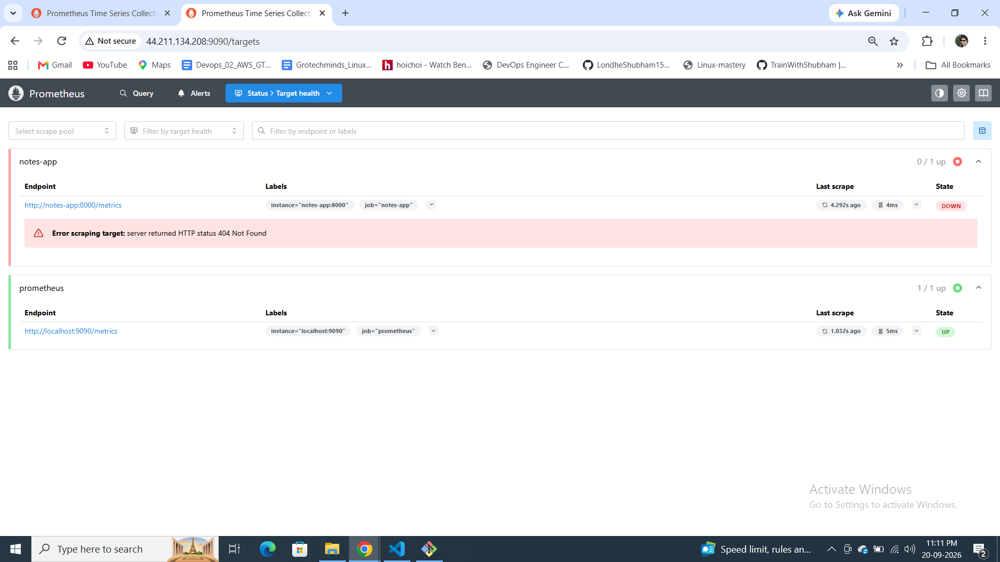
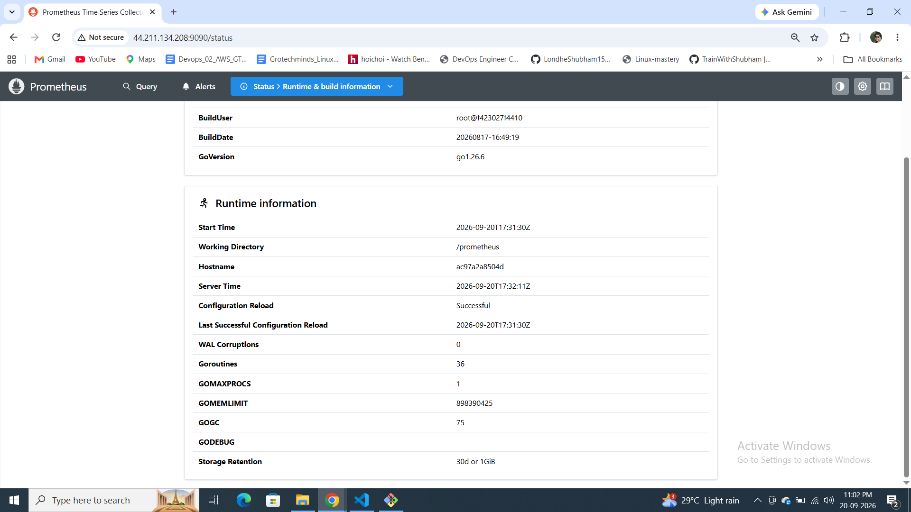
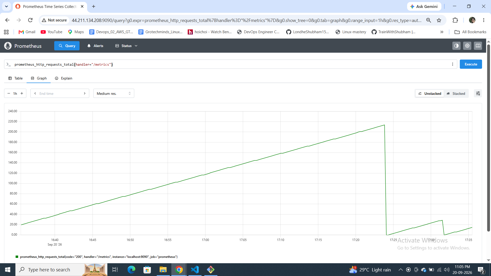
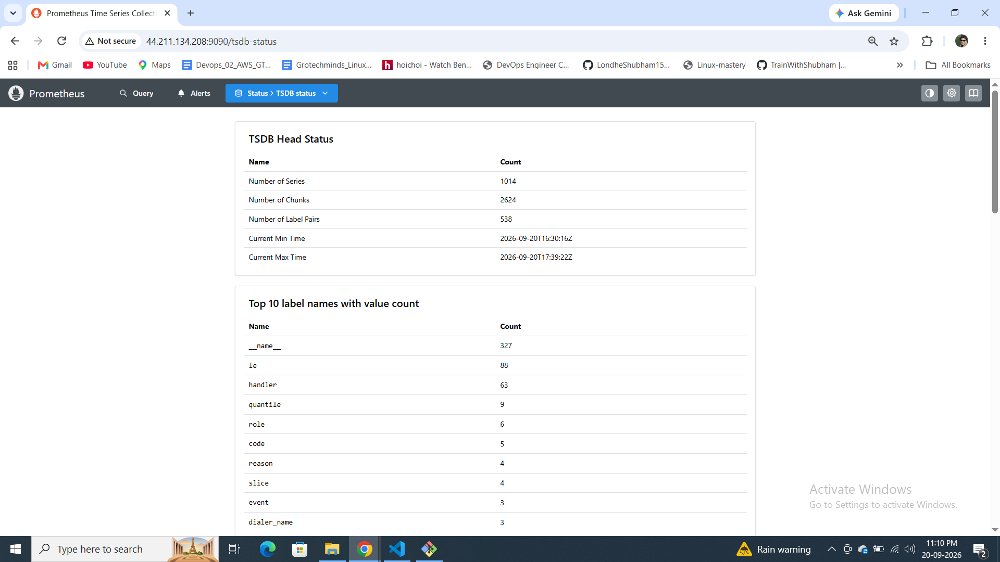

# Day 73 -- Introduction to Observability and Prometheus

## Task 1: Observability

### Monitoring vs Observability
- **Monitoring** tells me *when* something is wrong. It uses predefined alerts and thresholds, e.g. "CPU above 90%".
- **Observability** tells me *why* it is wrong. I can explore, query and correlate data to debug problems I did not predict in advance.

### The Three Pillars
- **Metrics**: numbers measured over time (CPU usage, request count, error rate). Tools: Prometheus, Datadog, CloudWatch.
- **Logs**: timestamped text records of events (app output, error messages). Tools: Loki, ELK Stack, Fluentd.
- **Traces**: the journey of one request across multiple services. Tools: OpenTelemetry, Jaeger, Zipkin.

### Why all three?
- Metrics show **what** is broken (high error rate on `/api/users`).
- Logs show **why** it broke (stack trace with a database timeout).
- Traces show **where** it broke (the payment service call took 12 seconds).

Any one alone leaves gaps. Together they take me from "something is wrong" to the root cause.

### Architecture I will build over Days 73-77
```
[Your App] --> metrics --> [Prometheus] --> [Grafana Dashboards]
[Your App] --> logs    --> [Promtail]   --> [Loki] --> [Grafana]
[Your App] --> traces  --> [OTEL Collector] --> [Grafana/Debug]
[Host]     --> metrics --> [Node Exporter] --> [Prometheus]
[Docker]   --> metrics --> [cAdvisor] --> [Prometheus]
```

## Task 2: Prometheus with Docker

I ran Prometheus in a container on an Ubuntu 24.04 EC2 instance (Docker 29.8.1, Compose v5.5.1), with port 9090 open only to my IP. It scrapes itself every 15 seconds.

### prometheus.yml
```yaml
global:
  scrape_interval: 15s
  evaluation_interval: 15s

scrape_configs:
  - job_name: "prometheus"
    static_configs:
      - targets: ["localhost:9090"]

  - job_name: "notes-app"
    static_configs:
      - targets: ["notes-app:8000"]
```

### docker-compose.yml (includes the retention flags added in Task 6)
```yaml
services:
  prometheus:
    image: prom/prometheus:latest
    container_name: prometheus
    ports:
      - "9090:9090"
    volumes:
      - ./prometheus.yml:/etc/prometheus/prometheus.yml
      - prometheus_data:/prometheus
    command:
      - '--config.file=/etc/prometheus/prometheus.yml'
      - '--storage.tsdb.retention.time=30d'
      - '--storage.tsdb.retention.size=1GB'
    restart: unless-stopped

  notes-app:
    image: trainwithshubham/notes-app:latest
    container_name: notes-app
    ports:
      - "8000:8000"
    restart: unless-stopped

volumes:
  prometheus_data:
```


## Task 3: Prometheus concepts

- **Scrape targets**: endpoints Prometheus pulls metrics from at a fixed interval (pull model).
- **Counter**: only goes up (resets to 0 when the process restarts). Example: `prometheus_http_requests_total`. Real life: a car's odometer.
- **Gauge**: goes up and down. Example: `process_resident_memory_bytes`. Real life: a fuel gauge, or the number of active connections.
- **Histogram**: counts observations in buckets (how many requests took under 100ms, 500ms, 1s).
- **Summary**: like a histogram but calculates percentiles on the client side.
- **Labels**: key-value pairs that add dimensions, e.g. `{code="200", handler="/metrics"}`.
- **Time series**: one unique combination of metric name + labels. `count({__name__=~".+"})` showed about 900 series for Prometheus's own metrics, and `prometheus_http_requests_total` alone has 64.

### Counter vs gauge
A counter only ever increases, so I use `rate()` to turn it into a per-second speed. A gauge is a current reading that can move both ways, so I read it directly. My graphs show both: memory stayed between roughly 86 and 96 MB (gauge), while `prometheus_http_requests_total` climbed steadily (counter).


## Task 4: PromQL queries I ran

| # | Query | What it returned |
|---|-------|------------------|
| 1 | `up` | 2 rows: `prometheus` = 1, `notes-app` = 0 |
| 2 | `prometheus_http_requests_total[5m]` | Range vector: 64 series, a sample every 15s each |
| 3 | `rate(prometheus_http_requests_total[5m])` | 64 series, mostly 0 because most handlers were never called |
| 4 | `sum(rate(prometheus_http_requests_total[5m]))` | About 0.11 requests/second in total |
| 5 | `process_resident_memory_bytes / 1024 / 1024` | About 85.3 MB |
| 6 | `topk(5, prometheus_http_requests_total)` | `/metrics` is highest at 176 (Prometheus scraping itself) |

### Exercise: rate of non-200 requests
```promql
rate(prometheus_http_requests_total{code!="200"}[5m])
```
It returned series for `code="302"` (handler `/`, the browser redirect) and `code="400"` (handler `/api/v1/query`). The 400 rate was 0 at first. It rose above 0 after I sent deliberately broken queries with curl, because `rate()` only shows movement when the counter changes inside the window.




## Task 5: notes-app as a scrape target

I added `notes-app` (port 8000) as a second target. Prometheus can reach it: from inside the Prometheus container, `/` returns 200 and `/metrics` returns 404. So the target shows **DOWN** with the error "server returned HTTP status 404 Not Found", and `up{job="notes-app"}` is 0. The app is a plain Django demo with no built-in Prometheus metrics endpoint. Apps like this need an exporter or instrumentation, which is what Node Exporter, cAdvisor and the OTEL Collector provide in the next days. I will retake an all-UP screenshot once those are added.



## Task 6: Retention and storage

- Disk used by `/prometheus`: 1.2 MB (`docker exec prometheus du -sh /prometheus`).
- Data lives in the named volume `prometheus_data`, on the host at `/var/lib/docker/volumes/observability-stack_prometheus_data/_data`.
- I set `--storage.tsdb.retention.time=30d` and `--storage.tsdb.retention.size=1GB`. Runtime information shows "Storage Retention: 30d or 1GiB".
- TSDB Status showed 1014 series, 2624 chunks and 538 label pairs.

**What happens when retention is exceeded?** Prometheus deletes the oldest data blocks first. Whichever limit is hit first, time or size, triggers the cleanup, so the newest data is kept.

**Why is a volume mount important?** A container's own filesystem disappears when the container is removed or recreated. With a named volume, the data lives on the host and survives restarts, recreation and image upgrades. I saw this myself: I recreated the container to add the retention flags, and the earlier graph history was still there. The counter graph also dropped to 0 at each restart, which is a normal counter reset, not data loss.

### Screenshot
.png>) .png>) .png>).png>).png>).png>)  -1.png>) 

## Key learnings
- Monitoring says something is wrong; observability lets me find out why.
- `up` is created automatically for every target, and 0 means the scrape failed.
- Counters reset on restart, and `rate()` handles that.
- Not every app exposes metrics, so exporters are needed.